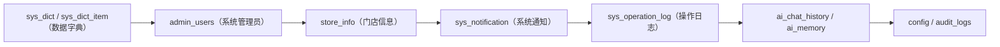
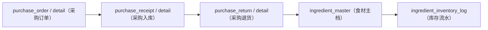
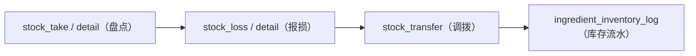

# 又见炊烟餐饮管理系统 - 数据库审计报告（完整版）

> 生成时间：2026-07-23 05:17:02
> 数据库：banquet（又见炊烟餐饮管理系统）
> 表总数：**85** 张
> 模块数：**15** 大业务模块
> 字符集：utf8mb4_unicode_ci
> 数据库引擎：InnoDB

## 目录

### 第一部分：数据库概览
- [1. 数据库基本信息](#1-数据库基本信息)
- [2. 表清单（按模块分类）](#2-表清单按模块分类)
- [3. 整体架构与数据流](#3-整体架构与数据流)

### 第二部分：15大业务模块数据流图
- [一、系统管理数据流](#一、系统管理数据流)
- [二、人事管理数据流](#二、人事管理数据流)
- [三、物资管理数据流](#三、物资管理数据流)
- [四、菜品管理数据流](#四、菜品管理数据流)
- [五、套餐管理数据流](#五、套餐管理数据流)
- [六、宴会菜单模板数据流](#六、宴会菜单模板数据流)
- [七、预订管理数据流](#七、预订管理数据流)
- [八、厨房管理数据流](#八、厨房管理数据流)
- [九、财务管理数据流](#九、财务管理数据流)
- [十、会员管理数据流](#十、会员管理数据流)
- [十一、采购订单管理数据流](#十一、采购订单管理数据流)
- [十二、库存盘点管理数据流](#十二、库存盘点管理数据流)
- [十三、营销管理数据流](#十三、营销管理数据流)
- [十四、报表统计数据流](#十四、报表统计数据流)

### 第三部分：数据表详细说明
- [一、系统管理](#一、系统管理)
  - [sys_dict（数据字典表）](#sys_dict-数据字典表)
  - [sys_dict_item（数据字典项表）](#sys_dict_item-数据字典项表)
  - [admin_users（系统管理员表）](#admin_users-系统管理员表)
  - [audit_logs（审计日志表）](#audit_logs-审计日志表)
  - [config（系统配置表）](#config-系统配置表)
  - [ai_chat_history（AI对话历史表）](#ai_chat_history-AI对话历史表)
  - [ai_memory（AI记忆表）](#ai_memory-AI记忆表)
  - [store_info（门店信息表）](#store_info-门店信息表)
  - [sys_notification（系统通知表）](#sys_notification-系统通知表)
  - [sys_operation_log（操作日志表）](#sys_operation_log-操作日志表)
- [二、人事管理](#二、人事管理)
  - [department（部门表）](#department-部门表)
  - [staff_master（员工主档表）](#staff_master-员工主档表)
  - [attendance（考勤明细表）](#attendance-考勤明细表)
  - [attendance_records（考勤月度汇总表）](#attendance_records-考勤月度汇总表)
  - [overtime（加班申请表）](#overtime-加班申请表)
  - [leave_record（请假记录表）](#leave_record-请假记录表)
  - [schedule（排班表）](#schedule-排班表)
  - [employee_lifecycle（员工生命周期表）](#employee_lifecycle-员工生命周期表)
- [三、物资管理](#三、物资管理)
  - [supplier_master（供应商主档表）](#supplier_master-供应商主档表)
  - [ingredient_master（食材/原料主档表）](#ingredient_master-食材/原料主档表)
  - [ingredient_purchase（采购记录表）](#ingredient_purchase-采购记录表)
  - [ingredient_inventory_log（库存变动日志表）](#ingredient_inventory_log-库存变动日志表)
- [四、菜品管理](#四、菜品管理)
  - [dish_category（菜品分类表）](#dish_category-菜品分类表)
  - [dish_master（菜品主档表）](#dish_master-菜品主档表)
  - [dish_tag（菜品标签表）](#dish_tag-菜品标签表)
  - [dish_tag_relation（菜品标签关联表）](#dish_tag_relation-菜品标签关联表)
  - [dish_usage（菜品用途表）](#dish_usage-菜品用途表)
  - [dish_usage_relation（菜品用途关联表）](#dish_usage_relation-菜品用途关联表)
  - [dish_occasion_names（菜品场合别名表）](#dish_occasion_names-菜品场合别名表)
  - [dish_recipe（菜品配方表）](#dish_recipe-菜品配方表)
- [五、套餐管理](#五、套餐管理)
  - [package_master（套餐主档表）](#package_master-套餐主档表)
  - [package_dish_detail（套餐菜品明细表）](#package_dish_detail-套餐菜品明细表)
- [六、宴会菜单模板](#六、宴会菜单模板)
  - [banquet_type（宴会类型表）](#banquet_type-宴会类型表)
  - [banquet_template（宴会菜单模板表）](#banquet_template-宴会菜单模板表)
  - [banquet_template_rel（宴会类型-模板关联表）](#banquet_template_rel-宴会类型-模板关联表)
  - [menu_category（菜单分类表(零点排版)）](#menu_category-菜单分类表(零点排版))
  - [template_category_rel（模板-分类关联表）](#template_category_rel-模板-分类关联表)
  - [template_dish_rel（模板-菜品关联表）](#template_dish_rel-模板-菜品关联表)
- [七、预订管理](#七、预订管理)
  - [customer_master（客户主档表）](#customer_master-客户主档表)
  - [table_master（桌台主档表）](#table_master-桌台主档表)
  - [booking_master（预订主档表）](#booking_master-预订主档表)
  - [booking_table（订桌明细表）](#booking_table-订桌明细表)
  - [booking_dish_detail（订菜明细表）](#booking_dish_detail-订菜明细表)
- [八、厨房管理](#八、厨房管理)
  - [kitchen_log（厨房操作日志表）](#kitchen_log-厨房操作日志表)
  - [change_log（系统变更日志表）](#change_log-系统变更日志表)
- [九、财务管理](#九、财务管理)
  - [finance_account（财务账户表）](#finance_account-财务账户表)
  - [finance_transaction（收支流水表）](#finance_transaction-收支流水表)
  - [finance_receivable（应收账款表）](#finance_receivable-应收账款表)
  - [finance_payable（应付账款表）](#finance_payable-应付账款表)
  - [finance_payment_record（收款记录表）](#finance_payment_record-收款记录表)
  - [finance_expense（费用报销表）](#finance_expense-费用报销表)
  - [finance_voucher（会计凭证表）](#finance_voucher-会计凭证表)
  - [finance_voucher_detail（会计凭证明细表）](#finance_voucher_detail-会计凭证明细表)
  - [finance_cost_record（成本记录表）](#finance_cost_record-成本记录表)
  - [finance_settlement（结算记录表）](#finance_settlement-结算记录表)
  - [finance_reconciliation（对账记录表）](#finance_reconciliation-对账记录表)
- [十、会员管理](#十、会员管理)
  - [member_level（会员等级表）](#member_level-会员等级表)
  - [member_card（会员卡主档表）](#member_card-会员卡主档表)
  - [member_recharge_record（储值充值记录表）](#member_recharge_record-储值充值记录表)
  - [member_consume_record（会员消费记录表）](#member_consume_record-会员消费记录表)
  - [member_point_log（积分变动日志表）](#member_point_log-积分变动日志表)
  - [member_point_rule（积分规则表）](#member_point_rule-积分规则表)
- [十一、采购订单管理](#十一、采购订单管理)
  - [purchase_order（采购订单主档表）](#purchase_order-采购订单主档表)
  - [purchase_order_detail（采购订单明细表）](#purchase_order_detail-采购订单明细表)
  - [purchase_receipt（采购入库单主档表）](#purchase_receipt-采购入库单主档表)
  - [purchase_receipt_detail（采购入库明细表）](#purchase_receipt_detail-采购入库明细表)
  - [purchase_return（采购退货单主档表）](#purchase_return-采购退货单主档表)
  - [purchase_return_detail（采购退货明细表）](#purchase_return_detail-采购退货明细表)
- [十二、库存盘点管理](#十二、库存盘点管理)
  - [stock_take（盘点单主档表）](#stock_take-盘点单主档表)
  - [stock_take_detail（盘点明细表）](#stock_take_detail-盘点明细表)
  - [stock_loss（报损单主档表）](#stock_loss-报损单主档表)
  - [stock_loss_detail（报损明细表）](#stock_loss_detail-报损明细表)
  - [stock_transfer（库存调拨单表）](#stock_transfer-库存调拨单表)
- [十三、营销管理](#十三、营销管理)
  - [marketing_coupon（优惠券表）](#marketing_coupon-优惠券表)
  - [marketing_coupon_record（优惠券领取使用记录表）](#marketing_coupon_record-优惠券领取使用记录表)
  - [marketing_activity（营销活动表）](#marketing_activity-营销活动表)
  - [marketing_discount_rule（优惠规则表）](#marketing_discount_rule-优惠规则表)
  - [marketing_member_reward（会员奖励规则表）](#marketing_member_reward-会员奖励规则表)
  - [marketing_promo_code（优惠码表）](#marketing_promo_code-优惠码表)
  - [marketing_lottery（抽奖活动表）](#marketing_lottery-抽奖活动表)
- [十四、报表统计](#十四、报表统计)
  - [report_daily（日报表）](#report_daily-日报表)
  - [report_monthly（月报表）](#report_monthly-月报表)
  - [report_dish_sales（菜品销售统计表）](#report_dish_sales-菜品销售统计表)
  - [report_department_cost（部门成本统计表）](#report_department_cost-部门成本统计表)
  - [report_staff_kpi（员工KPI统计表）](#report_staff_kpi-员工KPI统计表)

### 第四部分：附录
- [附录A：数据字典完整清单](#附录a数据字典完整清单)
- [附录B：物理外键清单](#附录b物理外键清单)
- [附录C：设计规范与命名约定](#附录c设计规范与命名约定)

---

## 第一部分：数据库概览

### 1. 数据库基本信息

| 项目 | 内容 |
|------|------|
| 数据库名 | banquet |
| 数据库引擎 | InnoDB |
| 字符集/排序规则 | utf8mb4 / utf8mb4_unicode_ci |
| 表总数 | **85** 张 |
| 模块数 | 15大业务模块 |
| 物理外键 | 21 个 |
| 门店隔离 | store_id 字段，支持多门店数据独立 |
| 数据字典 | sys_dict + sys_dict_item，统一管理下拉选项 |

### 2. 表清单（按模块分类）

#### 一、系统管理（10张）

| 序号 | 表名 | 中文名 | 记录数 | 说明 |
|------|------|--------|--------|------|
| 1 | `sys_dict` | 数据字典表 | 41 | 数据字典表 |
| 2 | `sys_dict_item` | 数据字典项表 | 347 | 数据字典项表 |
| 3 | `admin_users` | 系统管理员表 | 0 | 系统管理员表 |
| 4 | `audit_logs` | 审计日志表 | 0 | 审计日志表 |
| 5 | `config` | 系统配置表 | 0 | 系统配置表 |
| 6 | `ai_chat_history` | AI对话历史表 | 14 | AI对话历史表 |
| 7 | `ai_memory` | AI记忆表 | 0 | AI记忆表 |
| 8 | `store_info` | 门店信息表 | 0 | 门店信息表 |
| 9 | `sys_notification` | 系统通知表 | 0 | 系统通知表 |
| 10 | `sys_operation_log` | 操作日志表 | 0 | 操作日志表 |

#### 二、人事管理（8张）

| 序号 | 表名 | 中文名 | 记录数 | 说明 |
|------|------|--------|--------|------|
| 1 | `department` | 部门表 | 30 | 部门表 |
| 2 | `staff_master` | 员工主档表 | 24 | 员工主档表 |
| 3 | `attendance` | 考勤明细表 | 222 | 考勤明细表 |
| 4 | `attendance_records` | 考勤月度汇总表 | 18 | 考勤月度汇总表 |
| 5 | `overtime` | 加班申请表 | 50 | 加班申请表 |
| 6 | `leave_record` | 请假记录表 | 31 | 请假记录表 |
| 7 | `schedule` | 排班表 | 281 | 排班表 |
| 8 | `employee_lifecycle` | 员工生命周期表 | 11 | 员工生命周期表 |

#### 三、物资管理（4张）

| 序号 | 表名 | 中文名 | 记录数 | 说明 |
|------|------|--------|--------|------|
| 1 | `supplier_master` | 供应商主档表 | 6 | 供应商主档表 |
| 2 | `ingredient_master` | 食材/原料主档表 | 1215 | 食材/原料主档表 |
| 3 | `ingredient_purchase` | 采购记录表 | 53 | 采购记录表 |
| 4 | `ingredient_inventory_log` | 库存变动日志表 | 0 | 库存变动日志表 |

#### 四、菜品管理（8张）

| 序号 | 表名 | 中文名 | 记录数 | 说明 |
|------|------|--------|--------|------|
| 1 | `dish_category` | 菜品分类表 | 9 | 厨房分类表（食材/做法） |
| 2 | `dish_master` | 菜品主档表 | 597 | 菜品主档表 |
| 3 | `dish_tag` | 菜品标签表 | 19 | 菜牌标记类别表 |
| 4 | `dish_tag_relation` | 菜品标签关联表 | 1012 | 菜品标记关联表 |
| 5 | `dish_usage` | 菜品用途表 | 2 | 菜品用途表 |
| 6 | `dish_usage_relation` | 菜品用途关联表 | 357 | 菜品用途关联表 |
| 7 | `dish_occasion_names` | 菜品场合别名表 | 0 | 菜品场合别名表 |
| 8 | `dish_recipe` | 菜品配方表 | 0 | 菜品配方表 |

#### 五、套餐管理（2张）

| 序号 | 表名 | 中文名 | 记录数 | 说明 |
|------|------|--------|--------|------|
| 1 | `package_master` | 套餐主档表 | 8 | 套餐主档表 |
| 2 | `package_dish_detail` | 套餐菜品明细表 | 40 | 套餐菜品明细表 |

#### 六、宴会菜单模板（6张）

| 序号 | 表名 | 中文名 | 记录数 | 说明 |
|------|------|--------|--------|------|
| 1 | `banquet_type` | 宴会类型表 | 8 | 宴会类型表 |
| 2 | `banquet_template` | 宴会菜单模板表 | 5 | 菜单模板表 |
| 3 | `banquet_template_rel` | 宴会类型-模板关联表 | 0 | 宴会-模板关联表 |
| 4 | `menu_category` | 菜单分类表(零点排版) | 9 | 零点分类表（菜单排版用） |
| 5 | `template_category_rel` | 模板-分类关联表 | 9 | 模板-分类关联表 |
| 6 | `template_dish_rel` | 模板-菜品关联表 | 756 | 模板-菜品关联表 |

#### 七、预订管理（5张）

| 序号 | 表名 | 中文名 | 记录数 | 说明 |
|------|------|--------|--------|------|
| 1 | `customer_master` | 客户主档表 | 37 | 客户主档表 |
| 2 | `table_master` | 桌台主档表 | 84 | 桌台主档表 |
| 3 | `booking_master` | 预订主档表 | 0 | 预订主档表 |
| 4 | `booking_table` | 订桌明细表 | 0 | 订桌明细表 |
| 5 | `booking_dish_detail` | 订菜明细表 | 0 | 订菜明细表 |

#### 八、厨房管理（2张）

| 序号 | 表名 | 中文名 | 记录数 | 说明 |
|------|------|--------|--------|------|
| 1 | `kitchen_log` | 厨房操作日志表 | 5 | 厨房操作日志表 |
| 2 | `change_log` | 系统变更日志表 | 0 | 系统改动日志 |

#### 九、财务管理（11张）

| 序号 | 表名 | 中文名 | 记录数 | 说明 |
|------|------|--------|--------|------|
| 1 | `finance_account` | 财务账户表 | 0 | 财务账户表 |
| 2 | `finance_transaction` | 收支流水表 | 0 | 收支流水表 |
| 3 | `finance_receivable` | 应收账款表 | 0 | 应收账款表 |
| 4 | `finance_payable` | 应付账款表 | 0 | 应付账款表 |
| 5 | `finance_payment_record` | 收款记录表 | 0 | 收款记录表 |
| 6 | `finance_expense` | 费用报销表 | 0 | 费用报销表 |
| 7 | `finance_voucher` | 会计凭证表 | 0 | 会计凭证表 |
| 8 | `finance_voucher_detail` | 会计凭证明细表 | 0 | 会计凭证明细表 |
| 9 | `finance_cost_record` | 成本记录表 | 0 | 成本记录表 |
| 10 | `finance_settlement` | 结算记录表 | 0 | 结算记录表 |
| 11 | `finance_reconciliation` | 对账记录表 | 0 | 对账记录表 |

#### 十、会员管理（6张）

| 序号 | 表名 | 中文名 | 记录数 | 说明 |
|------|------|--------|--------|------|
| 1 | `member_level` | 会员等级表 | 0 | 会员等级表 |
| 2 | `member_card` | 会员卡主档表 | 0 | 会员卡主档表 |
| 3 | `member_recharge_record` | 储值充值记录表 | 0 | 储值充值记录表 |
| 4 | `member_consume_record` | 会员消费记录表 | 0 | 会员消费记录表 |
| 5 | `member_point_log` | 积分变动日志表 | 0 | 积分变动日志表 |
| 6 | `member_point_rule` | 积分规则表 | 0 | 积分规则表 |

#### 十一、采购订单管理（6张）

| 序号 | 表名 | 中文名 | 记录数 | 说明 |
|------|------|--------|--------|------|
| 1 | `purchase_order` | 采购订单主档表 | 0 | 采购订单主档表 |
| 2 | `purchase_order_detail` | 采购订单明细表 | 0 | 采购订单明细表 |
| 3 | `purchase_receipt` | 采购入库单主档表 | 0 | 采购入库单主档表 |
| 4 | `purchase_receipt_detail` | 采购入库明细表 | 0 | 采购入库明细表 |
| 5 | `purchase_return` | 采购退货单主档表 | 0 | 采购退货单主档表 |
| 6 | `purchase_return_detail` | 采购退货明细表 | 0 | 采购退货明细表 |

#### 十二、库存盘点管理（5张）

| 序号 | 表名 | 中文名 | 记录数 | 说明 |
|------|------|--------|--------|------|
| 1 | `stock_take` | 盘点单主档表 | 0 | 盘点单主档表 |
| 2 | `stock_take_detail` | 盘点明细表 | 0 | 盘点明细表 |
| 3 | `stock_loss` | 报损单主档表 | 0 | 报损单主档表 |
| 4 | `stock_loss_detail` | 报损明细表 | 0 | 报损明细表 |
| 5 | `stock_transfer` | 库存调拨单表 | 0 | 库存调拨单表 |

#### 十三、营销管理（7张）

| 序号 | 表名 | 中文名 | 记录数 | 说明 |
|------|------|--------|--------|------|
| 1 | `marketing_coupon` | 优惠券表 | 0 | 优惠券表 |
| 2 | `marketing_coupon_record` | 优惠券领取使用记录表 | 0 | 优惠券领取使用记录表 |
| 3 | `marketing_activity` | 营销活动表 | 0 | 营销活动表 |
| 4 | `marketing_discount_rule` | 优惠规则表 | 0 | 优惠规则表 |
| 5 | `marketing_member_reward` | 会员奖励规则表 | 0 | 会员奖励规则表 |
| 6 | `marketing_promo_code` | 优惠码表 | 0 | 优惠码表 |
| 7 | `marketing_lottery` | 抽奖活动表 | 0 | 抽奖活动表 |

#### 十四、报表统计（5张）

| 序号 | 表名 | 中文名 | 记录数 | 说明 |
|------|------|--------|--------|------|
| 1 | `report_daily` | 日报表 | 0 | 日报表 |
| 2 | `report_monthly` | 月报表 | 0 | 月报表 |
| 3 | `report_dish_sales` | 菜品销售统计表 | 0 | 菜品销售统计表 |
| 4 | `report_department_cost` | 部门成本统计表 | 0 | 部门成本统计表 |
| 5 | `report_staff_kpi` | 员工KPI统计表 | 0 | 员工KPI统计表 |

### 3. 整体架构与数据流

```

                    ┌──────────────────────────┐
                    │      系统管理模块        │
                    │  sys_dict / admin_users   │
                    │  store_info / 通知/日志   │
                    └──────────┬───────────────┘
                               │
        ┌──────────┬───────────┼───────────┬──────────┐
        ▼          ▼           ▼           ▼          ▼
  ┌─────────┐ ┌─────────┐ ┌─────────┐ ┌─────────┐ ┌─────────┐
  │ 人事管理 │ │ 物资管理 │ │ 菜品管理 │ │ 会员管理 │ │ 营销管理 │
  │ 部门/员工│ │ 供应商   │ │ 分类/标签│ │ 等级/卡  │ │ 优惠券   │
  │ 考勤/排班│ │ 食材/库存│ │ 配方/用途│ │ 充值/消费│ │ 活动/规则│
  └────┬────┘ └────┬────┘ └────┬────┘ └────┬────┘ └────┬────┘
       │           │           │           │           │
       └───────────┴─────┬─────┴───────────┴───────────┘
                         │
                    ┌────▼────┐
                    │ 套餐管理 │
                    └────┬────┘
                         │
                    ┌────▼────┐
                    │ 宴会模板 │
                    └────┬────┘
                         │
                    ┌────▼────┐       ┌─────────┐
                    │ 预订管理 │ ────→ │ 厨房管理 │
                    │ 客户/桌台 │       │ 出餐流程 │
                    └────┬────┘       └─────────┘
                         │
                    ┌────▼────┐
                    │ 财务管理 │
                    │ 收支/往来│
                    │ 凭证/成本│
                    └────┬────┘
                         │
                    ┌────▼────┐
                    │ 报表统计 │
                    │ 日/月报  │
                    └─────────┘

```

## 第二部分：15大业务模块数据流图

### 一、系统管理模块数据流



**说明：**

- **sys_dict / sys_dict_item（数据字典）**：所有下拉选项统一管理，供全系统调用
- **admin_users（系统管理员）**：后台管理账号
- **store_info（门店信息）**：门店主数据，多店架构基础
- **sys_notification（系统通知）**：系统消息/业务通知/审批提醒
- **sys_operation_log（操作日志）**：全系统操作审计，记录增删改查
- **ai_chat_history / ai_memory**：AI助手对话和记忆
- **config / audit_logs**：系统配置和审计日志

### 二、人事管理模块数据流


**说明：**

- **department（部门表）**：组织架构，员工归属部门
- **staff_master（员工主档）**：员工档案，含薪资结构/权限/银行信息
- **attendance（考勤明细）**：每日打卡记录
- **attendance_records（考勤月度汇总）**：按月统计出勤/请假/加班
- **overtime（加班）**：加班申请和审批
- **leave_record（请假）**：请假申请和审批
- **schedule（排班）**：员工排班计划
- **employee_lifecycle（员工生命周期）**：入职/转正/调岗/离职

### 三、物资管理模块数据流


**说明：**

- **supplier_master（供应商主档）**：供应商档案，关联食材采购
- **ingredient_master（食材主档）**：食材档案，库存/均价/出成率
- **ingredient_purchase（采购记录）**：历史采购记录
- **ingredient_inventory_log（库存变动）**：入库/出库/盘点流水

### 四、菜品管理模块数据流


**说明：**

- **dish_category（菜品分类）**：热菜/凉菜/汤品等分类
- **dish_master（菜品主档）**：菜品档案，成本/售价/烹饪方法
- **dish_tag / dish_tag_relation（标签）**：菜品多标签管理
- **dish_usage / dish_usage_relation（用途）**：菜品适用场合
- **dish_occasion_names（场合别名）**：不同场合的菜品别名
- **dish_recipe（菜品配方）**：菜品→食材用量关系，计算成本

### 五、套餐管理模块数据流


**说明：**

- **dish_master（菜品主档）**：套餐组成单元
- **package_dish_detail（套餐明细）**：套餐与菜品关联
- **package_master（套餐主档）**：套餐汇总，总价/成本/成本率

### 六、宴会菜单模板模块数据流


**说明：**

- **banquet_type（宴会类型）**：婚宴/寿宴/商务等分类
- **banquet_template（菜单模板）**：宴会菜单模板
- **menu_category（菜单分类）**：菜单排版分类：冷菜/热菜/汤
- **template_category_rel（模板-分类）**：模板下的分类结构
- **template_dish_rel（模板-菜品）**：每个分类下的菜品

### 七、预订管理模块数据流


**说明：**

- **customer_master（客户主档）**：客户档案，累计消费/会员关联
- **table_master（桌台主档）**：桌台资源，区域/类型/状态
- **booking_master（预订主档）**：预订单，关联客户/员工/金额
- **booking_table（订桌明细）**：预订下的桌台，关联套餐
- **booking_dish_detail（订菜明细）**：订桌下的菜品，流转到厨房

### 八、厨房管理模块数据流


**说明：**

- **booking_dish_detail（订菜明细）**：厨房任务来源
- **kitchen_log（厨房操作日志）**：厨房操作记录
- **change_log（系统变更日志）**：全系统变更审计

### 九、财务管理模块数据流


**说明：**

- **finance_account（财务账户）**：现金/银行/微信/支付宝等账户
- **finance_transaction（收支流水）**：每一笔收支明细
- **finance_receivable（应收账款）**：客户挂账管理
- **finance_payable（应付账款）**：供应商应付管理
- **finance_payment_record（收款记录）**：收款登记
- **finance_expense（费用报销）**：员工费用报销
- **finance_voucher / detail（会计凭证）**：凭证和分录
- **finance_cost_record（成本记录）**：成本归集
- **finance_settlement（结算）**：日结/月结/年结
- **finance_reconciliation（对账）**：账户对账

### 十、会员管理模块数据流


**说明：**

- **member_level（会员等级）**：等级配置，权益/折扣/积分倍率
- **member_card（会员卡主档）**：会员档案，余额/积分/消费记录
- **member_recharge_record（储值充值）**：充值记录，含赠送
- **member_consume_record（会员消费）**：消费记录，余额/积分变动
- **member_point_log（积分变动）**：积分流水
- **member_point_rule（积分规则）**：积分获取和使用规则

### 十一、采购订单管理模块数据流



**说明：**

- **purchase_order / detail（采购订单）**：采购下单
- **purchase_receipt / detail（采购入库）**：验收入库，更新库存
- **purchase_return / detail（采购退货）**：不合格退货
- **ingredient_master（食材主档）**：更新库存和均价
- **ingredient_inventory_log（库存流水）**：记录入库/退货变动

### 十二、库存盘点管理模块数据流



**说明：**

- **stock_take / detail（盘点）**：盘点单和明细，盘盈盘亏
- **stock_loss / detail（报损）**：报损单和明细
- **stock_transfer（调拨）**：仓库间调拨
- **ingredient_inventory_log（库存流水）**：记录所有库存变动

### 十三、营销管理模块数据流


**说明：**

- **marketing_coupon / record（优惠券）**：优惠券发放和使用
- **marketing_activity（营销活动）**：活动策划和效果追踪
- **marketing_discount_rule（优惠规则）**：满减/满赠/折扣规则
- **marketing_member_reward（会员奖励）**：注册/生日/推荐奖励
- **marketing_promo_code（优惠码）**：优惠码管理
- **marketing_lottery（抽奖活动）**：抽奖活动配置

### 十四、报表统计模块数据流


**说明：**

- **report_daily（日报表）**：每日营业汇总
- **report_monthly（月报表）**：月度经营分析
- **report_dish_sales（菜品销售统计）**：菜品销量/销售额/毛利排名
- **report_department_cost（部门成本）**：部门成本核算
- **report_staff_kpi（员工KPI）**：员工绩效统计

## 第三部分：数据表详细说明

### 一、系统管理

#### sys_dict（数据字典表）

- **表名**：`sys_dict`
- **中文名**：数据字典表
- **记录数**：41 行
- **字段数**：10 个
- **引擎**：InnoDB

**字段说明：**

| # | 字段名 | 中文名 | 类型 | 可空 | 键 | 默认值 |
|---|--------|--------|------|------|----|--------|
| 1 | `dict_id` | dict_id | `bigint` | 否 | 🔑主键 | - |
| 2 | `dict_code` | dict_code | `varchar(100)` | 否 | 📇索引 | - |
| 3 | `dict_name` | dict_name | `varchar(100)` | 否 |  | - |
| 4 | `dict_type` | dict_type | `varchar(20)` | 否 |  | list |
| 5 | `store_id` | 门店ID | `bigint` | 否 | 📇索引 | 1 |
| 6 | `description` | 描述 | `varchar(200)` | 是 |  | - |
| 7 | `sort_order` | 排序号 | `int` | 是 |  | 0 |
| 8 | `is_active` | 是否启用 | `tinyint` | 是 |  | 1 |
| 9 | `created_at` | 创建时间 | `timestamp` | 是 |  | CURRENT_TIMESTAMP |
| 10 | `updated_at` | 更新时间 | `timestamp` | 是 |  | CURRENT_TIMESTAMP |

**索引说明：**

| 索引名 | 类型 | 字段 |
|--------|------|------|
| `idx_store_id` | 普通索引 | store_id |
| `PRIMARY` | 唯一索引 | dict_id |
| `uk_dict_code` | 唯一索引 | dict_code, store_id |

---

#### sys_dict_item（数据字典项表）

- **表名**：`sys_dict_item`
- **中文名**：数据字典项表
- **记录数**：347 行
- **字段数**：12 个
- **引擎**：InnoDB

**字段说明：**

| # | 字段名 | 中文名 | 类型 | 可空 | 键 | 默认值 |
|---|--------|--------|------|------|----|--------|
| 1 | `item_id` | item_id | `bigint` | 否 | 🔑主键 | - |
| 2 | `dict_id` | dict_id | `bigint` | 否 | 📇索引 | - |
| 3 | `dict_code` | dict_code | `varchar(100)` | 否 | 📇索引 | - |
| 4 | `item_value` | item_value | `varchar(100)` | 否 |  | - |
| 5 | `item_label` | item_label | `varchar(100)` | 否 |  | - |
| 6 | `parent_id` | parent_id | `bigint` | 是 | 📇索引 | - |
| 7 | `store_id` | 门店ID | `bigint` | 否 | 📇索引 | 1 |
| 8 | `sort_order` | 排序号 | `int` | 是 |  | 0 |
| 9 | `is_active` | 是否启用 | `tinyint` | 是 |  | 1 |
| 10 | `remark` | 备注 | `varchar(200)` | 是 |  | - |
| 11 | `created_at` | 创建时间 | `timestamp` | 是 |  | CURRENT_TIMESTAMP |
| 12 | `updated_at` | 更新时间 | `timestamp` | 是 |  | CURRENT_TIMESTAMP |

**索引说明：**

| 索引名 | 类型 | 字段 |
|--------|------|------|
| `idx_dict_code` | 普通索引 | dict_code, store_id |
| `idx_parent_id` | 普通索引 | parent_id |
| `idx_store_id` | 普通索引 | store_id |
| `PRIMARY` | 唯一索引 | item_id |
| `uk_dict_value` | 唯一索引 | dict_id, item_value, store_id |

---

#### admin_users（系统管理员表）

- **表名**：`admin_users`
- **中文名**：系统管理员表
- **记录数**：0 行
- **字段数**：7 个
- **引擎**：InnoDB

**字段说明：**

| # | 字段名 | 中文名 | 类型 | 可空 | 键 | 默认值 |
|---|--------|--------|------|------|----|--------|
| 1 | `id` | 主键ID | `int` | 否 | 🔑主键 | - |
| 2 | `username` | username | `varchar(64)` | 否 | 🔒唯一 | - |
| 3 | `password` | password | `varchar(255)` | 否 |  | - |
| 4 | `real_name` | real_name | `varchar(50)` | 是 |  | - |
| 5 | `role` | role | `varchar(30)` | 否 |  | staff |
| 6 | `created_at` | 创建时间 | `timestamp` | 是 |  | CURRENT_TIMESTAMP |
| 7 | `store_id` | 门店ID | `bigint` | 否 | 📇索引 | 1 |

**索引说明：**

| 索引名 | 类型 | 字段 |
|--------|------|------|
| `idx_store_id` | 普通索引 | store_id |
| `PRIMARY` | 唯一索引 | id |
| `username` | 唯一索引 | username |

---

#### audit_logs（审计日志表）

- **表名**：`audit_logs`
- **中文名**：审计日志表
- **记录数**：0 行
- **字段数**：7 个
- **引擎**：InnoDB

**字段说明：**

| # | 字段名 | 中文名 | 类型 | 可空 | 键 | 默认值 |
|---|--------|--------|------|------|----|--------|
| 1 | `id` | 主键ID | `int` | 否 | 🔑主键 | - |
| 2 | `user_id` | user_id | `varchar(64)` | 是 | 📇索引 | - |
| 3 | `action` | action | `varchar(128)` | 是 |  | - |
| 4 | `target` | target | `varchar(256)` | 是 |  | - |
| 5 | `detail` | detail | `text` | 是 |  | - |
| 6 | `created_at` | 创建时间 | `timestamp` | 是 |  | CURRENT_TIMESTAMP |
| 7 | `store_id` | 门店ID | `bigint` | 否 | 📇索引 | 1 |

**索引说明：**

| 索引名 | 类型 | 字段 |
|--------|------|------|
| `idx_audit_user` | 普通索引 | user_id |
| `idx_store_id` | 普通索引 | store_id |
| `PRIMARY` | 唯一索引 | id |

---

#### config（系统配置表）

- **表名**：`config`
- **中文名**：系统配置表
- **记录数**：0 行
- **字段数**：3 个
- **引擎**：InnoDB

**字段说明：**

| # | 字段名 | 中文名 | 类型 | 可空 | 键 | 默认值 |
|---|--------|--------|------|------|----|--------|
| 1 | `config_key` | config_key | `varchar(128)` | 否 | 🔑主键 | - |
| 2 | `config_value` | config_value | `text` | 是 |  | - |
| 3 | `store_id` | 门店ID | `bigint` | 否 | 📇索引 | 1 |

**索引说明：**

| 索引名 | 类型 | 字段 |
|--------|------|------|
| `idx_store_id` | 普通索引 | store_id |
| `PRIMARY` | 唯一索引 | config_key |

---

#### ai_chat_history（AI对话历史表）

- **表名**：`ai_chat_history`
- **中文名**：AI对话历史表
- **记录数**：14 行
- **字段数**：7 个
- **引擎**：InnoDB

**字段说明：**

| # | 字段名 | 中文名 | 类型 | 可空 | 键 | 默认值 |
|---|--------|--------|------|------|----|--------|
| 1 | `id` | 主键ID | `bigint` | 否 | 🔑主键 | - |
| 2 | `staff_id` | staff_id | `int` | 是 | 📇索引 | - |
| 3 | `role` | role | `varchar(30)` | 是 |  | - |
| 4 | `content` | content | `text` | 否 |  | - |
| 5 | `image_url` | image_url | `varchar(500)` | 是 |  | - |
| 6 | `created_at` | 创建时间 | `timestamp` | 是 | 📇索引 | CURRENT_TIMESTAMP |
| 7 | `store_id` | 门店ID | `bigint` | 否 | 📇索引 | 1 |

**索引说明：**

| 索引名 | 类型 | 字段 |
|--------|------|------|
| `idx_created_at` | 普通索引 | created_at |
| `idx_staff_id` | 普通索引 | staff_id |
| `idx_store_id` | 普通索引 | store_id |
| `PRIMARY` | 唯一索引 | id |

---

#### ai_memory（AI记忆表）

- **表名**：`ai_memory`
- **中文名**：AI记忆表
- **记录数**：0 行
- **字段数**：6 个
- **引擎**：InnoDB

**字段说明：**

| # | 字段名 | 中文名 | 类型 | 可空 | 键 | 默认值 |
|---|--------|--------|------|------|----|--------|
| 1 | `id` | 主键ID | `bigint` | 否 | 🔑主键 | - |
| 2 | `user_id` | user_id | `varchar(64)` | 是 | 📇索引 | - |
| 3 | `content` | content | `text` | 否 |  | - |
| 4 | `created_at` | 创建时间 | `timestamp` | 是 |  | CURRENT_TIMESTAMP |
| 5 | `updated_at` | 更新时间 | `timestamp` | 是 |  | CURRENT_TIMESTAMP |
| 6 | `store_id` | 门店ID | `bigint` | 否 | 📇索引 | 1 |

**索引说明：**

| 索引名 | 类型 | 字段 |
|--------|------|------|
| `idx_store_id` | 普通索引 | store_id |
| `idx_user_id` | 普通索引 | user_id |
| `PRIMARY` | 唯一索引 | id |

---

#### store_info（门店信息表）

- **表名**：`store_info`
- **中文名**：门店信息表
- **记录数**：0 行
- **字段数**：29 个
- **引擎**：InnoDB

**字段说明：**

| # | 字段名 | 中文名 | 类型 | 可空 | 键 | 默认值 |
|---|--------|--------|------|------|----|--------|
| 1 | `store_id` | 门店ID | `bigint` | 否 | 🔑主键 | - |
| 2 | `store_code` | 门店编码 | `varchar(50)` | 否 | 🔒唯一 | - |
| 3 | `store_name` | 门店名称 | `varchar(100)` | 否 |  | - |
| 4 | `store_short_name` | 门店简称 | `varchar(50)` | 是 |  | - |
| 5 | `store_type` | 门店类型 | `varchar(20)` | 是 |  | normal |
| 6 | `store_level` | 门店等级 | `varchar(20)` | 是 |  | - |
| 7 | `address` | 地址 | `varchar(200)` | 是 |  | - |
| 8 | `province` | 省份 | `varchar(50)` | 是 |  | - |
| 9 | `city` | 城市 | `varchar(50)` | 是 |  | - |
| 10 | `district` | 区县 | `varchar(50)` | 是 |  | - |
| 11 | `phone` | 手机号 | `varchar(20)` | 是 |  | - |
| 12 | `contact_person` | 联系人 | `varchar(50)` | 是 |  | - |
| 13 | `business_hours` | 营业时间 | `varchar(100)` | 是 |  | - |
| 14 | `table_count` | 桌台总数 | `int` | 是 |  | 0 |
| 15 | `max_capacity` | 最大容纳人数 | `int` | 是 |  | 0 |
| 16 | `business_area` | 营业面积(㎡) | `decimal(8,2)` | 是 |  | - |
| 17 | `manager_id` | 店长ID | `int` | 是 |  | - |
| 18 | `manager_name` | 店长姓名 | `varchar(50)` | 是 |  | - |
| 19 | `opening_date` | 开业日期 | `date` | 是 |  | - |
| 20 | `status` | 状态 | `varchar(20)` | 是 | 📇索引 | open |
| 21 | `tax_no` | 税号 | `varchar(50)` | 是 |  | - |
| 22 | `bank_name` | 开户银行 | `varchar(100)` | 是 |  | - |
| 23 | `bank_account` | 银行账号 | `varchar(50)` | 是 |  | - |
| 24 | `logo_url` | Logo URL | `varchar(255)` | 是 |  | - |
| 25 | `store_image_url` | 门店图片 | `varchar(255)` | 是 |  | - |
| 26 | `sort_order` | 排序号 | `int` | 是 |  | 0 |
| 27 | `remark` | 备注 | `varchar(500)` | 是 |  | - |
| 28 | `created_at` | 创建时间 | `timestamp` | 是 |  | CURRENT_TIMESTAMP |
| 29 | `updated_at` | 更新时间 | `timestamp` | 是 |  | CURRENT_TIMESTAMP |

**索引说明：**

| 索引名 | 类型 | 字段 |
|--------|------|------|
| `idx_status` | 普通索引 | status |
| `PRIMARY` | 唯一索引 | store_id |
| `uk_store_code` | 唯一索引 | store_code |

---

#### sys_notification（系统通知表）

- **表名**：`sys_notification`
- **中文名**：系统通知表
- **记录数**：0 行
- **字段数**：18 个
- **引擎**：InnoDB

**字段说明：**

| # | 字段名 | 中文名 | 类型 | 可空 | 键 | 默认值 |
|---|--------|--------|------|------|----|--------|
| 1 | `notify_id` | 通知ID | `bigint` | 否 | 🔑主键 | - |
| 2 | `store_id` | 门店ID | `bigint` | 否 | 📇索引 | 1 |
| 3 | `notify_type` | 通知类型 | `varchar(50)` | 否 | 📇索引 | - |
| 4 | `notify_title` | 通知标题 | `varchar(200)` | 否 |  | - |
| 5 | `notify_content` | 通知内容 | `text` | 是 |  | - |
| 6 | `priority` | 优先级 | `varchar(20)` | 是 | 📇索引 | normal |
| 7 | `sender_id` | 发送人ID | `int` | 是 | 📇索引 | - |
| 8 | `sender_name` | 发送人姓名 | `varchar(50)` | 是 |  | - |
| 9 | `send_time` | 发送时间 | `datetime` | 是 |  | - |
| 10 | `receiver_type` | 接收人类型 | `varchar(20)` | 是 |  | all |
| 11 | `receiver_ids` | 接收人ID列表 | `text` | 是 |  | - |
| 12 | `related_type` | 关联类型 | `varchar(50)` | 是 |  | - |
| 13 | `related_id` | 关联单据ID | `bigint` | 是 |  | - |
| 14 | `is_read` | 是否已读 | `tinyint` | 是 |  | 0 |
| 15 | `status` | 状态 | `varchar(20)` | 是 |  | published |
| 16 | `remark` | 备注 | `varchar(500)` | 是 |  | - |
| 17 | `created_at` | 创建时间 | `timestamp` | 是 | 📇索引 | CURRENT_TIMESTAMP |
| 18 | `updated_at` | 更新时间 | `timestamp` | 是 |  | CURRENT_TIMESTAMP |

**索引说明：**

| 索引名 | 类型 | 字段 |
|--------|------|------|
| `idx_created_at` | 普通索引 | created_at |
| `idx_notify_type` | 普通索引 | notify_type |
| `idx_priority` | 普通索引 | priority |
| `idx_sender_id` | 普通索引 | sender_id |
| `idx_store_id` | 普通索引 | store_id |
| `PRIMARY` | 唯一索引 | notify_id |

---

#### sys_operation_log（操作日志表）

- **表名**：`sys_operation_log`
- **中文名**：操作日志表
- **记录数**：0 行
- **字段数**：23 个
- **引擎**：InnoDB

**字段说明：**

| # | 字段名 | 中文名 | 类型 | 可空 | 键 | 默认值 |
|---|--------|--------|------|------|----|--------|
| 1 | `log_id` | 日志ID | `bigint` | 否 | 🔑主键 | - |
| 2 | `store_id` | 门店ID | `bigint` | 否 | 📇索引 | 1 |
| 3 | `operator_id` | 操作人ID | `int` | 是 | 📇索引 | - |
| 4 | `operator_name` | 操作人姓名 | `varchar(50)` | 是 |  | - |
| 5 | `operator_account` | operator_account | `varchar(50)` | 是 |  | - |
| 6 | `operation_type` | 操作类型 | `varchar(50)` | 否 | 📇索引 | - |
| 7 | `operation_module` | 操作模块 | `varchar(50)` | 是 | 📇索引 | - |
| 8 | `operation_action` | 操作动作 | `varchar(100)` | 是 |  | - |
| 9 | `request_method` | 请求方法 | `varchar(10)` | 是 |  | - |
| 10 | `request_url` | 请求URL | `varchar(255)` | 是 |  | - |
| 11 | `request_params` | 请求参数 | `text` | 是 |  | - |
| 12 | `request_ip` | 请求IP | `varchar(50)` | 是 |  | - |
| 13 | `target_type` | 操作对象类型 | `varchar(50)` | 是 |  | - |
| 14 | `target_id` | 操作对象ID | `varchar(100)` | 是 |  | - |
| 15 | `target_name` | 操作对象名称 | `varchar(200)` | 是 |  | - |
| 16 | `old_value` | 修改前值 | `text` | 是 |  | - |
| 17 | `new_value` | 修改后值 | `text` | 是 |  | - |
| 18 | `diff_value` | 差异值 | `text` | 是 |  | - |
| 19 | `status` | 状态 | `varchar(20)` | 是 | 📇索引 | success |
| 20 | `error_msg` | 失败原因 | `text` | 是 |  | - |
| 21 | `cost_time` | 耗时(毫秒) | `int` | 是 |  | - |
| 22 | `user_agent` | 用户代理 | `varchar(500)` | 是 |  | - |
| 23 | `created_at` | 创建时间 | `timestamp` | 是 | 📇索引 | CURRENT_TIMESTAMP |

**索引说明：**

| 索引名 | 类型 | 字段 |
|--------|------|------|
| `idx_created_at` | 普通索引 | created_at |
| `idx_operation_module` | 普通索引 | operation_module |
| `idx_operation_type` | 普通索引 | operation_type |
| `idx_operator_id` | 普通索引 | operator_id |
| `idx_status` | 普通索引 | status |
| `idx_store_id` | 普通索引 | store_id |
| `PRIMARY` | 唯一索引 | log_id |

---

### 二、人事管理

#### department（部门表）

- **表名**：`department`
- **中文名**：部门表
- **记录数**：30 行
- **字段数**：11 个
- **引擎**：InnoDB

**字段说明：**

| # | 字段名 | 中文名 | 类型 | 可空 | 键 | 默认值 |
|---|--------|--------|------|------|----|--------|
| 1 | `dept_id` | dept_id | `int` | 否 | 🔑主键 | - |
| 2 | `store_id` | 门店ID | `bigint` | 否 |  | 1 |
| 3 | `dept_name` | dept_name | `varchar(50)` | 否 |  | - |
| 4 | `dept_code` | dept_code | `varchar(20)` | 是 |  | - |
| 5 | `parent_id` | parent_id | `int` | 是 |  | - |
| 6 | `sort_order` | 排序号 | `int` | 是 |  | 0 |
| 7 | `status` | 状态 | `varchar(32)` | 是 |  | active |
| 8 | `description` | 描述 | `varchar(200)` | 是 |  | - |
| 9 | `created_at` | 创建时间 | `timestamp` | 是 |  | CURRENT_TIMESTAMP |
| 10 | `updated_at` | 更新时间 | `timestamp` | 是 |  | CURRENT_TIMESTAMP |
| 11 | `level` | level | `int` | 是 |  | 1 |

**索引说明：**

| 索引名 | 类型 | 字段 |
|--------|------|------|
| `PRIMARY` | 唯一索引 | dept_id |

---

#### staff_master（员工主档表）

- **表名**：`staff_master`
- **中文名**：员工主档表
- **记录数**：24 行
- **字段数**：63 个
- **引擎**：InnoDB

**字段说明：**

| # | 字段名 | 中文名 | 类型 | 可空 | 键 | 默认值 |
|---|--------|--------|------|------|----|--------|
| 1 | `staff_id` | staff_id | `int` | 否 | 🔑主键 | - |
| 2 | `store_id` | 门店ID | `bigint` | 否 | 📇索引 | 1 |
| 3 | `staff_name` | staff_name | `varchar(20)` | 否 |  | - |
| 4 | `staff_account` | staff_account | `varchar(20)` | 是 | 📇索引 | - |
| 5 | `staff_password` | staff_password | `varchar(100)` | 是 |  | - |
| 6 | `staff_gender` | staff_gender | `varchar(2)` | 是 |  | - |
| 7 | `staff_age` | staff_age | `int` | 是 |  | - |
| 8 | `staff_phone` | staff_phone | `varchar(20)` | 是 | 📇索引 | - |
| 9 | `staff_position` | staff_position | `varchar(50)` | 是 |  | - |
| 10 | `department` | 部门 | `varchar(50)` | 是 |  | - |
| 11 | `hire_date` | hire_date | `date` | 是 |  | - |
| 12 | `monthly_salary` | monthly_salary | `decimal(12,2)` | 是 |  | 0.00 |
| 13 | `id_card` | 身份证号 | `varchar(20)` | 是 |  | - |
| 14 | `home_address` | home_address | `varchar(200)` | 是 |  | - |
| 15 | `emergency_contact` | emergency_contact | `varchar(20)` | 是 |  | - |
| 16 | `emergency_phone` | emergency_phone | `varchar(20)` | 是 |  | - |
| 17 | `employment_status` | employment_status | `varchar(10)` | 是 | 📇索引 | active |
| 18 | `resign_reason` | resign_reason | `text` | 是 |  | - |
| 19 | `resign_date` | resign_date | `date` | 是 |  | - |
| 20 | `role` | role | `varchar(30)` | 是 |  | - |
| 21 | `remark` | 备注 | `text` | 是 |  | - |
| 22 | `created_at` | 创建时间 | `timestamp` | 是 |  | CURRENT_TIMESTAMP |
| 23 | `updated_at` | 更新时间 | `timestamp` | 是 |  | CURRENT_TIMESTAMP |
| 24 | `permission_level` | permission_level | `int` | 是 |  | 0 |
| 25 | `dept_id` | dept_id | `int` | 是 | 📇索引 | - |
| 26 | `can_manage_kitchen` | can_manage_kitchen | `tinyint` | 是 |  | 0 |
| 27 | `can_manage_sales` | can_manage_sales | `tinyint` | 是 |  | 0 |
| 28 | `can_manage_finance` | can_manage_finance | `tinyint` | 是 |  | 0 |
| 29 | `can_manage_hr` | can_manage_hr | `tinyint` | 是 |  | 0 |
| 30 | `can_view_all_stores` | can_view_all_stores | `tinyint` | 是 |  | 0 |
| 31 | `can_edit_system` | can_edit_system | `tinyint` | 是 |  | 0 |
| 32 | `staff_no` | staff_no | `varchar(20)` | 是 |  | - |
| 33 | `avatar_url` | 头像URL | `varchar(500)` | 是 |  | - |
| 34 | `nation` | nation | `varchar(20)` | 是 |  | - |
| 35 | `birth_date` | birth_date | `date` | 是 |  | - |
| 36 | `native_place` | native_place | `varchar(100)` | 是 |  | - |
| 37 | `marital_status` | marital_status | `varchar(10)` | 是 |  | - |
| 38 | `political_status` | political_status | `varchar(20)` | 是 |  | - |
| 39 | `education` | education | `varchar(20)` | 是 |  | - |
| 40 | `major` | major | `varchar(50)` | 是 |  | - |
| 41 | `graduate_school` | graduate_school | `varchar(100)` | 是 |  | - |
| 42 | `email` | 邮箱 | `varchar(100)` | 是 |  | - |
| 43 | `wechat` | wechat | `varchar(50)` | 是 |  | - |
| 44 | `staff_rank` | staff_rank | `varchar(20)` | 是 |  | - |
| 45 | `employment_type` | employment_type | `varchar(20)` | 是 |  | - |
| 46 | `hire_channel` | hire_channel | `varchar(30)` | 是 |  | - |
| 47 | `probation_months` | probation_months | `decimal(3,1)` | 是 |  | - |
| 48 | `probation_start_date` | probation_start_date | `date` | 是 |  | - |
| 49 | `probation_end_date` | probation_end_date | `date` | 是 |  | - |
| 50 | `regular_date` | regular_date | `date` | 是 |  | - |
| 51 | `leader_id` | leader_id | `int` | 是 |  | - |
| 52 | `work_location` | work_location | `varchar(100)` | 是 |  | - |
| 53 | `basic_salary` | basic_salary | `decimal(12,2)` | 是 |  | - |
| 54 | `performance_salary` | performance_salary | `decimal(12,2)` | 是 |  | - |
| 55 | `subsidy` | subsidy | `decimal(12,2)` | 是 |  | - |
| 56 | `bonus` | bonus | `decimal(12,2)` | 是 |  | - |
| 57 | `social_insurance` | social_insurance | `decimal(12,2)` | 是 |  | - |
| 58 | `housing_fund` | housing_fund | `decimal(12,2)` | 是 |  | - |
| 59 | `bank_name` | 开户银行 | `varchar(50)` | 是 |  | - |
| 60 | `bank_account` | 银行账号 | `varchar(30)` | 是 |  | - |
| 61 | `account_holder` | 开户人 | `varchar(20)` | 是 |  | - |
| 62 | `entry_age` | entry_age | `int` | 是 |  | - |
| 63 | `work_years` | work_years | `decimal(5,2)` | 是 |  | - |

**索引说明：**

| 索引名 | 类型 | 字段 |
|--------|------|------|
| `fk_staff_dept` | 普通索引 | dept_id |
| `idx_account` | 普通索引 | staff_account |
| `idx_phone` | 普通索引 | staff_phone |
| `idx_staff_dept_status` | 普通索引 | dept_id, employment_status |
| `idx_status` | 普通索引 | employment_status |
| `idx_store` | 普通索引 | store_id |
| `idx_store_staff` | 普通索引 | store_id, staff_id |
| `PRIMARY` | 唯一索引 | staff_id |

---

#### attendance（考勤明细表）

- **表名**：`attendance`
- **中文名**：考勤明细表
- **记录数**：222 行
- **字段数**：13 个
- **引擎**：InnoDB

**字段说明：**

| # | 字段名 | 中文名 | 类型 | 可空 | 键 | 默认值 |
|---|--------|--------|------|------|----|--------|
| 1 | `attendance_id` | attendance_id | `int` | 否 | 🔑主键 | - |
| 2 | `store_id` | 门店ID | `bigint` | 否 | 📇索引 | 1 |
| 3 | `staff_id` | staff_id | `int` | 否 | 📇索引 | - |
| 4 | `attendance_date` | attendance_date | `date` | 否 | 📇索引 | - |
| 5 | `clock_in` | clock_in | `datetime` | 是 |  | - |
| 6 | `clock_out` | clock_out | `datetime` | 是 |  | - |
| 7 | `status` | 状态 | `varchar(32)` | 是 |  | normal |
| 8 | `late_minutes` | late_minutes | `int` | 是 |  | 0 |
| 9 | `early_leave_minutes` | early_leave_minutes | `int` | 是 |  | 0 |
| 10 | `absent` | absent | `tinyint(1)` | 是 |  | 0 |
| 11 | `work_hours` | work_hours | `decimal(10,3)` | 是 |  | 0.000 |
| 12 | `remark` | 备注 | `text` | 是 |  | - |
| 13 | `created_at` | 创建时间 | `timestamp` | 是 |  | CURRENT_TIMESTAMP |

**索引说明：**

| 索引名 | 类型 | 字段 |
|--------|------|------|
| `idx_attendance_date` | 普通索引 | attendance_date |
| `idx_staff_date` | 普通索引 | staff_id, attendance_date |
| `idx_store_att` | 普通索引 | store_id, staff_id, attendance_date |
| `PRIMARY` | 唯一索引 | attendance_id |

---

#### attendance_records（考勤月度汇总表）

- **表名**：`attendance_records`
- **中文名**：考勤月度汇总表
- **记录数**：18 行
- **字段数**：33 个
- **引擎**：InnoDB

**字段说明：**

| # | 字段名 | 中文名 | 类型 | 可空 | 键 | 默认值 |
|---|--------|--------|------|------|----|--------|
| 1 | `id` | 主键ID | `int` | 否 | 🔑主键 | - |
| 2 | `record_id` | 记录ID | `varchar(50)` | 否 | 🔒唯一 | - |
| 3 | `staff_id` | staff_id | `varchar(50)` | 是 | 📇索引 | - |
| 4 | `staff_name` | staff_name | `varchar(50)` | 是 |  | - |
| 5 | `department` | 部门 | `varchar(50)` | 是 |  | - |
| 6 | `month` | month | `varchar(7)` | 否 | 📇索引 | - |
| 7 | `scope` | scope | `varchar(10)` | 否 |  | full |
| 8 | `day_num` | day_num | `int` | 否 |  | - |
| 9 | `am_type` | am_type | `varchar(20)` | 是 |  | - |
| 10 | `pm_type` | pm_type | `varchar(20)` | 是 |  | - |
| 11 | `am_note` | am_note | `text` | 是 |  | - |
| 12 | `pm_note` | pm_note | `text` | 是 |  | - |
| 13 | `day_note` | day_note | `text` | 是 |  | - |
| 14 | `employment` | employment | `varchar(20)` | 是 |  | 全勤在职 |
| 15 | `salary_status` | salary_status | `varchar(20)` | 是 |  | 未发放 |
| 16 | `public_holiday` | public_holiday | `int` | 是 |  | 6 |
| 17 | `carry_over` | carry_over | `int` | 是 |  | 0 |
| 18 | `summary_notes` | summary_notes | `text` | 是 |  | - |
| 19 | `total_present` | total_present | `decimal(12,2)` | 是 |  | 0.00 |
| 20 | `total_statutory` | total_statutory | `decimal(12,2)` | 是 |  | 0.00 |
| 21 | `total_holiday` | total_holiday | `decimal(12,2)` | 是 |  | 0.00 |
| 22 | `total_comp` | total_comp | `decimal(12,2)` | 是 |  | 0.00 |
| 23 | `total_travel` | total_travel | `decimal(12,2)` | 是 |  | 0.00 |
| 24 | `total_overtime` | total_overtime | `decimal(12,2)` | 是 |  | 0.00 |
| 25 | `total_leave` | total_leave | `decimal(12,2)` | 是 |  | 0.00 |
| 26 | `total_late` | total_late | `decimal(12,2)` | 是 |  | 0.00 |
| 27 | `total_early` | total_early | `decimal(12,2)` | 是 |  | 0.00 |
| 28 | `total_absent` | total_absent | `decimal(12,2)` | 是 |  | 0.00 |
| 29 | `final_balance` | final_balance | `decimal(12,2)` | 是 |  | 0.00 |
| 30 | `recorded_days` | recorded_days | `int` | 是 |  | 0 |
| 31 | `created_by` | created_by | `varchar(50)` | 是 |  | Rino |
| 32 | `created_at` | 创建时间 | `timestamp` | 是 |  | CURRENT_TIMESTAMP |
| 33 | `store_id` | 门店ID | `bigint` | 否 | 📇索引 | 1 |

**索引说明：**

| 索引名 | 类型 | 字段 |
|--------|------|------|
| `idx_emp_id` | 普通索引 | staff_id |
| `idx_month` | 普通索引 | month |
| `idx_store_attr` | 普通索引 | store_id, staff_id, month |
| `idx_store_id` | 普通索引 | store_id |
| `PRIMARY` | 唯一索引 | id |
| `record_id` | 唯一索引 | record_id |
| `uk_emp_month` | 唯一索引 | staff_id, month |

---

#### overtime（加班申请表）

- **表名**：`overtime`
- **中文名**：加班申请表
- **记录数**：50 行
- **字段数**：14 个
- **引擎**：InnoDB

**字段说明：**

| # | 字段名 | 中文名 | 类型 | 可空 | 键 | 默认值 |
|---|--------|--------|------|------|----|--------|
| 1 | `overtime_id` | overtime_id | `int` | 否 | 🔑主键 | - |
| 2 | `store_id` | 门店ID | `bigint` | 否 | 📇索引 | 1 |
| 3 | `staff_id` | staff_id | `int` | 否 | 📇索引 | - |
| 4 | `overtime_date` | overtime_date | `date` | 否 |  | - |
| 5 | `start_time` | start_time | `datetime` | 是 |  | - |
| 6 | `end_time` | end_time | `datetime` | 是 |  | - |
| 7 | `hours` | hours | `decimal(10,3)` | 是 |  | 0.000 |
| 8 | `status` | 状态 | `varchar(32)` | 是 |  | pending |
| 9 | `reason` | reason | `varchar(500)` | 是 |  | - |
| 10 | `approver_id` | 审批人ID | `int` | 是 |  | - |
| 11 | `approve_time` | 审批时间 | `datetime` | 是 |  | - |
| 12 | `approve_remark` | 审批备注 | `text` | 是 |  | - |
| 13 | `created_at` | 创建时间 | `timestamp` | 是 |  | CURRENT_TIMESTAMP |
| 14 | `updated_at` | 更新时间 | `timestamp` | 是 |  | CURRENT_TIMESTAMP |

**索引说明：**

| 索引名 | 类型 | 字段 |
|--------|------|------|
| `idx_staff_date` | 普通索引 | staff_id, overtime_date |
| `idx_store_ot` | 普通索引 | store_id, staff_id, overtime_date |
| `PRIMARY` | 唯一索引 | overtime_id |

---

#### leave_record（请假记录表）

- **表名**：`leave_record`
- **中文名**：请假记录表
- **记录数**：31 行
- **字段数**：14 个
- **引擎**：InnoDB

**字段说明：**

| # | 字段名 | 中文名 | 类型 | 可空 | 键 | 默认值 |
|---|--------|--------|------|------|----|--------|
| 1 | `leave_id` | leave_id | `int` | 否 | 🔑主键 | - |
| 2 | `store_id` | 门店ID | `bigint` | 否 | 📇索引 | 1 |
| 3 | `staff_id` | staff_id | `int` | 否 | 📇索引 | - |
| 4 | `leave_type` | leave_type | `varchar(20)` | 否 |  | - |
| 5 | `start_date` | 开始日期 | `date` | 否 |  | - |
| 6 | `end_date` | 结束日期 | `date` | 否 |  | - |
| 7 | `days` | days | `decimal(10,3)` | 是 |  | 0.000 |
| 8 | `status` | 状态 | `varchar(32)` | 是 |  | pending |
| 9 | `reason` | reason | `varchar(500)` | 是 |  | - |
| 10 | `approver_id` | 审批人ID | `int` | 是 |  | - |
| 11 | `approve_time` | 审批时间 | `datetime` | 是 |  | - |
| 12 | `approve_remark` | 审批备注 | `text` | 是 |  | - |
| 13 | `created_at` | 创建时间 | `timestamp` | 是 |  | CURRENT_TIMESTAMP |
| 14 | `updated_at` | 更新时间 | `timestamp` | 是 |  | CURRENT_TIMESTAMP |

**索引说明：**

| 索引名 | 类型 | 字段 |
|--------|------|------|
| `idx_staff_status` | 普通索引 | staff_id, status |
| `idx_store_leave` | 普通索引 | store_id, staff_id, start_date |
| `PRIMARY` | 唯一索引 | leave_id |

---

#### schedule（排班表）

- **表名**：`schedule`
- **中文名**：排班表
- **记录数**：281 行
- **字段数**：11 个
- **引擎**：InnoDB

**字段说明：**

| # | 字段名 | 中文名 | 类型 | 可空 | 键 | 默认值 |
|---|--------|--------|------|------|----|--------|
| 1 | `schedule_id` | schedule_id | `int` | 否 | 🔑主键 | - |
| 2 | `store_id` | 门店ID | `bigint` | 否 | 📇索引 | 1 |
| 3 | `staff_id` | staff_id | `int` | 否 | 📇索引 | - |
| 4 | `schedule_date` | schedule_date | `date` | 否 |  | - |
| 5 | `shift_type` | shift_type | `varchar(20)` | 是 |  | - |
| 6 | `start_time` | start_time | `datetime` | 是 |  | - |
| 7 | `end_time` | end_time | `datetime` | 是 |  | - |
| 8 | `status` | 状态 | `varchar(32)` | 是 |  | normal |
| 9 | `remark` | 备注 | `text` | 是 |  | - |
| 10 | `created_at` | 创建时间 | `timestamp` | 是 |  | CURRENT_TIMESTAMP |
| 11 | `updated_at` | 更新时间 | `timestamp` | 是 |  | CURRENT_TIMESTAMP |

**索引说明：**

| 索引名 | 类型 | 字段 |
|--------|------|------|
| `idx_staff_date` | 普通索引 | staff_id, schedule_date |
| `idx_store_sched` | 普通索引 | store_id, staff_id, schedule_date |
| `PRIMARY` | 唯一索引 | schedule_id |

---

#### employee_lifecycle（员工生命周期表）

- **表名**：`employee_lifecycle`
- **中文名**：员工生命周期表
- **记录数**：11 行
- **字段数**：7 个
- **引擎**：InnoDB

**字段说明：**

| # | 字段名 | 中文名 | 类型 | 可空 | 键 | 默认值 |
|---|--------|--------|------|------|----|--------|
| 1 | `id` | 主键ID | `int` | 否 | 🔑主键 | - |
| 2 | `staff_id` | staff_id | `varchar(50)` | 是 | 📇索引 | - |
| 3 | `staff_name` | staff_name | `varchar(50)` | 是 |  | - |
| 4 | `event_type` | event_type | `varchar(20)` | 否 |  | - |
| 5 | `event_date` | event_date | `date` | 否 | 📇索引 | - |
| 6 | `created_at` | 创建时间 | `timestamp` | 是 |  | CURRENT_TIMESTAMP |
| 7 | `store_id` | 门店ID | `bigint` | 否 | 📇索引 | 1 |

**索引说明：**

| 索引名 | 类型 | 字段 |
|--------|------|------|
| `idx_emp_id` | 普通索引 | staff_id |
| `idx_event_date` | 普通索引 | event_date |
| `idx_store_id` | 普通索引 | store_id |
| `idx_store_life` | 普通索引 | store_id, staff_id |
| `PRIMARY` | 唯一索引 | id |

---

### 三、物资管理

#### supplier_master（供应商主档表）

- **表名**：`supplier_master`
- **中文名**：供应商主档表
- **记录数**：6 行
- **字段数**：17 个
- **引擎**：InnoDB

**字段说明：**

| # | 字段名 | 中文名 | 类型 | 可空 | 键 | 默认值 |
|---|--------|--------|------|------|----|--------|
| 1 | `supplier_id` | 供应商ID | `int` | 否 | 🔑主键 | - |
| 2 | `store_id` | 门店ID | `bigint` | 否 | 📇索引 | 1 |
| 3 | `supplier_code` | supplier_code | `varchar(20)` | 是 |  | - |
| 4 | `supplier_name` | 供应商名称 | `varchar(100)` | 否 | 📇索引 | - |
| 5 | `contact_person` | 联系人 | `varchar(50)` | 是 |  | - |
| 6 | `contact_phone` | contact_phone | `varchar(20)` | 是 |  | - |
| 7 | `bank_account` | 银行账号 | `varchar(50)` | 是 |  | - |
| 8 | `platform_account` | platform_account | `varchar(100)` | 是 |  | - |
| 9 | `main_products` | main_products | `text` | 是 |  | - |
| 10 | `wechat_account` | wechat_account | `varchar(50)` | 是 |  | - |
| 11 | `alipay_account` | alipay_account | `varchar(50)` | 是 |  | - |
| 12 | `taobao_account` | taobao_account | `varchar(50)` | 是 |  | - |
| 13 | `supplier_rating` | supplier_rating | `int` | 是 |  | 5 |
| 14 | `is_active` | 是否启用 | `tinyint` | 是 | 📇索引 | 1 |
| 15 | `remark` | 备注 | `text` | 是 |  | - |
| 16 | `created_at` | 创建时间 | `timestamp` | 是 |  | CURRENT_TIMESTAMP |
| 17 | `updated_at` | 更新时间 | `timestamp` | 是 |  | CURRENT_TIMESTAMP |

**索引说明：**

| 索引名 | 类型 | 字段 |
|--------|------|------|
| `idx_active` | 普通索引 | is_active |
| `idx_name` | 普通索引 | supplier_name |
| `idx_store` | 普通索引 | store_id |
| `idx_store_supplier` | 普通索引 | store_id, supplier_code |
| `PRIMARY` | 唯一索引 | supplier_id |

---

#### ingredient_master（食材/原料主档表）

- **表名**：`ingredient_master`
- **中文名**：食材/原料主档表
- **记录数**：1215 行
- **字段数**：18 个
- **引擎**：InnoDB

**字段说明：**

| # | 字段名 | 中文名 | 类型 | 可空 | 键 | 默认值 |
|---|--------|--------|------|------|----|--------|
| 1 | `ingredient_id` | 食材ID | `varchar(50)` | 否 | 🔑主键 | - |
| 2 | `store_id` | 门店ID | `bigint` | 否 | 🔑主键 | 1 |
| 3 | `ingredient_name` | 食材名称 | `varchar(100)` | 否 |  | - |
| 4 | `ingredient_category` | ingredient_category | `varchar(50)` | 是 | 📇索引 | - |
| 5 | `brand` | brand | `varchar(100)` | 是 |  | - |
| 6 | `purchase_unit` | purchase_unit | `varchar(20)` | 是 |  | - |
| 7 | `usage_unit` | usage_unit | `varchar(20)` | 是 |  | - |
| 8 | `conversion_rate` | conversion_rate | `decimal(5,2)` | 是 |  | 1.00 |
| 9 | `primary_supplier_id` | primary_supplier_id | `int` | 是 |  | - |
| 10 | `current_stock` | current_stock | `decimal(10,3)` | 是 |  | 0.000 |
| 11 | `warning_threshold` | warning_threshold | `decimal(12,2)` | 是 |  | 0.00 |
| 12 | `avg_price` | avg_price | `decimal(12,2)` | 是 |  | 0.00 |
| 13 | `yield_rate` | yield_rate | `decimal(5,2)` | 是 |  | 0.00 |
| 14 | `last_entry_date` | last_entry_date | `date` | 是 |  | - |
| 15 | `is_active` | 是否启用 | `tinyint` | 是 | 📇索引 | 1 |
| 16 | `sort_order` | 排序号 | `int` | 是 |  | 0 |
| 17 | `created_at` | 创建时间 | `timestamp` | 是 |  | CURRENT_TIMESTAMP |
| 18 | `updated_at` | 更新时间 | `timestamp` | 是 |  | CURRENT_TIMESTAMP |

**索引说明：**

| 索引名 | 类型 | 字段 |
|--------|------|------|
| `idx_active` | 普通索引 | is_active |
| `idx_category` | 普通索引 | ingredient_category |
| `idx_store` | 普通索引 | store_id |
| `idx_store_ing` | 普通索引 | store_id, ingredient_id |
| `PRIMARY` | 唯一索引 | ingredient_id, store_id |

---

#### ingredient_purchase（采购记录表）

- **表名**：`ingredient_purchase`
- **中文名**：采购记录表
- **记录数**：53 行
- **字段数**：14 个
- **引擎**：InnoDB

**字段说明：**

| # | 字段名 | 中文名 | 类型 | 可空 | 键 | 默认值 |
|---|--------|--------|------|------|----|--------|
| 1 | `purchase_id` | 采购单ID | `bigint` | 否 | 🔑主键 | - |
| 2 | `store_id` | 门店ID | `bigint` | 否 | 📇索引 | 1 |
| 3 | `ingredient_id` | 食材ID | `varchar(50)` | 否 | 📇索引 | - |
| 4 | `supplier_id` | 供应商ID | `int` | 是 | 📇索引 | - |
| 5 | `purchase_date` | purchase_date | `date` | 否 | 📇索引 | - |
| 6 | `purchase_quantity` | purchase_quantity | `decimal(10,3)` | 是 |  | 0.000 |
| 7 | `purchase_price` | purchase_price | `decimal(12,2)` | 是 |  | 0.00 |
| 8 | `purchase_total` | purchase_total | `decimal(12,2)` | 是 |  | 0.00 |
| 9 | `usage_quantity` | usage_quantity | `decimal(10,3)` | 是 |  | 0.000 |
| 10 | `usage_price` | usage_price | `decimal(12,2)` | 是 |  | 0.00 |
| 11 | `processing_note` | processing_note | `text` | 是 |  | - |
| 12 | `operator_id` | 操作人ID | `int` | 是 |  | - |
| 13 | `status` | 状态 | `varchar(32)` | 是 |  | completed |
| 14 | `created_at` | 创建时间 | `timestamp` | 是 |  | CURRENT_TIMESTAMP |

**索引说明：**

| 索引名 | 类型 | 字段 |
|--------|------|------|
| `idx_date` | 普通索引 | purchase_date |
| `idx_ingredient` | 普通索引 | ingredient_id |
| `idx_purchase_date` | 普通索引 | purchase_date |
| `idx_store` | 普通索引 | store_id |
| `idx_supplier` | 普通索引 | supplier_id |
| `PRIMARY` | 唯一索引 | purchase_id |

---

#### ingredient_inventory_log（库存变动日志表）

- **表名**：`ingredient_inventory_log`
- **中文名**：库存变动日志表
- **记录数**：0 行
- **字段数**：10 个
- **引擎**：InnoDB

**字段说明：**

| # | 字段名 | 中文名 | 类型 | 可空 | 键 | 默认值 |
|---|--------|--------|------|------|----|--------|
| 1 | `log_id` | 日志ID | `bigint` | 否 | 🔑主键 | - |
| 2 | `store_id` | 门店ID | `bigint` | 否 | 📇索引 | 1 |
| 3 | `ingredient_id` | 食材ID | `varchar(50)` | 否 | 📇索引 | - |
| 4 | `log_type` | log_type | `varchar(20)` | 否 | 📇索引 | - |
| 5 | `log_quantity` | log_quantity | `decimal(10,3)` | 否 |  | - |
| 6 | `stock_after` | stock_after | `decimal(10,3)` | 是 |  | 0.000 |
| 7 | `log_time` | log_time | `timestamp` | 是 | 📇索引 | CURRENT_TIMESTAMP |
| 8 | `related_order_id` | related_order_id | `varchar(50)` | 是 |  | - |
| 9 | `operator_id` | 操作人ID | `int` | 是 |  | - |
| 10 | `note` | note | `text` | 是 |  | - |

**索引说明：**

| 索引名 | 类型 | 字段 |
|--------|------|------|
| `idx_ingredient` | 普通索引 | ingredient_id |
| `idx_store` | 普通索引 | store_id |
| `idx_time` | 普通索引 | log_time |
| `idx_type` | 普通索引 | log_type |
| `PRIMARY` | 唯一索引 | log_id |

---

### 四、菜品管理

#### dish_category（菜品分类表）

- **表名**：`dish_category`
- **中文名**：菜品分类表
- **记录数**：9 行
- **字段数**：8 个
- **引擎**：InnoDB

**字段说明：**

| # | 字段名 | 中文名 | 类型 | 可空 | 键 | 默认值 |
|---|--------|--------|------|------|----|--------|
| 1 | `id` | 主键ID | `int` | 否 | 🔑主键 | - |
| 2 | `category_name` | category_name | `varchar(50)` | 否 |  | - |
| 3 | `category_code` | category_code | `varchar(50)` | 否 | 🔒唯一 | - |
| 4 | `description` | 描述 | `varchar(200)` | 是 |  | - |
| 5 | `sort_order` | 排序号 | `int` | 是 |  | 0 |
| 6 | `is_active` | 是否启用 | `tinyint` | 是 |  | 1 |
| 7 | `created_at` | 创建时间 | `timestamp` | 是 |  | CURRENT_TIMESTAMP |
| 8 | `updated_at` | 更新时间 | `timestamp` | 是 |  | CURRENT_TIMESTAMP |

**索引说明：**

| 索引名 | 类型 | 字段 |
|--------|------|------|
| `category_code` | 唯一索引 | category_code |
| `PRIMARY` | 唯一索引 | id |

---

#### dish_master（菜品主档表）

- **表名**：`dish_master`
- **中文名**：菜品主档表
- **记录数**：597 行
- **字段数**：40 个
- **引擎**：InnoDB

**字段说明：**

| # | 字段名 | 中文名 | 类型 | 可空 | 键 | 默认值 |
|---|--------|--------|------|------|----|--------|
| 1 | `dish_id` | dish_id | `varchar(20)` | 否 | 🔑主键 | - |
| 2 | `store_id` | 门店ID | `bigint` | 否 | 🔑主键 | 1 |
| 3 | `dish_name` | 菜品名称 | `varchar(100)` | 否 |  | - |
| 4 | `category` | category | `varchar(50)` | 是 |  | - |
| 5 | `category_id` | 分类ID | `varchar(64)` | 是 |  | - |
| 6 | `dish_category` | dish_category | `varchar(50)` | 是 | 📇索引 | - |
| 7 | `spicy_level` | 辣度等级 | `int` | 是 |  | 0 |
| 8 | `main_ingredient_type` | 主料类型 | `varchar(50)` | 是 |  | - |
| 9 | `main_ingredient` | main_ingredient | `varchar(100)` | 是 |  | - |
| 10 | `english_name` | english_name | `varchar(200)` | 是 |  | - |
| 11 | `cost_price` | cost_price | `decimal(12,2)` | 是 |  | 0.00 |
| 12 | `sale_price` | sale_price | `decimal(12,2)` | 是 |  | 0.00 |
| 13 | `cost_rate` | 成本率(%) | `decimal(12,2)` | 是 |  | 0.00 |
| 14 | `cooking_time` | cooking_time | `int` | 是 |  | 15 |
| 15 | `servings` | servings | `int` | 是 |  | 1 |
| 16 | `birthday_name` | birthday_name | `varchar(100)` | 是 |  | - |
| 17 | `wedding_name` | wedding_name | `varchar(100)` | 是 |  | - |
| 18 | `house_move_name` | house_move_name | `varchar(100)` | 是 |  | - |
| 19 | `promotion_name` | promotion_name | `varchar(100)` | 是 |  | - |
| 20 | `reunion_name` | reunion_name | `varchar(100)` | 是 |  | - |
| 21 | `thanksgiving_name` | thanksgiving_name | `varchar(100)` | 是 |  | - |
| 22 | `year_end_name` | year_end_name | `varchar(100)` | 是 |  | - |
| 23 | `baby_born_name` | baby_born_name | `varchar(100)` | 是 |  | - |
| 24 | `is_active` | 是否启用 | `tinyint` | 是 | 📇索引 | 1 |
| 25 | `sort_order` | 排序号 | `int` | 是 |  | 0 |
| 26 | `usage_type` | usage_type | `varchar(20)` | 是 |  | unused |
| 27 | `created_at` | 创建时间 | `timestamp` | 是 |  | CURRENT_TIMESTAMP |
| 28 | `updated_at` | 更新时间 | `timestamp` | 是 |  | CURRENT_TIMESTAMP |
| 29 | `image_url` | image_url | `varchar(500)` | 是 |  | - |
| 30 | `festive_name` | festive_name | `varchar(100)` | 是 |  | - |
| 31 | `cooking_method` | cooking_method | `varchar(50)` | 是 |  | - |
| 32 | `dish_code` | dish_code | `varchar(64)` | 是 |  | - |
| 33 | `dish_name_en` | dish_name_en | `varchar(100)` | 是 |  | - |
| 34 | `is_seasonal` | is_seasonal | `int` | 是 |  | 0 |
| 35 | `is_specialty` | is_specialty | `int` | 是 |  | 0 |
| 36 | `main_ingredients` | main_ingredients | `text` | 是 |  | - |
| 37 | `taste` | taste | `varchar(50)` | 是 |  | - |
| 38 | `unit` | 单位 | `varchar(32)` | 是 |  | ? |
| 39 | `price` | price | `decimal(12,2)` | 是 |  | 0.00 |
| 40 | `remark` | 备注 | `text` | 是 |  | - |

**索引说明：**

| 索引名 | 类型 | 字段 |
|--------|------|------|
| `idx_active` | 普通索引 | is_active |
| `idx_category` | 普通索引 | dish_category |
| `idx_store` | 普通索引 | store_id |
| `idx_store_dish` | 普通索引 | store_id, dish_id |
| `PRIMARY` | 唯一索引 | dish_id, store_id |

---

#### dish_tag（菜品标签表）

- **表名**：`dish_tag`
- **中文名**：菜品标签表
- **记录数**：19 行
- **字段数**：11 个
- **引擎**：InnoDB

**字段说明：**

| # | 字段名 | 中文名 | 类型 | 可空 | 键 | 默认值 |
|---|--------|--------|------|------|----|--------|
| 1 | `id` | 主键ID | `int` | 否 | 🔑主键 | - |
| 2 | `tag_name` | tag_name | `varchar(50)` | 否 |  | - |
| 3 | `tag_code` | tag_code | `varchar(50)` | 否 | 🔒唯一 | - |
| 4 | `tag_type` | tag_type | `varchar(20)` | 否 |  | - |
| 5 | `dish_category` | dish_category | `varchar(50)` | 是 |  | - |
| 6 | `sort_order` | 排序号 | `int` | 是 |  | 0 |
| 7 | `is_active` | 是否启用 | `tinyint` | 是 |  | 1 |
| 8 | `created_at` | 创建时间 | `timestamp` | 是 |  | CURRENT_TIMESTAMP |
| 9 | `updated_at` | 更新时间 | `timestamp` | 是 |  | CURRENT_TIMESTAMP |
| 10 | `import_time` | import_time | `timestamp` | 是 |  | CURRENT_TIMESTAMP |
| 11 | `menu_date` | menu_date | `date` | 是 |  | - |

**索引说明：**

| 索引名 | 类型 | 字段 |
|--------|------|------|
| `PRIMARY` | 唯一索引 | id |
| `tag_code` | 唯一索引 | tag_code |

---

#### dish_tag_relation（菜品标签关联表）

- **表名**：`dish_tag_relation`
- **中文名**：菜品标签关联表
- **记录数**：1012 行
- **字段数**：5 个
- **引擎**：InnoDB

**字段说明：**

| # | 字段名 | 中文名 | 类型 | 可空 | 键 | 默认值 |
|---|--------|--------|------|------|----|--------|
| 1 | `id` | 主键ID | `int` | 否 | 🔑主键 | - |
| 2 | `dish_id` | dish_id | `varchar(20)` | 否 | 📇索引 | - |
| 3 | `store_id` | 门店ID | `bigint` | 否 |  | 1 |
| 4 | `tag_id` | tag_id | `int` | 否 | 📇索引 | - |
| 5 | `created_at` | 创建时间 | `timestamp` | 是 |  | CURRENT_TIMESTAMP |

**索引说明：**

| 索引名 | 类型 | 字段 |
|--------|------|------|
| `PRIMARY` | 唯一索引 | id |
| `tag_id` | 普通索引 | tag_id |
| `uk_dish_tag` | 唯一索引 | dish_id, store_id, tag_id |

---

#### dish_usage（菜品用途表）

- **表名**：`dish_usage`
- **中文名**：菜品用途表
- **记录数**：2 行
- **字段数**：8 个
- **引擎**：InnoDB

**字段说明：**

| # | 字段名 | 中文名 | 类型 | 可空 | 键 | 默认值 |
|---|--------|--------|------|------|----|--------|
| 1 | `id` | 主键ID | `int` | 否 | 🔑主键 | - |
| 2 | `usage_name` | usage_name | `varchar(20)` | 否 |  | - |
| 3 | `usage_code` | usage_code | `varchar(20)` | 否 | 🔒唯一 | - |
| 4 | `description` | 描述 | `varchar(200)` | 是 |  | - |
| 5 | `is_active` | 是否启用 | `tinyint` | 是 |  | 1 |
| 6 | `sort_order` | 排序号 | `int` | 是 |  | 0 |
| 7 | `created_at` | 创建时间 | `timestamp` | 是 |  | CURRENT_TIMESTAMP |
| 8 | `updated_at` | 更新时间 | `timestamp` | 是 |  | CURRENT_TIMESTAMP |

**索引说明：**

| 索引名 | 类型 | 字段 |
|--------|------|------|
| `PRIMARY` | 唯一索引 | id |
| `usage_code` | 唯一索引 | usage_code |

---

#### dish_usage_relation（菜品用途关联表）

- **表名**：`dish_usage_relation`
- **中文名**：菜品用途关联表
- **记录数**：357 行
- **字段数**：5 个
- **引擎**：InnoDB

**字段说明：**

| # | 字段名 | 中文名 | 类型 | 可空 | 键 | 默认值 |
|---|--------|--------|------|------|----|--------|
| 1 | `id` | 主键ID | `int` | 否 | 🔑主键 | - |
| 2 | `dish_id` | dish_id | `varchar(20)` | 否 | 📇索引 | - |
| 3 | `store_id` | 门店ID | `bigint` | 否 |  | 1 |
| 4 | `usage_id` | usage_id | `int` | 否 | 📇索引 | - |
| 5 | `created_at` | 创建时间 | `timestamp` | 是 |  | CURRENT_TIMESTAMP |

**索引说明：**

| 索引名 | 类型 | 字段 |
|--------|------|------|
| `PRIMARY` | 唯一索引 | id |
| `uk_dish_usage` | 唯一索引 | dish_id, store_id, usage_id |
| `usage_id` | 普通索引 | usage_id |

---

#### dish_occasion_names（菜品场合别名表）

- **表名**：`dish_occasion_names`
- **中文名**：菜品场合别名表
- **记录数**：0 行
- **字段数**：6 个
- **引擎**：InnoDB

**字段说明：**

| # | 字段名 | 中文名 | 类型 | 可空 | 键 | 默认值 |
|---|--------|--------|------|------|----|--------|
| 1 | `id` | 主键ID | `bigint` | 否 | 🔑主键 | - |
| 2 | `store_id` | 门店ID | `bigint` | 否 | 📇索引 | 1 |
| 3 | `dish_id` | dish_id | `varchar(20)` | 否 | 📇索引 | - |
| 4 | `occasion_type` | occasion_type | `varchar(20)` | 否 | 📇索引 | - |
| 5 | `custom_name` | custom_name | `varchar(100)` | 否 |  | - |
| 6 | `created_at` | 创建时间 | `timestamp` | 是 |  | CURRENT_TIMESTAMP |

**索引说明：**

| 索引名 | 类型 | 字段 |
|--------|------|------|
| `idx_dish` | 普通索引 | dish_id |
| `idx_occasion` | 普通索引 | occasion_type |
| `idx_store` | 普通索引 | store_id |
| `PRIMARY` | 唯一索引 | id |

---

#### dish_recipe（菜品配方表）

- **表名**：`dish_recipe`
- **中文名**：菜品配方表
- **记录数**：0 行
- **字段数**：16 个
- **引擎**：InnoDB

**字段说明：**

| # | 字段名 | 中文名 | 类型 | 可空 | 键 | 默认值 |
|---|--------|--------|------|------|----|--------|
| 1 | `recipe_id` | recipe_id | `bigint` | 否 | 🔑主键 | - |
| 2 | `store_id` | 门店ID | `bigint` | 否 | 📇索引 | 1 |
| 3 | `dish_id` | dish_id | `varchar(20)` | 否 | 📇索引 | - |
| 4 | `ingredient_id` | 食材ID | `varchar(50)` | 否 | 📇索引 | - |
| 5 | `ingredient_name` | 食材名称 | `varchar(100)` | 是 |  | - |
| 6 | `unit` | 单位 | `varchar(32)` | 是 |  | - |
| 7 | `unit_price` | 单价 | `decimal(12,2)` | 是 |  | 0.00 |
| 8 | `quantity` | 数量 | `decimal(10,3)` | 是 |  | 0.000 |
| 9 | `total_cost` | total_cost | `decimal(12,2)` | 是 |  | 0.00 |
| 10 | `sort_order` | 排序号 | `int` | 是 |  | 0 |
| 11 | `created_at` | 创建时间 | `timestamp` | 是 |  | CURRENT_TIMESTAMP |
| 12 | `updated_at` | 更新时间 | `timestamp` | 是 |  | CURRENT_TIMESTAMP |
| 13 | `wastage_rate` | wastage_rate | `decimal(5,2)` | 是 |  | 0.00 |
| 14 | `yield_rate` | yield_rate | `decimal(5,2)` | 是 |  | 0.00 |
| 15 | `last_entry_date` | last_entry_date | `date` | 是 |  | - |
| 16 | `net_unit_price` | net_unit_price | `decimal(12,2)` | 是 |  | 0.00 |

**索引说明：**

| 索引名 | 类型 | 字段 |
|--------|------|------|
| `idx_dish` | 普通索引 | dish_id |
| `idx_ingredient` | 普通索引 | ingredient_id |
| `idx_store` | 普通索引 | store_id |
| `PRIMARY` | 唯一索引 | recipe_id |

---

### 五、套餐管理

#### package_master（套餐主档表）

- **表名**：`package_master`
- **中文名**：套餐主档表
- **记录数**：8 行
- **字段数**：14 个
- **引擎**：InnoDB

**字段说明：**

| # | 字段名 | 中文名 | 类型 | 可空 | 键 | 默认值 |
|---|--------|--------|------|------|----|--------|
| 1 | `package_id` | package_id | `varchar(20)` | 否 | 🔑主键 | - |
| 2 | `store_id` | 门店ID | `bigint` | 否 | 🔑主键 | 1 |
| 3 | `package_name` | package_name | `varchar(100)` | 否 |  | - |
| 4 | `package_total_price` | package_total_price | `decimal(12,2)` | 是 |  | 0.00 |
| 5 | `package_cost_price` | package_cost_price | `decimal(12,2)` | 是 |  | 0.00 |
| 6 | `cost_rate` | 成本率(%) | `decimal(12,2)` | 是 |  | 0.00 |
| 7 | `dish_count` | dish_count | `int` | 是 |  | 0 |
| 8 | `suggest_guests` | suggest_guests | `int` | 是 |  | 10 |
| 9 | `occasion_type` | occasion_type | `varchar(20)` | 是 | 📇索引 | - |
| 10 | `package_series` | package_series | `varchar(20)` | 是 |  | - |
| 11 | `is_active` | 是否启用 | `tinyint` | 是 | 📇索引 | 1 |
| 12 | `sort_order` | 排序号 | `int` | 是 |  | 0 |
| 13 | `created_at` | 创建时间 | `timestamp` | 是 |  | CURRENT_TIMESTAMP |
| 14 | `updated_at` | 更新时间 | `timestamp` | 是 |  | CURRENT_TIMESTAMP |

**索引说明：**

| 索引名 | 类型 | 字段 |
|--------|------|------|
| `idx_active` | 普通索引 | is_active |
| `idx_occasion` | 普通索引 | occasion_type |
| `idx_store` | 普通索引 | store_id |
| `idx_store_package` | 普通索引 | store_id, package_id |
| `PRIMARY` | 唯一索引 | package_id, store_id |

---

#### package_dish_detail（套餐菜品明细表）

- **表名**：`package_dish_detail`
- **中文名**：套餐菜品明细表
- **记录数**：40 行
- **字段数**：9 个
- **引擎**：InnoDB

**字段说明：**

| # | 字段名 | 中文名 | 类型 | 可空 | 键 | 默认值 |
|---|--------|--------|------|------|----|--------|
| 1 | `detail_id` | 明细ID | `bigint` | 否 | 🔑主键 | - |
| 2 | `store_id` | 门店ID | `bigint` | 否 | 📇索引 | 1 |
| 3 | `package_id` | package_id | `varchar(20)` | 否 | 📇索引 | - |
| 4 | `dish_id` | dish_id | `varchar(20)` | 否 | 📇索引 | - |
| 5 | `dish_quantity` | dish_quantity | `int` | 是 |  | 1 |
| 6 | `dish_order` | dish_order | `int` | 是 |  | 0 |
| 7 | `custom_name` | custom_name | `varchar(100)` | 是 |  | - |
| 8 | `note` | note | `text` | 是 |  | - |
| 9 | `created_at` | 创建时间 | `timestamp` | 是 |  | CURRENT_TIMESTAMP |

**索引说明：**

| 索引名 | 类型 | 字段 |
|--------|------|------|
| `idx_dish` | 普通索引 | dish_id |
| `idx_package` | 普通索引 | package_id |
| `idx_pkg_dish_pkg` | 普通索引 | package_id |
| `idx_store` | 普通索引 | store_id |
| `PRIMARY` | 唯一索引 | detail_id |

---

### 六、宴会菜单模板

#### banquet_type（宴会类型表）

- **表名**：`banquet_type`
- **中文名**：宴会类型表
- **记录数**：8 行
- **字段数**：8 个
- **引擎**：InnoDB

**字段说明：**

| # | 字段名 | 中文名 | 类型 | 可空 | 键 | 默认值 |
|---|--------|--------|------|------|----|--------|
| 1 | `id` | 主键ID | `int` | 否 | 🔑主键 | - |
| 2 | `type_name` | type_name | `varchar(50)` | 否 |  | - |
| 3 | `type_code` | type_code | `varchar(50)` | 否 | 🔒唯一 | - |
| 4 | `description` | 描述 | `varchar(200)` | 是 |  | - |
| 5 | `is_active` | 是否启用 | `tinyint` | 是 |  | 1 |
| 6 | `created_at` | 创建时间 | `timestamp` | 是 |  | CURRENT_TIMESTAMP |
| 7 | `updated_at` | 更新时间 | `timestamp` | 是 |  | CURRENT_TIMESTAMP |
| 8 | `store_id` | 门店ID | `bigint` | 否 | 📇索引 | 1 |

**索引说明：**

| 索引名 | 类型 | 字段 |
|--------|------|------|
| `idx_store_id` | 普通索引 | store_id |
| `PRIMARY` | 唯一索引 | id |
| `type_code` | 唯一索引 | type_code |

---

#### banquet_template（宴会菜单模板表）

- **表名**：`banquet_template`
- **中文名**：宴会菜单模板表
- **记录数**：5 行
- **字段数**：10 个
- **引擎**：InnoDB

**字段说明：**

| # | 字段名 | 中文名 | 类型 | 可空 | 键 | 默认值 |
|---|--------|--------|------|------|----|--------|
| 1 | `id` | 主键ID | `int` | 否 | 🔑主键 | - |
| 2 | `template_name` | template_name | `varchar(100)` | 否 |  | - |
| 3 | `template_code` | template_code | `varchar(50)` | 否 | 🔒唯一 | - |
| 4 | `template_type` | template_type | `varchar(20)` | 否 |  | - |
| 5 | `description` | 描述 | `varchar(200)` | 是 |  | - |
| 6 | `base_price` | base_price | `decimal(12,2)` | 是 |  | - |
| 7 | `is_active` | 是否启用 | `tinyint` | 是 |  | 1 |
| 8 | `created_at` | 创建时间 | `timestamp` | 是 |  | CURRENT_TIMESTAMP |
| 9 | `updated_at` | 更新时间 | `timestamp` | 是 |  | CURRENT_TIMESTAMP |
| 10 | `store_id` | 门店ID | `bigint` | 否 | 📇索引 | 1 |

**索引说明：**

| 索引名 | 类型 | 字段 |
|--------|------|------|
| `idx_store_id` | 普通索引 | store_id |
| `PRIMARY` | 唯一索引 | id |
| `template_code` | 唯一索引 | template_code |

---

#### banquet_template_rel（宴会类型-模板关联表）

- **表名**：`banquet_template_rel`
- **中文名**：宴会类型-模板关联表
- **记录数**：0 行
- **字段数**：6 个
- **引擎**：InnoDB

**字段说明：**

| # | 字段名 | 中文名 | 类型 | 可空 | 键 | 默认值 |
|---|--------|--------|------|------|----|--------|
| 1 | `id` | 主键ID | `int` | 否 | 🔑主键 | - |
| 2 | `banquet_type_id` | banquet_type_id | `int` | 否 | 📇索引 | - |
| 3 | `template_id` | template_id | `int` | 否 | 📇索引 | - |
| 4 | `is_default` | is_default | `tinyint` | 是 |  | 0 |
| 5 | `created_at` | 创建时间 | `timestamp` | 是 |  | CURRENT_TIMESTAMP |
| 6 | `store_id` | 门店ID | `bigint` | 否 | 📇索引 | 1 |

**索引说明：**

| 索引名 | 类型 | 字段 |
|--------|------|------|
| `idx_store_id` | 普通索引 | store_id |
| `PRIMARY` | 唯一索引 | id |
| `template_id` | 普通索引 | template_id |
| `uk_banquet_template` | 唯一索引 | banquet_type_id, template_id |

---

#### menu_category（菜单分类表(零点排版)）

- **表名**：`menu_category`
- **中文名**：菜单分类表(零点排版)
- **记录数**：9 行
- **字段数**：8 个
- **引擎**：InnoDB

**字段说明：**

| # | 字段名 | 中文名 | 类型 | 可空 | 键 | 默认值 |
|---|--------|--------|------|------|----|--------|
| 1 | `id` | 主键ID | `int` | 否 | 🔑主键 | - |
| 2 | `category_name` | category_name | `varchar(50)` | 否 |  | - |
| 3 | `category_code` | category_code | `varchar(50)` | 否 | 🔒唯一 | - |
| 4 | `description` | 描述 | `varchar(200)` | 是 |  | - |
| 5 | `sort_order` | 排序号 | `int` | 是 |  | 0 |
| 6 | `is_active` | 是否启用 | `tinyint` | 是 |  | 1 |
| 7 | `created_at` | 创建时间 | `timestamp` | 是 |  | CURRENT_TIMESTAMP |
| 8 | `updated_at` | 更新时间 | `timestamp` | 是 |  | CURRENT_TIMESTAMP |

**索引说明：**

| 索引名 | 类型 | 字段 |
|--------|------|------|
| `category_code` | 唯一索引 | category_code |
| `PRIMARY` | 唯一索引 | id |

---

#### template_category_rel（模板-分类关联表）

- **表名**：`template_category_rel`
- **中文名**：模板-分类关联表
- **记录数**：9 行
- **字段数**：6 个
- **引擎**：InnoDB

**字段说明：**

| # | 字段名 | 中文名 | 类型 | 可空 | 键 | 默认值 |
|---|--------|--------|------|------|----|--------|
| 1 | `id` | 主键ID | `int` | 否 | 🔑主键 | - |
| 2 | `template_id` | template_id | `int` | 否 | 📇索引 | - |
| 3 | `menu_category_id` | menu_category_id | `int` | 否 | 📇索引 | - |
| 4 | `sort_order` | 排序号 | `int` | 是 |  | 0 |
| 5 | `created_at` | 创建时间 | `timestamp` | 是 |  | CURRENT_TIMESTAMP |
| 6 | `store_id` | 门店ID | `bigint` | 否 | 📇索引 | 1 |

**索引说明：**

| 索引名 | 类型 | 字段 |
|--------|------|------|
| `idx_store_id` | 普通索引 | store_id |
| `menu_category_id` | 普通索引 | menu_category_id |
| `PRIMARY` | 唯一索引 | id |
| `uk_template_category` | 唯一索引 | template_id, menu_category_id |

---

#### template_dish_rel（模板-菜品关联表）

- **表名**：`template_dish_rel`
- **中文名**：模板-菜品关联表
- **记录数**：756 行
- **字段数**：8 个
- **引擎**：InnoDB

**字段说明：**

| # | 字段名 | 中文名 | 类型 | 可空 | 键 | 默认值 |
|---|--------|--------|------|------|----|--------|
| 1 | `id` | 主键ID | `int` | 否 | 🔑主键 | - |
| 2 | `template_id` | template_id | `int` | 否 | 📇索引 | - |
| 3 | `dish_id` | dish_id | `varchar(20)` | 否 |  | - |
| 4 | `store_id` | 门店ID | `bigint` | 否 |  | 1 |
| 5 | `menu_category_id` | menu_category_id | `int` | 是 | 📇索引 | - |
| 6 | `special_price` | special_price | `decimal(12,2)` | 是 |  | - |
| 7 | `sort_order` | 排序号 | `int` | 是 |  | 0 |
| 8 | `created_at` | 创建时间 | `timestamp` | 是 |  | CURRENT_TIMESTAMP |

**索引说明：**

| 索引名 | 类型 | 字段 |
|--------|------|------|
| `menu_category_id` | 普通索引 | menu_category_id |
| `PRIMARY` | 唯一索引 | id |
| `uk_template_dish` | 唯一索引 | template_id, dish_id |

---

### 七、预订管理

#### customer_master（客户主档表）

- **表名**：`customer_master`
- **中文名**：客户主档表
- **记录数**：37 行
- **字段数**：13 个
- **引擎**：InnoDB

**字段说明：**

| # | 字段名 | 中文名 | 类型 | 可空 | 键 | 默认值 |
|---|--------|--------|------|------|----|--------|
| 1 | `customer_id` | 客户ID | `int` | 否 | 🔑主键 | - |
| 2 | `store_id` | 门店ID | `bigint` | 否 | 📇索引 | 1 |
| 3 | `customer_name` | 客户名称 | `varchar(50)` | 否 | 📇索引 | - |
| 4 | `customer_phone` | customer_phone | `varchar(20)` | 否 | 📇索引 | - |
| 5 | `customer_preference` | customer_preference | `text` | 是 |  | - |
| 6 | `total_amount` | 应收总额 | `decimal(12,2)` | 是 |  | 0.00 |
| 7 | `member_level` | member_level | `varchar(10)` | 是 | 📇索引 | v1 |
| 8 | `booking_count` | booking_count | `int` | 是 |  | 0 |
| 9 | `last_booking_date` | last_booking_date | `date` | 是 |  | - |
| 10 | `remark` | 备注 | `text` | 是 |  | - |
| 11 | `is_active` | 是否启用 | `tinyint` | 是 |  | 1 |
| 12 | `created_at` | 创建时间 | `timestamp` | 是 |  | CURRENT_TIMESTAMP |
| 13 | `updated_at` | 更新时间 | `timestamp` | 是 |  | CURRENT_TIMESTAMP |

**索引说明：**

| 索引名 | 类型 | 字段 |
|--------|------|------|
| `idx_level` | 普通索引 | member_level |
| `idx_name` | 普通索引 | customer_name |
| `idx_phone` | 普通索引 | customer_phone |
| `idx_store` | 普通索引 | store_id |
| `idx_store_customer` | 普通索引 | store_id, customer_phone |
| `PRIMARY` | 唯一索引 | customer_id |
| `uk_store_name_phone` | 唯一索引 | store_id, customer_name, customer_phone |

---

#### table_master（桌台主档表）

- **表名**：`table_master`
- **中文名**：桌台主档表
- **记录数**：84 行
- **字段数**：16 个
- **引擎**：InnoDB

**字段说明：**

| # | 字段名 | 中文名 | 类型 | 可空 | 键 | 默认值 |
|---|--------|--------|------|------|----|--------|
| 1 | `table_id` | table_id | `int` | 否 | 🔑主键 | - |
| 2 | `store_id` | 门店ID | `bigint` | 否 | 📇索引 | 1 |
| 3 | `table_number` | table_number | `varchar(10)` | 否 | 📇索引 | - |
| 4 | `table_name` | table_name | `varchar(50)` | 否 |  | - |
| 5 | `table_location` | table_location | `varchar(50)` | 是 |  | - |
| 6 | `table_area` | table_area | `varchar(20)` | 是 | 📇索引 | - |
| 7 | `table_capacity` | table_capacity | `int` | 是 |  | 10 |
| 8 | `table_type` | table_type | `varchar(20)` | 是 |  | - |
| 9 | `table_status` | table_status | `varchar(20)` | 否 | 📇索引 | available |
| 10 | `min_capacity` | min_capacity | `int` | 是 |  | 6 |
| 11 | `max_capacity` | 最大容纳人数 | `int` | 是 |  | 12 |
| 12 | `sort_order` | 排序号 | `int` | 是 |  | 0 |
| 13 | `is_active` | 是否启用 | `tinyint` | 是 |  | 1 |
| 14 | `remark` | 备注 | `text` | 是 |  | - |
| 15 | `created_at` | 创建时间 | `timestamp` | 是 |  | CURRENT_TIMESTAMP |
| 16 | `updated_at` | 更新时间 | `timestamp` | 是 |  | CURRENT_TIMESTAMP |

**索引说明：**

| 索引名 | 类型 | 字段 |
|--------|------|------|
| `idx_area` | 普通索引 | table_area |
| `idx_number` | 普通索引 | table_number |
| `idx_status` | 普通索引 | table_status |
| `idx_store` | 普通索引 | store_id |
| `idx_store_table` | 普通索引 | store_id, table_number |
| `PRIMARY` | 唯一索引 | table_id |

---

#### booking_master（预订主档表）

- **表名**：`booking_master`
- **中文名**：预订主档表
- **记录数**：0 行
- **字段数**：30 个
- **引擎**：InnoDB

**字段说明：**

| # | 字段名 | 中文名 | 类型 | 可空 | 键 | 默认值 |
|---|--------|--------|------|------|----|--------|
| 1 | `booking_id` | 预订ID | `varchar(20)` | 否 | 🔑主键 | - |
| 2 | `store_id` | 门店ID | `bigint` | 否 | 🔑主键 | 1 |
| 3 | `booking_date` | booking_date | `date` | 否 | 📇索引 | - |
| 4 | `booking_time` | booking_time | `time` | 否 |  | - |
| 5 | `customer_id` | 客户ID | `int` | 是 | 📇索引 | - |
| 6 | `customer_name` | 客户名称 | `varchar(50)` | 是 |  | - |
| 7 | `customer_phone` | customer_phone | `varchar(20)` | 是 | 📇索引 | - |
| 8 | `staff_id` | staff_id | `int` | 是 | 📇索引 | - |
| 9 | `staff_name` | staff_name | `varchar(20)` | 是 |  | - |
| 10 | `deposit` | deposit | `decimal(12,2)` | 是 |  | 0.00 |
| 11 | `guest_count` | guest_count | `int` | 是 |  | 0 |
| 12 | `table_count` | 桌台总数 | `int` | 是 |  | 0 |
| 13 | `spare_tables` | spare_tables | `int` | 是 |  | 0 |
| 14 | `guest_per_table` | guest_per_table | `int` | 是 |  | 10 |
| 15 | `booking_status` | booking_status | `varchar(20)` | 否 | 📇索引 | pending |
| 16 | `banquet_name` | banquet_name | `varchar(100)` | 是 |  | - |
| 17 | `occasion_type` | occasion_type | `varchar(20)` | 是 |  | - |
| 18 | `special_request` | special_request | `text` | 是 |  | - |
| 19 | `total_amount` | 应收总额 | `decimal(12,2)` | 是 |  | 0.00 |
| 20 | `final_amount` | final_amount | `decimal(12,2)` | 是 |  | 0.00 |
| 21 | `payment_status` | 付款状态 | `varchar(20)` | 是 |  | unpaid |
| 22 | `remark` | 备注 | `text` | 是 |  | - |
| 23 | `created_at` | 创建时间 | `timestamp` | 是 |  | CURRENT_TIMESTAMP |
| 24 | `updated_at` | 更新时间 | `timestamp` | 是 |  | CURRENT_TIMESTAMP |
| 25 | `booking_no` | 预订编号 | `varchar(30)` | 是 |  | - |
| 26 | `package_id` | package_id | `varchar(20)` | 是 |  | - |
| 27 | `booking_type` | booking_type | `varchar(20)` | 是 |  | normal |
| 28 | `deposit_amount` | deposit_amount | `decimal(12,2)` | 是 |  | 0.00 |
| 29 | `package_name` | package_name | `varchar(100)` | 是 |  | - |
| 30 | `status` | 状态 | `varchar(32)` | 是 |  | pending |

**索引说明：**

| 索引名 | 类型 | 字段 |
|--------|------|------|
| `fk_bm_staff` | 普通索引 | staff_id |
| `idx_booking_customer` | 普通索引 | customer_id |
| `idx_booking_date_status` | 普通索引 | booking_date, booking_status |
| `idx_customer` | 普通索引 | customer_id |
| `idx_date` | 普通索引 | booking_date |
| `idx_phone` | 普通索引 | customer_phone |
| `idx_status` | 普通索引 | booking_status |
| `idx_store` | 普通索引 | store_id |
| `idx_store_booking` | 普通索引 | store_id, booking_date |
| `PRIMARY` | 唯一索引 | booking_id, store_id |

---

#### booking_table（订桌明细表）

- **表名**：`booking_table`
- **中文名**：订桌明细表
- **记录数**：0 行
- **字段数**：14 个
- **引擎**：InnoDB

**字段说明：**

| # | 字段名 | 中文名 | 类型 | 可空 | 键 | 默认值 |
|---|--------|--------|------|------|----|--------|
| 1 | `table_booking_id` | table_booking_id | `bigint` | 否 | 🔑主键 | - |
| 2 | `store_id` | 门店ID | `bigint` | 否 | 📇索引 | 1 |
| 3 | `booking_id` | 预订ID | `varchar(20)` | 否 | 📇索引 | - |
| 4 | `booking_date` | booking_date | `date` | 否 |  | - |
| 5 | `booking_time` | booking_time | `time` | 否 |  | - |
| 6 | `table_id` | table_id | `int` | 否 | 📇索引 | - |
| 7 | `table_number` | table_number | `varchar(10)` | 是 |  | - |
| 8 | `table_name` | table_name | `varchar(50)` | 是 |  | - |
| 9 | `guest_count` | guest_count | `int` | 是 |  | 0 |
| 10 | `package_id` | package_id | `varchar(20)` | 是 |  | - |
| 11 | `package_name` | package_name | `varchar(100)` | 是 |  | - |
| 12 | `open_table_type` | open_table_type | `varchar(50)` | 是 |  | - |
| 13 | `table_note` | table_note | `text` | 是 |  | - |
| 14 | `created_at` | 创建时间 | `timestamp` | 是 |  | CURRENT_TIMESTAMP |

**索引说明：**

| 索引名 | 类型 | 字段 |
|--------|------|------|
| `idx_booking` | 普通索引 | booking_id |
| `idx_booking_table_booking` | 普通索引 | booking_id |
| `idx_booking_table_table` | 普通索引 | table_id |
| `idx_store` | 普通索引 | store_id |
| `idx_table` | 普通索引 | table_id |
| `PRIMARY` | 唯一索引 | table_booking_id |
| `uk_table_date_time` | 唯一索引 | table_id, booking_date, booking_time |

---

#### booking_dish_detail（订菜明细表）

- **表名**：`booking_dish_detail`
- **中文名**：订菜明细表
- **记录数**：0 行
- **字段数**：18 个
- **引擎**：InnoDB

**字段说明：**

| # | 字段名 | 中文名 | 类型 | 可空 | 键 | 默认值 |
|---|--------|--------|------|------|----|--------|
| 1 | `dish_booking_id` | dish_booking_id | `bigint` | 否 | 🔑主键 | - |
| 2 | `store_id` | 门店ID | `bigint` | 否 | 📇索引 | 1 |
| 3 | `table_booking_id` | table_booking_id | `bigint` | 是 | 📇索引 | - |
| 4 | `booking_id` | 预订ID | `varchar(20)` | 是 | 📇索引 | - |
| 5 | `dish_id` | dish_id | `varchar(20)` | 否 | 📇索引 | - |
| 6 | `dish_name` | 菜品名称 | `varchar(100)` | 是 |  | - |
| 7 | `dish_quantity` | dish_quantity | `int` | 是 |  | 1 |
| 8 | `unit_price` | 单价 | `decimal(12,2)` | 是 |  | 0.00 |
| 9 | `subtotal` | subtotal | `decimal(12,2)` | 是 |  | 0.00 |
| 10 | `custom_name` | custom_name | `varchar(100)` | 是 |  | - |
| 11 | `dish_note` | dish_note | `text` | 是 |  | - |
| 12 | `dish_order` | dish_order | `int` | 是 |  | 0 |
| 13 | `created_at` | 创建时间 | `timestamp` | 是 |  | CURRENT_TIMESTAMP |
| 14 | `kitchen_status` | kitchen_status | `varchar(20)` | 是 |  | pending |
| 15 | `kitchen_station` | kitchen_station | `varchar(50)` | 是 |  | - |
| 16 | `kitchen_note` | kitchen_note | `text` | 是 |  | - |
| 17 | `kitchen_started_at` | kitchen_started_at | `bigint` | 是 |  | - |
| 18 | `kitchen_done_at` | kitchen_done_at | `bigint` | 是 |  | - |

**索引说明：**

| 索引名 | 类型 | 字段 |
|--------|------|------|
| `idx_booking` | 普通索引 | booking_id |
| `idx_booking_dish_booking` | 普通索引 | booking_id |
| `idx_dish` | 普通索引 | dish_id |
| `idx_store` | 普通索引 | store_id |
| `idx_table_booking` | 普通索引 | table_booking_id |
| `PRIMARY` | 唯一索引 | dish_booking_id |

---

### 八、厨房管理

#### kitchen_log（厨房操作日志表）

- **表名**：`kitchen_log`
- **中文名**：厨房操作日志表
- **记录数**：5 行
- **字段数**：11 个
- **引擎**：InnoDB

**字段说明：**

| # | 字段名 | 中文名 | 类型 | 可空 | 键 | 默认值 |
|---|--------|--------|------|------|----|--------|
| 1 | `id` | 主键ID | `bigint` | 否 | 🔑主键 | - |
| 2 | `store_id` | 门店ID | `bigint` | 否 | 📇索引 | 1 |
| 3 | `action` | action | `varchar(128)` | 否 |  | - |
| 4 | `target_type` | 操作对象类型 | `varchar(30)` | 否 |  | - |
| 5 | `booking_id` | 预订ID | `varchar(20)` | 是 | 📇索引 | - |
| 6 | `dish_id` | dish_id | `varchar(20)` | 是 |  | - |
| 7 | `dish_name` | 菜品名称 | `varchar(100)` | 是 |  | - |
| 8 | `operator_id` | 操作人ID | `int` | 是 |  | - |
| 9 | `operator_name` | 操作人姓名 | `varchar(50)` | 是 |  | - |
| 10 | `note` | note | `text` | 是 |  | - |
| 11 | `created_at` | 创建时间 | `timestamp` | 是 | 📇索引 | CURRENT_TIMESTAMP |

**索引说明：**

| 索引名 | 类型 | 字段 |
|--------|------|------|
| `idx_booking` | 普通索引 | booking_id |
| `idx_created` | 普通索引 | created_at |
| `idx_store` | 普通索引 | store_id |
| `PRIMARY` | 唯一索引 | id |

---

#### change_log（系统变更日志表）

- **表名**：`change_log`
- **中文名**：系统变更日志表
- **记录数**：0 行
- **字段数**：13 个
- **引擎**：InnoDB

**字段说明：**

| # | 字段名 | 中文名 | 类型 | 可空 | 键 | 默认值 |
|---|--------|--------|------|------|----|--------|
| 1 | `log_id` | 日志ID | `bigint` | 否 | 🔑主键 | - |
| 2 | `store_id` | 门店ID | `bigint` | 否 | 📇索引 | 1 |
| 3 | `operator_id` | 操作人ID | `int` | 是 | 📇索引 | - |
| 4 | `operator_name` | 操作人姓名 | `varchar(50)` | 是 |  | - |
| 5 | `operation_type` | 操作类型 | `varchar(30)` | 否 | 📇索引 | - |
| 6 | `target_type` | 操作对象类型 | `varchar(30)` | 否 | 📇索引 | - |
| 7 | `target_id` | 操作对象ID | `varchar(50)` | 是 |  | - |
| 8 | `summary` | 摘要 | `varchar(200)` | 否 |  | - |
| 9 | `detail` | detail | `text` | 是 |  | - |
| 10 | `old_value` | 修改前值 | `text` | 是 |  | - |
| 11 | `new_value` | 修改后值 | `text` | 是 |  | - |
| 12 | `ip_address` | ip_address | `varchar(128)` | 是 |  | - |
| 13 | `created_at` | 创建时间 | `timestamp` | 否 | 📇索引 | CURRENT_TIMESTAMP |

**索引说明：**

| 索引名 | 类型 | 字段 |
|--------|------|------|
| `idx_changelog_time` | 普通索引 | created_at |
| `idx_operator` | 普通索引 | operator_id |
| `idx_store_time` | 普通索引 | store_id, created_at |
| `idx_target` | 普通索引 | target_type, target_id |
| `idx_type` | 普通索引 | operation_type, target_type |
| `PRIMARY` | 唯一索引 | log_id |

---

### 九、财务管理

#### finance_account（财务账户表）

- **表名**：`finance_account`
- **中文名**：财务账户表
- **记录数**：0 行
- **字段数**：15 个
- **引擎**：InnoDB

**字段说明：**

| # | 字段名 | 中文名 | 类型 | 可空 | 键 | 默认值 |
|---|--------|--------|------|------|----|--------|
| 1 | `account_id` | 账户ID | `bigint` | 否 | 🔑主键 | - |
| 2 | `store_id` | 门店ID | `bigint` | 否 | 📇索引 | 1 |
| 3 | `account_code` | 账户编码 | `varchar(50)` | 否 | 📇索引 | - |
| 4 | `account_name` | 账户名称 | `varchar(100)` | 否 |  | - |
| 5 | `account_type` | 账户类型 | `varchar(20)` | 否 | 📇索引 | - |
| 6 | `bank_name` | 开户银行 | `varchar(100)` | 是 |  | - |
| 7 | `bank_account` | 银行账号 | `varchar(50)` | 是 |  | - |
| 8 | `account_holder` | 开户人 | `varchar(50)` | 是 |  | - |
| 9 | `initial_balance` | 期初余额 | `decimal(12,2)` | 否 |  | 0.00 |
| 10 | `current_balance` | 当前余额 | `decimal(12,2)` | 否 |  | 0.00 |
| 11 | `is_active` | 是否启用 | `tinyint` | 否 |  | 1 |
| 12 | `sort_order` | 排序号 | `int` | 是 |  | 0 |
| 13 | `remark` | 备注 | `varchar(500)` | 是 |  | - |
| 14 | `created_at` | 创建时间 | `timestamp` | 是 |  | CURRENT_TIMESTAMP |
| 15 | `updated_at` | 更新时间 | `timestamp` | 是 |  | CURRENT_TIMESTAMP |

**索引说明：**

| 索引名 | 类型 | 字段 |
|--------|------|------|
| `idx_account_type` | 普通索引 | account_type |
| `idx_store_id` | 普通索引 | store_id |
| `PRIMARY` | 唯一索引 | account_id |
| `uk_account_code` | 唯一索引 | account_code, store_id |

---

#### finance_transaction（收支流水表）

- **表名**：`finance_transaction`
- **中文名**：收支流水表
- **记录数**：0 行
- **字段数**：19 个
- **引擎**：InnoDB

**字段说明：**

| # | 字段名 | 中文名 | 类型 | 可空 | 键 | 默认值 |
|---|--------|--------|------|------|----|--------|
| 1 | `trans_id` | 流水ID | `bigint` | 否 | 🔑主键 | - |
| 2 | `store_id` | 门店ID | `bigint` | 否 | 📇索引 | 1 |
| 3 | `trans_no` | 流水单号 | `varchar(50)` | 否 | 📇索引 | - |
| 4 | `trans_date` | 交易日期 | `date` | 否 | 📇索引 | - |
| 5 | `trans_time` | 交易时间 | `datetime` | 否 |  | - |
| 6 | `trans_type` | 交易类型 | `varchar(20)` | 否 | 📇索引 | - |
| 7 | `trans_category` | 收支分类 | `varchar(50)` | 是 |  | - |
| 8 | `account_id` | 账户ID | `bigint` | 是 | 📇索引 | - |
| 9 | `related_type` | 关联类型 | `varchar(50)` | 是 | 📇索引 | - |
| 10 | `related_id` | 关联单据ID | `bigint` | 是 |  | - |
| 11 | `related_no` | 关联单号 | `varchar(50)` | 是 |  | - |
| 12 | `amount` | 金额 | `decimal(12,2)` | 否 |  | - |
| 13 | `balance_after` | 充值后余额 | `decimal(12,2)` | 是 |  | - |
| 14 | `payer_payee` | 付款方/收款方 | `varchar(100)` | 是 |  | - |
| 15 | `payment_method` | 支付方式 | `varchar(20)` | 是 |  | - |
| 16 | `operator_id` | 操作人ID | `int` | 是 |  | - |
| 17 | `operator_name` | 操作人姓名 | `varchar(50)` | 是 |  | - |
| 18 | `remark` | 备注 | `varchar(500)` | 是 |  | - |
| 19 | `created_at` | 创建时间 | `timestamp` | 是 |  | CURRENT_TIMESTAMP |

**索引说明：**

| 索引名 | 类型 | 字段 |
|--------|------|------|
| `idx_account_id` | 普通索引 | account_id |
| `idx_related` | 普通索引 | related_type, related_id |
| `idx_store_id` | 普通索引 | store_id |
| `idx_trans_date` | 普通索引 | trans_date |
| `idx_trans_no` | 普通索引 | trans_no |
| `idx_trans_type` | 普通索引 | trans_type |
| `PRIMARY` | 唯一索引 | trans_id |

---

#### finance_receivable（应收账款表）

- **表名**：`finance_receivable`
- **中文名**：应收账款表
- **记录数**：0 行
- **字段数**：19 个
- **引擎**：InnoDB

**字段说明：**

| # | 字段名 | 中文名 | 类型 | 可空 | 键 | 默认值 |
|---|--------|--------|------|------|----|--------|
| 1 | `receivable_id` | 应收ID | `bigint` | 否 | 🔑主键 | - |
| 2 | `store_id` | 门店ID | `bigint` | 否 | 📇索引 | 1 |
| 3 | `receivable_no` | 应收单号 | `varchar(50)` | 否 | 📇索引 | - |
| 4 | `customer_id` | 客户ID | `int` | 是 | 📇索引 | - |
| 5 | `customer_name` | 客户名称 | `varchar(100)` | 是 |  | - |
| 6 | `booking_id` | 预订ID | `int` | 是 |  | - |
| 7 | `booking_no` | 预订编号 | `varchar(50)` | 是 |  | - |
| 8 | `total_amount` | 应收总额 | `decimal(12,2)` | 否 |  | - |
| 9 | `received_amount` | 已入库金额 | `decimal(12,2)` | 否 |  | 0.00 |
| 10 | `pending_amount` | 待收金额 | `decimal(12,2)` | 否 |  | 0.00 |
| 11 | `receivable_date` | 应收日期 | `date` | 是 |  | - |
| 12 | `due_date` | 到期日期 | `date` | 是 | 📇索引 | - |
| 13 | `status` | 状态 | `varchar(20)` | 否 | 📇索引 | unpaid |
| 14 | `credit_days` | 账期天数 | `int` | 是 |  | - |
| 15 | `operator_id` | 操作人ID | `int` | 是 |  | - |
| 16 | `operator_name` | 操作人姓名 | `varchar(50)` | 是 |  | - |
| 17 | `remark` | 备注 | `varchar(500)` | 是 |  | - |
| 18 | `created_at` | 创建时间 | `timestamp` | 是 |  | CURRENT_TIMESTAMP |
| 19 | `updated_at` | 更新时间 | `timestamp` | 是 |  | CURRENT_TIMESTAMP |

**索引说明：**

| 索引名 | 类型 | 字段 |
|--------|------|------|
| `idx_customer_id` | 普通索引 | customer_id |
| `idx_due_date` | 普通索引 | due_date |
| `idx_receivable_no` | 普通索引 | receivable_no |
| `idx_status` | 普通索引 | status |
| `idx_store_id` | 普通索引 | store_id |
| `PRIMARY` | 唯一索引 | receivable_id |

---

#### finance_payable（应付账款表）

- **表名**：`finance_payable`
- **中文名**：应付账款表
- **记录数**：0 行
- **字段数**：19 个
- **引擎**：InnoDB

**字段说明：**

| # | 字段名 | 中文名 | 类型 | 可空 | 键 | 默认值 |
|---|--------|--------|------|------|----|--------|
| 1 | `payable_id` | 应付ID | `bigint` | 否 | 🔑主键 | - |
| 2 | `store_id` | 门店ID | `bigint` | 否 | 📇索引 | 1 |
| 3 | `payable_no` | 应付单号 | `varchar(50)` | 否 | 📇索引 | - |
| 4 | `supplier_id` | 供应商ID | `int` | 是 | 📇索引 | - |
| 5 | `supplier_name` | 供应商名称 | `varchar(100)` | 是 |  | - |
| 6 | `purchase_id` | 采购单ID | `int` | 是 |  | - |
| 7 | `purchase_no` | 采购单号 | `varchar(50)` | 是 |  | - |
| 8 | `total_amount` | 应收总额 | `decimal(12,2)` | 否 |  | - |
| 9 | `paid_amount` | 已付金额 | `decimal(12,2)` | 否 |  | 0.00 |
| 10 | `pending_amount` | 待收金额 | `decimal(12,2)` | 否 |  | 0.00 |
| 11 | `payable_date` | 应付日期 | `date` | 是 |  | - |
| 12 | `due_date` | 到期日期 | `date` | 是 | 📇索引 | - |
| 13 | `status` | 状态 | `varchar(20)` | 否 | 📇索引 | unpaid |
| 14 | `credit_days` | 账期天数 | `int` | 是 |  | - |
| 15 | `operator_id` | 操作人ID | `int` | 是 |  | - |
| 16 | `operator_name` | 操作人姓名 | `varchar(50)` | 是 |  | - |
| 17 | `remark` | 备注 | `varchar(500)` | 是 |  | - |
| 18 | `created_at` | 创建时间 | `timestamp` | 是 |  | CURRENT_TIMESTAMP |
| 19 | `updated_at` | 更新时间 | `timestamp` | 是 |  | CURRENT_TIMESTAMP |

**索引说明：**

| 索引名 | 类型 | 字段 |
|--------|------|------|
| `idx_due_date` | 普通索引 | due_date |
| `idx_payable_no` | 普通索引 | payable_no |
| `idx_status` | 普通索引 | status |
| `idx_store_id` | 普通索引 | store_id |
| `idx_supplier_id` | 普通索引 | supplier_id |
| `PRIMARY` | 唯一索引 | payable_id |

---

#### finance_payment_record（收款记录表）

- **表名**：`finance_payment_record`
- **中文名**：收款记录表
- **记录数**：0 行
- **字段数**：16 个
- **引擎**：InnoDB

**字段说明：**

| # | 字段名 | 中文名 | 类型 | 可空 | 键 | 默认值 |
|---|--------|--------|------|------|----|--------|
| 1 | `payment_id` | 收款ID | `bigint` | 否 | 🔑主键 | - |
| 2 | `store_id` | 门店ID | `bigint` | 否 | 📇索引 | 1 |
| 3 | `payment_no` | 收款单号 | `varchar(50)` | 否 | 📇索引 | - |
| 4 | `payment_date` | 收款日期 | `date` | 否 | 📇索引 | - |
| 5 | `receivable_id` | 应收ID | `bigint` | 是 | 📇索引 | - |
| 6 | `customer_id` | 客户ID | `int` | 是 | 📇索引 | - |
| 7 | `customer_name` | 客户名称 | `varchar(100)` | 是 |  | - |
| 8 | `booking_id` | 预订ID | `int` | 是 |  | - |
| 9 | `booking_no` | 预订编号 | `varchar(50)` | 是 |  | - |
| 10 | `amount` | 金额 | `decimal(12,2)` | 否 |  | - |
| 11 | `payment_method` | 支付方式 | `varchar(20)` | 是 |  | - |
| 12 | `account_id` | 账户ID | `bigint` | 是 |  | - |
| 13 | `operator_id` | 操作人ID | `int` | 是 |  | - |
| 14 | `operator_name` | 操作人姓名 | `varchar(50)` | 是 |  | - |
| 15 | `remark` | 备注 | `varchar(500)` | 是 |  | - |
| 16 | `created_at` | 创建时间 | `timestamp` | 是 |  | CURRENT_TIMESTAMP |

**索引说明：**

| 索引名 | 类型 | 字段 |
|--------|------|------|
| `idx_customer_id` | 普通索引 | customer_id |
| `idx_payment_date` | 普通索引 | payment_date |
| `idx_payment_no` | 普通索引 | payment_no |
| `idx_receivable_id` | 普通索引 | receivable_id |
| `idx_store_id` | 普通索引 | store_id |
| `PRIMARY` | 唯一索引 | payment_id |

---

#### finance_expense（费用报销表）

- **表名**：`finance_expense`
- **中文名**：费用报销表
- **记录数**：0 行
- **字段数**：22 个
- **引擎**：InnoDB

**字段说明：**

| # | 字段名 | 中文名 | 类型 | 可空 | 键 | 默认值 |
|---|--------|--------|------|------|----|--------|
| 1 | `expense_id` | 报销ID | `bigint` | 否 | 🔑主键 | - |
| 2 | `store_id` | 门店ID | `bigint` | 否 | 📇索引 | 1 |
| 3 | `expense_no` | 报销单号 | `varchar(50)` | 否 | 📇索引 | - |
| 4 | `expense_type` | 费用类型 | `varchar(50)` | 是 | 📇索引 | - |
| 5 | `expense_date` | 费用日期 | `date` | 否 |  | - |
| 6 | `applicant_id` | 申请人ID | `int` | 是 | 📇索引 | - |
| 7 | `applicant_name` | 申请人姓名 | `varchar(50)` | 是 |  | - |
| 8 | `department_id` | 部门ID | `int` | 是 |  | - |
| 9 | `department` | 部门 | `varchar(50)` | 是 |  | - |
| 10 | `amount` | 金额 | `decimal(12,2)` | 否 |  | - |
| 11 | `invoice_amount` | 发票金额 | `decimal(12,2)` | 是 |  | - |
| 12 | `approval_status` | 审批状态 | `varchar(20)` | 否 | 📇索引 | pending |
| 13 | `approver_id` | 审批人ID | `int` | 是 |  | - |
| 14 | `approver_name` | 审批人姓名 | `varchar(50)` | 是 |  | - |
| 15 | `approve_time` | 审批时间 | `datetime` | 是 |  | - |
| 16 | `approve_remark` | 审批备注 | `varchar(500)` | 是 |  | - |
| 17 | `payment_status` | 付款状态 | `varchar(20)` | 是 |  | unpaid |
| 18 | `payment_time` | 付款时间 | `datetime` | 是 |  | - |
| 19 | `account_id` | 账户ID | `bigint` | 是 |  | - |
| 20 | `remark` | 备注 | `varchar(500)` | 是 |  | - |
| 21 | `created_at` | 创建时间 | `timestamp` | 是 |  | CURRENT_TIMESTAMP |
| 22 | `updated_at` | 更新时间 | `timestamp` | 是 |  | CURRENT_TIMESTAMP |

**索引说明：**

| 索引名 | 类型 | 字段 |
|--------|------|------|
| `idx_applicant_id` | 普通索引 | applicant_id |
| `idx_approval_status` | 普通索引 | approval_status |
| `idx_expense_no` | 普通索引 | expense_no |
| `idx_expense_type` | 普通索引 | expense_type |
| `idx_store_id` | 普通索引 | store_id |
| `PRIMARY` | 唯一索引 | expense_id |

---

#### finance_voucher（会计凭证表）

- **表名**：`finance_voucher`
- **中文名**：会计凭证表
- **记录数**：0 行
- **字段数**：20 个
- **引擎**：InnoDB

**字段说明：**

| # | 字段名 | 中文名 | 类型 | 可空 | 键 | 默认值 |
|---|--------|--------|------|------|----|--------|
| 1 | `voucher_id` | 凭证ID | `bigint` | 否 | 🔑主键 | - |
| 2 | `store_id` | 门店ID | `bigint` | 否 | 📇索引 | 1 |
| 3 | `voucher_no` | 凭证字号 | `varchar(50)` | 否 | 📇索引 | - |
| 4 | `voucher_date` | 凭证日期 | `date` | 否 | 📇索引 | - |
| 5 | `voucher_type` | 凭证类型 | `varchar(20)` | 是 |  | transfer |
| 6 | `summary` | 摘要 | `varchar(200)` | 是 |  | - |
| 7 | `total_debit` | 借方合计 | `decimal(12,2)` | 否 |  | 0.00 |
| 8 | `total_credit` | 贷方合计 | `decimal(12,2)` | 否 |  | 0.00 |
| 9 | `is_balanced` | 是否平衡 | `tinyint` | 是 |  | 1 |
| 10 | `status` | 状态 | `varchar(20)` | 是 | 📇索引 | draft |
| 11 | `prepared_by` | 制单人ID | `int` | 是 |  | - |
| 12 | `prepared_name` | 制单人姓名 | `varchar(50)` | 是 |  | - |
| 13 | `audited_by` | 审核人ID | `int` | 是 |  | - |
| 14 | `audited_name` | 审核人姓名 | `varchar(50)` | 是 |  | - |
| 15 | `audited_at` | 审核时间 | `datetime` | 是 |  | - |
| 16 | `posted_by` | 过账人ID | `int` | 是 |  | - |
| 17 | `posted_at` | 过账时间 | `datetime` | 是 |  | - |
| 18 | `remark` | 备注 | `varchar(500)` | 是 |  | - |
| 19 | `created_at` | 创建时间 | `timestamp` | 是 |  | CURRENT_TIMESTAMP |
| 20 | `updated_at` | 更新时间 | `timestamp` | 是 |  | CURRENT_TIMESTAMP |

**索引说明：**

| 索引名 | 类型 | 字段 |
|--------|------|------|
| `idx_status` | 普通索引 | status |
| `idx_store_id` | 普通索引 | store_id |
| `idx_voucher_date` | 普通索引 | voucher_date |
| `idx_voucher_no` | 普通索引 | voucher_no |
| `PRIMARY` | 唯一索引 | voucher_id |

---

#### finance_voucher_detail（会计凭证明细表）

- **表名**：`finance_voucher_detail`
- **中文名**：会计凭证明细表
- **记录数**：0 行
- **字段数**：13 个
- **引擎**：InnoDB

**字段说明：**

| # | 字段名 | 中文名 | 类型 | 可空 | 键 | 默认值 |
|---|--------|--------|------|------|----|--------|
| 1 | `detail_id` | 明细ID | `bigint` | 否 | 🔑主键 | - |
| 2 | `voucher_id` | 凭证ID | `bigint` | 否 | 📇索引 | - |
| 3 | `store_id` | 门店ID | `bigint` | 否 | 📇索引 | 1 |
| 4 | `line_no` | 行号 | `int` | 否 |  | - |
| 5 | `subject_code` | 科目编码 | `varchar(50)` | 否 | 📇索引 | - |
| 6 | `subject_name` | 科目名称 | `varchar(100)` | 否 |  | - |
| 7 | `summary` | 摘要 | `varchar(200)` | 是 |  | - |
| 8 | `debit_amount` | 借方金额 | `decimal(12,2)` | 是 |  | 0.00 |
| 9 | `credit_amount` | 贷方金额 | `decimal(12,2)` | 是 |  | 0.00 |
| 10 | `related_type` | 关联类型 | `varchar(50)` | 是 |  | - |
| 11 | `related_id` | 关联单据ID | `bigint` | 是 |  | - |
| 12 | `remark` | 备注 | `varchar(500)` | 是 |  | - |
| 13 | `created_at` | 创建时间 | `timestamp` | 是 |  | CURRENT_TIMESTAMP |

**索引说明：**

| 索引名 | 类型 | 字段 |
|--------|------|------|
| `idx_store_id` | 普通索引 | store_id |
| `idx_subject_code` | 普通索引 | subject_code |
| `idx_voucher_id` | 普通索引 | voucher_id |
| `PRIMARY` | 唯一索引 | detail_id |

---

#### finance_cost_record（成本记录表）

- **表名**：`finance_cost_record`
- **中文名**：成本记录表
- **记录数**：0 行
- **字段数**：14 个
- **引擎**：InnoDB

**字段说明：**

| # | 字段名 | 中文名 | 类型 | 可空 | 键 | 默认值 |
|---|--------|--------|------|------|----|--------|
| 1 | `cost_id` | 成本记录ID | `bigint` | 否 | 🔑主键 | - |
| 2 | `store_id` | 门店ID | `bigint` | 否 | 📇索引 | 1 |
| 3 | `cost_date` | 成本日期 | `date` | 否 | 📇索引 | - |
| 4 | `cost_type` | 成本类型 | `varchar(50)` | 否 | 📇索引 | - |
| 5 | `cost_category` | 成本分类 | `varchar(50)` | 是 |  | - |
| 6 | `amount` | 金额 | `decimal(12,2)` | 否 |  | - |
| 7 | `related_type` | 关联类型 | `varchar(50)` | 是 |  | - |
| 8 | `related_id` | 关联单据ID | `bigint` | 是 |  | - |
| 9 | `department_id` | 部门ID | `int` | 是 |  | - |
| 10 | `department` | 部门 | `varchar(50)` | 是 |  | - |
| 11 | `operator_id` | 操作人ID | `int` | 是 |  | - |
| 12 | `operator_name` | 操作人姓名 | `varchar(50)` | 是 |  | - |
| 13 | `remark` | 备注 | `varchar(500)` | 是 |  | - |
| 14 | `created_at` | 创建时间 | `timestamp` | 是 |  | CURRENT_TIMESTAMP |

**索引说明：**

| 索引名 | 类型 | 字段 |
|--------|------|------|
| `idx_cost_date` | 普通索引 | cost_date |
| `idx_cost_type` | 普通索引 | cost_type |
| `idx_store_id` | 普通索引 | store_id |
| `PRIMARY` | 唯一索引 | cost_id |

---

#### finance_settlement（结算记录表）

- **表名**：`finance_settlement`
- **中文名**：结算记录表
- **记录数**：0 行
- **字段数**：22 个
- **引擎**：InnoDB

**字段说明：**

| # | 字段名 | 中文名 | 类型 | 可空 | 键 | 默认值 |
|---|--------|--------|------|------|----|--------|
| 1 | `settlement_id` | 结算ID | `bigint` | 否 | 🔑主键 | - |
| 2 | `store_id` | 门店ID | `bigint` | 否 | 📇索引 | 1 |
| 3 | `settlement_no` | 结算单号 | `varchar(50)` | 否 | 📇索引 | - |
| 4 | `settlement_date` | 结算日期 | `date` | 否 | 📇索引 | - |
| 5 | `settlement_type` | 结算类型 | `varchar(20)` | 否 | 📇索引 | - |
| 6 | `start_date` | 开始日期 | `date` | 是 |  | - |
| 7 | `end_date` | 结束日期 | `date` | 是 |  | - |
| 8 | `total_income` | 总收入 | `decimal(12,2)` | 是 |  | 0.00 |
| 9 | `total_expense` | 总支出 | `decimal(12,2)` | 是 |  | 0.00 |
| 10 | `total_profit` | 总利润 | `decimal(12,2)` | 是 |  | 0.00 |
| 11 | `food_cost` | 食材成本 | `decimal(12,2)` | 是 |  | 0.00 |
| 12 | `labor_cost` | 人工成本 | `decimal(12,2)` | 是 |  | 0.00 |
| 13 | `rent_cost` | 房租成本 | `decimal(12,2)` | 是 |  | 0.00 |
| 14 | `utility_cost` | 水电成本 | `decimal(12,2)` | 是 |  | 0.00 |
| 15 | `other_cost` | 其他成本 | `decimal(12,2)` | 是 |  | 0.00 |
| 16 | `cost_rate` | 成本率(%) | `decimal(5,2)` | 是 |  | - |
| 17 | `status` | 状态 | `varchar(20)` | 是 |  | draft |
| 18 | `operator_id` | 操作人ID | `int` | 是 |  | - |
| 19 | `operator_name` | 操作人姓名 | `varchar(50)` | 是 |  | - |
| 20 | `remark` | 备注 | `varchar(500)` | 是 |  | - |
| 21 | `created_at` | 创建时间 | `timestamp` | 是 |  | CURRENT_TIMESTAMP |
| 22 | `updated_at` | 更新时间 | `timestamp` | 是 |  | CURRENT_TIMESTAMP |

**索引说明：**

| 索引名 | 类型 | 字段 |
|--------|------|------|
| `idx_settlement_date` | 普通索引 | settlement_date |
| `idx_settlement_no` | 普通索引 | settlement_no |
| `idx_settlement_type` | 普通索引 | settlement_type |
| `idx_store_id` | 普通索引 | store_id |
| `PRIMARY` | 唯一索引 | settlement_id |

---

#### finance_reconciliation（对账记录表）

- **表名**：`finance_reconciliation`
- **中文名**：对账记录表
- **记录数**：0 行
- **字段数**：15 个
- **引擎**：InnoDB

**字段说明：**

| # | 字段名 | 中文名 | 类型 | 可空 | 键 | 默认值 |
|---|--------|--------|------|------|----|--------|
| 1 | `recon_id` | 对账ID | `bigint` | 否 | 🔑主键 | - |
| 2 | `store_id` | 门店ID | `bigint` | 否 | 📇索引 | 1 |
| 3 | `recon_no` | 对账单号 | `varchar(50)` | 否 | 📇索引 | - |
| 4 | `recon_date` | 对账日期 | `date` | 否 |  | - |
| 5 | `account_id` | 账户ID | `bigint` | 是 | 📇索引 | - |
| 6 | `account_name` | 账户名称 | `varchar(100)` | 是 |  | - |
| 7 | `book_balance` | 账面余额 | `decimal(12,2)` | 是 |  | - |
| 8 | `bank_balance` | 银行/平台余额 | `decimal(12,2)` | 是 |  | - |
| 9 | `diff_amount` | 差异金额 | `decimal(12,2)` | 是 |  | 0.00 |
| 10 | `status` | 状态 | `varchar(20)` | 是 | 📇索引 | pending |
| 11 | `operator_id` | 操作人ID | `int` | 是 |  | - |
| 12 | `operator_name` | 操作人姓名 | `varchar(50)` | 是 |  | - |
| 13 | `remark` | 备注 | `varchar(500)` | 是 |  | - |
| 14 | `created_at` | 创建时间 | `timestamp` | 是 |  | CURRENT_TIMESTAMP |
| 15 | `updated_at` | 更新时间 | `timestamp` | 是 |  | CURRENT_TIMESTAMP |

**索引说明：**

| 索引名 | 类型 | 字段 |
|--------|------|------|
| `idx_account_id` | 普通索引 | account_id |
| `idx_recon_no` | 普通索引 | recon_no |
| `idx_status` | 普通索引 | status |
| `idx_store_id` | 普通索引 | store_id |
| `PRIMARY` | 唯一索引 | recon_id |

---

### 十、会员管理

#### member_level（会员等级表）

- **表名**：`member_level`
- **中文名**：会员等级表
- **记录数**：0 行
- **字段数**：14 个
- **引擎**：InnoDB

**字段说明：**

| # | 字段名 | 中文名 | 类型 | 可空 | 键 | 默认值 |
|---|--------|--------|------|------|----|--------|
| 1 | `level_id` | 等级ID | `int` | 否 | 🔑主键 | - |
| 2 | `store_id` | 门店ID | `bigint` | 否 | 📇索引 | 1 |
| 3 | `level_code` | 等级编码 | `varchar(20)` | 否 | 📇索引 | - |
| 4 | `level_name` | 等级名称 | `varchar(50)` | 否 |  | - |
| 5 | `min_points` | 最低积分 | `int` | 是 |  | 0 |
| 6 | `min_recharge` | 最低储值 | `decimal(12,2)` | 是 |  | 0.00 |
| 7 | `discount_rate` | 折扣率(%) | `decimal(5,2)` | 是 |  | 100.00 |
| 8 | `point_rate` | 积分倍率 | `decimal(5,2)` | 是 |  | 1.00 |
| 9 | `birthday_discount` | 生日折扣(%) | `decimal(5,2)` | 是 |  | 100.00 |
| 10 | `benefits` | 等级权益说明 | `text` | 是 |  | - |
| 11 | `is_active` | 是否启用 | `tinyint` | 否 |  | 1 |
| 12 | `sort_order` | 排序号 | `int` | 是 |  | 0 |
| 13 | `created_at` | 创建时间 | `timestamp` | 是 |  | CURRENT_TIMESTAMP |
| 14 | `updated_at` | 更新时间 | `timestamp` | 是 |  | CURRENT_TIMESTAMP |

**索引说明：**

| 索引名 | 类型 | 字段 |
|--------|------|------|
| `idx_store_id` | 普通索引 | store_id |
| `PRIMARY` | 唯一索引 | level_id |
| `uk_level_code` | 唯一索引 | level_code, store_id |

---

#### member_card（会员卡主档表）

- **表名**：`member_card`
- **中文名**：会员卡主档表
- **记录数**：0 行
- **字段数**：26 个
- **引擎**：InnoDB

**字段说明：**

| # | 字段名 | 中文名 | 类型 | 可空 | 键 | 默认值 |
|---|--------|--------|------|------|----|--------|
| 1 | `member_id` | 会员ID | `bigint` | 否 | 🔑主键 | - |
| 2 | `store_id` | 门店ID | `bigint` | 否 | 📇索引 | 1 |
| 3 | `card_no` | 会员卡号 | `varchar(50)` | 否 | 📇索引 | - |
| 4 | `member_name` | 会员姓名 | `varchar(100)` | 否 |  | - |
| 5 | `gender` | 性别 | `varchar(2)` | 是 |  | - |
| 6 | `phone` | 手机号 | `varchar(20)` | 否 | 📇索引 | - |
| 7 | `id_card` | 身份证号 | `varchar(20)` | 是 |  | - |
| 8 | `birthday` | 生日 | `date` | 是 |  | - |
| 9 | `level_id` | 等级ID | `int` | 是 | 📇索引 | - |
| 10 | `level_name` | 等级名称 | `varchar(50)` | 是 |  | - |
| 11 | `balance` | 储值余额 | `decimal(12,2)` | 否 |  | 0.00 |
| 12 | `total_points` | 当前积分 | `int` | 否 |  | 0 |
| 13 | `total_recharge` | 累计充值 | `decimal(12,2)` | 否 |  | 0.00 |
| 14 | `total_consume` | 累计消费 | `decimal(12,2)` | 否 |  | 0.00 |
| 15 | `consume_count` | 消费次数 | `int` | 否 |  | 0 |
| 16 | `last_consume_date` | 最后消费日期 | `date` | 是 |  | - |
| 17 | `register_date` | 注册日期 | `date` | 是 |  | - |
| 18 | `register_store_id` | 注册门店ID | `bigint` | 是 |  | - |
| 19 | `referrer_id` | 推荐人会员ID | `bigint` | 是 |  | - |
| 20 | `avatar_url` | 头像URL | `varchar(255)` | 是 |  | - |
| 21 | `email` | 邮箱 | `varchar(100)` | 是 |  | - |
| 22 | `address` | 地址 | `varchar(200)` | 是 |  | - |
| 23 | `status` | 状态 | `varchar(20)` | 否 | 📇索引 | active |
| 24 | `remark` | 备注 | `varchar(500)` | 是 |  | - |
| 25 | `created_at` | 创建时间 | `timestamp` | 是 |  | CURRENT_TIMESTAMP |
| 26 | `updated_at` | 更新时间 | `timestamp` | 是 |  | CURRENT_TIMESTAMP |

**索引说明：**

| 索引名 | 类型 | 字段 |
|--------|------|------|
| `idx_level_id` | 普通索引 | level_id |
| `idx_phone` | 普通索引 | phone |
| `idx_status` | 普通索引 | status |
| `idx_store_id` | 普通索引 | store_id |
| `PRIMARY` | 唯一索引 | member_id |
| `uk_card_no` | 唯一索引 | card_no, store_id |

---

#### member_recharge_record（储值充值记录表）

- **表名**：`member_recharge_record`
- **中文名**：储值充值记录表
- **记录数**：0 行
- **字段数**：19 个
- **引擎**：InnoDB

**字段说明：**

| # | 字段名 | 中文名 | 类型 | 可空 | 键 | 默认值 |
|---|--------|--------|------|------|----|--------|
| 1 | `recharge_id` | 充值ID | `bigint` | 否 | 🔑主键 | - |
| 2 | `store_id` | 门店ID | `bigint` | 否 | 📇索引 | 1 |
| 3 | `recharge_no` | 充值单号 | `varchar(50)` | 否 | 📇索引 | - |
| 4 | `member_id` | 会员ID | `bigint` | 否 | 📇索引 | - |
| 5 | `card_no` | 会员卡号 | `varchar(50)` | 是 |  | - |
| 6 | `member_name` | 会员姓名 | `varchar(100)` | 是 |  | - |
| 7 | `recharge_date` | 充值日期 | `date` | 否 | 📇索引 | - |
| 8 | `recharge_amount` | 充值金额 | `decimal(12,2)` | 否 |  | - |
| 9 | `gift_amount` | 赠送金额 | `decimal(12,2)` | 是 |  | 0.00 |
| 10 | `total_amount` | 应收总额 | `decimal(12,2)` | 否 |  | - |
| 11 | `balance_before` | 充值前余额 | `decimal(12,2)` | 是 |  | - |
| 12 | `balance_after` | 充值后余额 | `decimal(12,2)` | 是 |  | - |
| 13 | `payment_method` | 支付方式 | `varchar(20)` | 是 |  | - |
| 14 | `recharge_type` | 充值类型 | `varchar(20)` | 是 |  | normal |
| 15 | `activity_id` | 活动ID | `bigint` | 是 |  | - |
| 16 | `operator_id` | 操作人ID | `int` | 是 |  | - |
| 17 | `operator_name` | 操作人姓名 | `varchar(50)` | 是 |  | - |
| 18 | `remark` | 备注 | `varchar(500)` | 是 |  | - |
| 19 | `created_at` | 创建时间 | `timestamp` | 是 |  | CURRENT_TIMESTAMP |

**索引说明：**

| 索引名 | 类型 | 字段 |
|--------|------|------|
| `idx_member_id` | 普通索引 | member_id |
| `idx_recharge_date` | 普通索引 | recharge_date |
| `idx_recharge_no` | 普通索引 | recharge_no |
| `idx_store_id` | 普通索引 | store_id |
| `PRIMARY` | 唯一索引 | recharge_id |

---

#### member_consume_record（会员消费记录表）

- **表名**：`member_consume_record`
- **中文名**：会员消费记录表
- **记录数**：0 行
- **字段数**：23 个
- **引擎**：InnoDB

**字段说明：**

| # | 字段名 | 中文名 | 类型 | 可空 | 键 | 默认值 |
|---|--------|--------|------|------|----|--------|
| 1 | `consume_id` | 消费ID | `bigint` | 否 | 🔑主键 | - |
| 2 | `store_id` | 门店ID | `bigint` | 否 | 📇索引 | 1 |
| 3 | `consume_no` | 消费单号 | `varchar(50)` | 否 | 📇索引 | - |
| 4 | `member_id` | 会员ID | `bigint` | 否 | 📇索引 | - |
| 5 | `card_no` | 会员卡号 | `varchar(50)` | 是 |  | - |
| 6 | `member_name` | 会员姓名 | `varchar(100)` | 是 |  | - |
| 7 | `consume_date` | 消费日期 | `date` | 否 | 📇索引 | - |
| 8 | `booking_id` | 预订ID | `int` | 是 | 📇索引 | - |
| 9 | `booking_no` | 预订编号 | `varchar(50)` | 是 |  | - |
| 10 | `consume_amount` | 消费金额 | `decimal(12,2)` | 否 |  | - |
| 11 | `discount_amount` | 优惠金额 | `decimal(12,2)` | 是 |  | 0.00 |
| 12 | `actual_amount` | 实际盘点金额 | `decimal(12,2)` | 否 |  | - |
| 13 | `balance_pay` | 余额支付 | `decimal(12,2)` | 是 |  | 0.00 |
| 14 | `cash_pay` | 现金支付 | `decimal(12,2)` | 是 |  | 0.00 |
| 15 | `other_pay` | 其他支付 | `decimal(12,2)` | 是 |  | 0.00 |
| 16 | `balance_before` | 充值前余额 | `decimal(12,2)` | 是 |  | - |
| 17 | `balance_after` | 充值后余额 | `decimal(12,2)` | 是 |  | - |
| 18 | `points_earned` | 获得积分 | `int` | 是 |  | 0 |
| 19 | `points_used` | 抵扣积分 | `int` | 是 |  | 0 |
| 20 | `operator_id` | 操作人ID | `int` | 是 |  | - |
| 21 | `operator_name` | 操作人姓名 | `varchar(50)` | 是 |  | - |
| 22 | `remark` | 备注 | `varchar(500)` | 是 |  | - |
| 23 | `created_at` | 创建时间 | `timestamp` | 是 |  | CURRENT_TIMESTAMP |

**索引说明：**

| 索引名 | 类型 | 字段 |
|--------|------|------|
| `idx_booking_id` | 普通索引 | booking_id |
| `idx_consume_date` | 普通索引 | consume_date |
| `idx_consume_no` | 普通索引 | consume_no |
| `idx_member_id` | 普通索引 | member_id |
| `idx_store_id` | 普通索引 | store_id |
| `PRIMARY` | 唯一索引 | consume_id |

---

#### member_point_log（积分变动日志表）

- **表名**：`member_point_log`
- **中文名**：积分变动日志表
- **记录数**：0 行
- **字段数**：16 个
- **引擎**：InnoDB

**字段说明：**

| # | 字段名 | 中文名 | 类型 | 可空 | 键 | 默认值 |
|---|--------|--------|------|------|----|--------|
| 1 | `log_id` | 日志ID | `bigint` | 否 | 🔑主键 | - |
| 2 | `store_id` | 门店ID | `bigint` | 否 | 📇索引 | 1 |
| 3 | `member_id` | 会员ID | `bigint` | 否 | 📇索引 | - |
| 4 | `card_no` | 会员卡号 | `varchar(50)` | 是 |  | - |
| 5 | `member_name` | 会员姓名 | `varchar(100)` | 是 |  | - |
| 6 | `change_type` | 变动类型 | `varchar(20)` | 否 | 📇索引 | - |
| 7 | `change_points` | 变动积分 | `int` | 否 |  | - |
| 8 | `points_before` | 变动前积分 | `int` | 是 |  | - |
| 9 | `points_after` | 变动后积分 | `int` | 是 |  | - |
| 10 | `related_type` | 关联类型 | `varchar(50)` | 是 |  | - |
| 11 | `related_id` | 关联单据ID | `bigint` | 是 |  | - |
| 12 | `related_no` | 关联单号 | `varchar(50)` | 是 |  | - |
| 13 | `operator_id` | 操作人ID | `int` | 是 |  | - |
| 14 | `operator_name` | 操作人姓名 | `varchar(50)` | 是 |  | - |
| 15 | `remark` | 备注 | `varchar(500)` | 是 |  | - |
| 16 | `created_at` | 创建时间 | `timestamp` | 是 | 📇索引 | CURRENT_TIMESTAMP |

**索引说明：**

| 索引名 | 类型 | 字段 |
|--------|------|------|
| `idx_change_type` | 普通索引 | change_type |
| `idx_created_at` | 普通索引 | created_at |
| `idx_member_id` | 普通索引 | member_id |
| `idx_store_id` | 普通索引 | store_id |
| `PRIMARY` | 唯一索引 | log_id |

---

#### member_point_rule（积分规则表）

- **表名**：`member_point_rule`
- **中文名**：积分规则表
- **记录数**：0 行
- **字段数**：12 个
- **引擎**：InnoDB

**字段说明：**

| # | 字段名 | 中文名 | 类型 | 可空 | 键 | 默认值 |
|---|--------|--------|------|------|----|--------|
| 1 | `rule_id` | 规则ID | `int` | 否 | 🔑主键 | - |
| 2 | `store_id` | 门店ID | `bigint` | 否 | 📇索引 | 1 |
| 3 | `rule_name` | 规则名称 | `varchar(100)` | 否 |  | - |
| 4 | `rule_type` | 规则类型 | `varchar(50)` | 否 | 📇索引 | - |
| 5 | `point_value` | 积分数值 | `int` | 是 |  | - |
| 6 | `amount_condition` | 金额条件 | `decimal(12,2)` | 是 |  | - |
| 7 | `is_active` | 是否启用 | `tinyint` | 否 |  | 1 |
| 8 | `effective_date` | 生效日期 | `date` | 是 |  | - |
| 9 | `expiry_date` | 失效日期 | `date` | 是 |  | - |
| 10 | `description` | 描述 | `varchar(500)` | 是 |  | - |
| 11 | `created_at` | 创建时间 | `timestamp` | 是 |  | CURRENT_TIMESTAMP |
| 12 | `updated_at` | 更新时间 | `timestamp` | 是 |  | CURRENT_TIMESTAMP |

**索引说明：**

| 索引名 | 类型 | 字段 |
|--------|------|------|
| `idx_rule_type` | 普通索引 | rule_type |
| `idx_store_id` | 普通索引 | store_id |
| `PRIMARY` | 唯一索引 | rule_id |

---

### 十一、采购订单管理

#### purchase_order（采购订单主档表）

- **表名**：`purchase_order`
- **中文名**：采购订单主档表
- **记录数**：0 行
- **字段数**：23 个
- **引擎**：InnoDB

**字段说明：**

| # | 字段名 | 中文名 | 类型 | 可空 | 键 | 默认值 |
|---|--------|--------|------|------|----|--------|
| 1 | `order_id` | 订单ID | `bigint` | 否 | 🔑主键 | - |
| 2 | `store_id` | 门店ID | `bigint` | 否 | 📇索引 | 1 |
| 3 | `order_no` | 订单编号 | `varchar(50)` | 否 | 🔒唯一 | - |
| 4 | `supplier_id` | 供应商ID | `int` | 是 | 📇索引 | - |
| 5 | `supplier_name` | 供应商名称 | `varchar(100)` | 是 |  | - |
| 6 | `order_date` | 下单日期 | `date` | 否 | 📇索引 | - |
| 7 | `expected_date` | 预计到货日期 | `date` | 是 |  | - |
| 8 | `total_quantity` | 总数量 | `decimal(10,2)` | 是 |  | 0.00 |
| 9 | `total_amount` | 应收总额 | `decimal(12,2)` | 是 |  | 0.00 |
| 10 | `received_quantity` | 已入库数量 | `decimal(10,2)` | 是 |  | 0.00 |
| 11 | `received_amount` | 已入库金额 | `decimal(12,2)` | 是 |  | 0.00 |
| 12 | `status` | 状态 | `varchar(20)` | 否 | 📇索引 | pending |
| 13 | `order_type` | 订单类型 | `varchar(20)` | 是 |  | normal |
| 14 | `purchaser_id` | 采购员ID | `int` | 是 |  | - |
| 15 | `purchaser_name` | 采购员姓名 | `varchar(50)` | 是 |  | - |
| 16 | `approver_id` | 审批人ID | `int` | 是 |  | - |
| 17 | `approver_name` | 审批人姓名 | `varchar(50)` | 是 |  | - |
| 18 | `approve_time` | 审批时间 | `datetime` | 是 |  | - |
| 19 | `warehouse_keeper_id` | 仓管ID | `int` | 是 |  | - |
| 20 | `warehouse_keeper_name` | 仓管姓名 | `varchar(50)` | 是 |  | - |
| 21 | `remark` | 备注 | `varchar(500)` | 是 |  | - |
| 22 | `created_at` | 创建时间 | `timestamp` | 是 |  | CURRENT_TIMESTAMP |
| 23 | `updated_at` | 更新时间 | `timestamp` | 是 |  | CURRENT_TIMESTAMP |

**索引说明：**

| 索引名 | 类型 | 字段 |
|--------|------|------|
| `idx_order_date` | 普通索引 | order_date |
| `idx_order_no` | 唯一索引 | order_no |
| `idx_status` | 普通索引 | status |
| `idx_store_id` | 普通索引 | store_id |
| `idx_supplier_id` | 普通索引 | supplier_id |
| `PRIMARY` | 唯一索引 | order_id |

---

#### purchase_order_detail（采购订单明细表）

- **表名**：`purchase_order_detail`
- **中文名**：采购订单明细表
- **记录数**：0 行
- **字段数**：16 个
- **引擎**：InnoDB

**字段说明：**

| # | 字段名 | 中文名 | 类型 | 可空 | 键 | 默认值 |
|---|--------|--------|------|------|----|--------|
| 1 | `detail_id` | 明细ID | `bigint` | 否 | 🔑主键 | - |
| 2 | `order_id` | 订单ID | `bigint` | 否 | 📇索引 | - |
| 3 | `store_id` | 门店ID | `bigint` | 否 | 📇索引 | 1 |
| 4 | `line_no` | 行号 | `int` | 否 |  | - |
| 5 | `ingredient_id` | 食材ID | `int` | 是 | 📇索引 | - |
| 6 | `ingredient_name` | 食材名称 | `varchar(100)` | 否 |  | - |
| 7 | `category` | category | `varchar(50)` | 是 |  | - |
| 8 | `spec` | 规格 | `varchar(100)` | 是 |  | - |
| 9 | `unit` | 单位 | `varchar(20)` | 是 |  | - |
| 10 | `quantity` | 数量 | `decimal(10,2)` | 否 |  | - |
| 11 | `unit_price` | 单价 | `decimal(10,2)` | 否 |  | - |
| 12 | `amount` | 金额 | `decimal(12,2)` | 否 |  | - |
| 13 | `received_quantity` | 已入库数量 | `decimal(10,2)` | 是 |  | 0.00 |
| 14 | `returned_quantity` | 已退货数量 | `decimal(10,2)` | 是 |  | 0.00 |
| 15 | `remark` | 备注 | `varchar(200)` | 是 |  | - |
| 16 | `created_at` | 创建时间 | `timestamp` | 是 |  | CURRENT_TIMESTAMP |

**索引说明：**

| 索引名 | 类型 | 字段 |
|--------|------|------|
| `idx_ingredient_id` | 普通索引 | ingredient_id |
| `idx_order_id` | 普通索引 | order_id |
| `idx_store_id` | 普通索引 | store_id |
| `PRIMARY` | 唯一索引 | detail_id |

---

#### purchase_receipt（采购入库单主档表）

- **表名**：`purchase_receipt`
- **中文名**：采购入库单主档表
- **记录数**：0 行
- **字段数**：17 个
- **引擎**：InnoDB

**字段说明：**

| # | 字段名 | 中文名 | 类型 | 可空 | 键 | 默认值 |
|---|--------|--------|------|------|----|--------|
| 1 | `receipt_id` | 入库单ID | `bigint` | 否 | 🔑主键 | - |
| 2 | `store_id` | 门店ID | `bigint` | 否 | 📇索引 | 1 |
| 3 | `receipt_no` | 入库单号 | `varchar(50)` | 否 | 🔒唯一 | - |
| 4 | `receipt_date` | 入库日期 | `date` | 否 | 📇索引 | - |
| 5 | `order_id` | 订单ID | `bigint` | 是 | 📇索引 | - |
| 6 | `order_no` | 订单编号 | `varchar(50)` | 是 |  | - |
| 7 | `supplier_id` | 供应商ID | `int` | 是 | 📇索引 | - |
| 8 | `supplier_name` | 供应商名称 | `varchar(100)` | 是 |  | - |
| 9 | `total_quantity` | 总数量 | `decimal(10,2)` | 是 |  | 0.00 |
| 10 | `total_amount` | 应收总额 | `decimal(12,2)` | 是 |  | 0.00 |
| 11 | `status` | 状态 | `varchar(20)` | 是 |  | confirmed |
| 12 | `warehouse_keeper_id` | 仓管ID | `int` | 是 |  | - |
| 13 | `warehouse_keeper_name` | 仓管姓名 | `varchar(50)` | 是 |  | - |
| 14 | `delivery_person` | 送货人 | `varchar(50)` | 是 |  | - |
| 15 | `remark` | 备注 | `varchar(500)` | 是 |  | - |
| 16 | `created_at` | 创建时间 | `timestamp` | 是 |  | CURRENT_TIMESTAMP |
| 17 | `updated_at` | 更新时间 | `timestamp` | 是 |  | CURRENT_TIMESTAMP |

**索引说明：**

| 索引名 | 类型 | 字段 |
|--------|------|------|
| `idx_order_id` | 普通索引 | order_id |
| `idx_receipt_date` | 普通索引 | receipt_date |
| `idx_receipt_no` | 唯一索引 | receipt_no |
| `idx_store_id` | 普通索引 | store_id |
| `idx_supplier_id` | 普通索引 | supplier_id |
| `PRIMARY` | 唯一索引 | receipt_id |

---

#### purchase_receipt_detail（采购入库明细表）

- **表名**：`purchase_receipt_detail`
- **中文名**：采购入库明细表
- **记录数**：0 行
- **字段数**：17 个
- **引擎**：InnoDB

**字段说明：**

| # | 字段名 | 中文名 | 类型 | 可空 | 键 | 默认值 |
|---|--------|--------|------|------|----|--------|
| 1 | `detail_id` | 明细ID | `bigint` | 否 | 🔑主键 | - |
| 2 | `receipt_id` | 入库单ID | `bigint` | 否 | 📇索引 | - |
| 3 | `store_id` | 门店ID | `bigint` | 否 | 📇索引 | 1 |
| 4 | `line_no` | 行号 | `int` | 否 |  | - |
| 5 | `order_detail_id` | order_detail_id | `bigint` | 是 |  | - |
| 6 | `ingredient_id` | 食材ID | `int` | 是 | 📇索引 | - |
| 7 | `ingredient_name` | 食材名称 | `varchar(100)` | 否 |  | - |
| 8 | `category` | category | `varchar(50)` | 是 |  | - |
| 9 | `spec` | 规格 | `varchar(100)` | 是 |  | - |
| 10 | `unit` | 单位 | `varchar(20)` | 是 |  | - |
| 11 | `order_quantity` | order_quantity | `decimal(10,2)` | 是 |  | - |
| 12 | `actual_quantity` | 实际盘点数量 | `decimal(10,2)` | 否 |  | - |
| 13 | `unit_price` | 单价 | `decimal(10,2)` | 否 |  | - |
| 14 | `amount` | 金额 | `decimal(12,2)` | 否 |  | - |
| 15 | `quality_status` | 质量状态 | `varchar(20)` | 是 |  | qualified |
| 16 | `remark` | 备注 | `varchar(200)` | 是 |  | - |
| 17 | `created_at` | 创建时间 | `timestamp` | 是 |  | CURRENT_TIMESTAMP |

**索引说明：**

| 索引名 | 类型 | 字段 |
|--------|------|------|
| `idx_ingredient_id` | 普通索引 | ingredient_id |
| `idx_receipt_id` | 普通索引 | receipt_id |
| `idx_store_id` | 普通索引 | store_id |
| `PRIMARY` | 唯一索引 | detail_id |

---

#### purchase_return（采购退货单主档表）

- **表名**：`purchase_return`
- **中文名**：采购退货单主档表
- **记录数**：0 行
- **字段数**：20 个
- **引擎**：InnoDB

**字段说明：**

| # | 字段名 | 中文名 | 类型 | 可空 | 键 | 默认值 |
|---|--------|--------|------|------|----|--------|
| 1 | `return_id` | 退货单ID | `bigint` | 否 | 🔑主键 | - |
| 2 | `store_id` | 门店ID | `bigint` | 否 | 📇索引 | 1 |
| 3 | `return_no` | 退货单号 | `varchar(50)` | 否 | 🔒唯一 | - |
| 4 | `return_date` | 退货日期 | `date` | 否 | 📇索引 | - |
| 5 | `receipt_id` | 入库单ID | `bigint` | 是 | 📇索引 | - |
| 6 | `receipt_no` | 入库单号 | `varchar(50)` | 是 |  | - |
| 7 | `order_id` | 订单ID | `bigint` | 是 |  | - |
| 8 | `supplier_id` | 供应商ID | `int` | 是 | 📇索引 | - |
| 9 | `supplier_name` | 供应商名称 | `varchar(100)` | 是 |  | - |
| 10 | `total_quantity` | 总数量 | `decimal(10,2)` | 是 |  | 0.00 |
| 11 | `total_amount` | 应收总额 | `decimal(12,2)` | 是 |  | 0.00 |
| 12 | `return_reason` | 退货原因 | `varchar(200)` | 是 |  | - |
| 13 | `status` | 状态 | `varchar(20)` | 是 |  | confirmed |
| 14 | `warehouse_keeper_id` | 仓管ID | `int` | 是 |  | - |
| 15 | `warehouse_keeper_name` | 仓管姓名 | `varchar(50)` | 是 |  | - |
| 16 | `operator_id` | 操作人ID | `int` | 是 |  | - |
| 17 | `operator_name` | 操作人姓名 | `varchar(50)` | 是 |  | - |
| 18 | `remark` | 备注 | `varchar(500)` | 是 |  | - |
| 19 | `created_at` | 创建时间 | `timestamp` | 是 |  | CURRENT_TIMESTAMP |
| 20 | `updated_at` | 更新时间 | `timestamp` | 是 |  | CURRENT_TIMESTAMP |

**索引说明：**

| 索引名 | 类型 | 字段 |
|--------|------|------|
| `idx_receipt_id` | 普通索引 | receipt_id |
| `idx_return_date` | 普通索引 | return_date |
| `idx_return_no` | 唯一索引 | return_no |
| `idx_store_id` | 普通索引 | store_id |
| `idx_supplier_id` | 普通索引 | supplier_id |
| `PRIMARY` | 唯一索引 | return_id |

---

#### purchase_return_detail（采购退货明细表）

- **表名**：`purchase_return_detail`
- **中文名**：采购退货明细表
- **记录数**：0 行
- **字段数**：15 个
- **引擎**：InnoDB

**字段说明：**

| # | 字段名 | 中文名 | 类型 | 可空 | 键 | 默认值 |
|---|--------|--------|------|------|----|--------|
| 1 | `detail_id` | 明细ID | `bigint` | 否 | 🔑主键 | - |
| 2 | `return_id` | 退货单ID | `bigint` | 否 | 📇索引 | - |
| 3 | `store_id` | 门店ID | `bigint` | 否 | 📇索引 | 1 |
| 4 | `line_no` | 行号 | `int` | 否 |  | - |
| 5 | `receipt_detail_id` | receipt_detail_id | `bigint` | 是 |  | - |
| 6 | `ingredient_id` | 食材ID | `int` | 是 | 📇索引 | - |
| 7 | `ingredient_name` | 食材名称 | `varchar(100)` | 否 |  | - |
| 8 | `category` | category | `varchar(50)` | 是 |  | - |
| 9 | `unit` | 单位 | `varchar(20)` | 是 |  | - |
| 10 | `return_quantity` | 退货数量 | `decimal(10,2)` | 否 |  | - |
| 11 | `unit_price` | 单价 | `decimal(10,2)` | 否 |  | - |
| 12 | `amount` | 金额 | `decimal(12,2)` | 否 |  | - |
| 13 | `return_reason` | 退货原因 | `varchar(200)` | 是 |  | - |
| 14 | `remark` | 备注 | `varchar(200)` | 是 |  | - |
| 15 | `created_at` | 创建时间 | `timestamp` | 是 |  | CURRENT_TIMESTAMP |

**索引说明：**

| 索引名 | 类型 | 字段 |
|--------|------|------|
| `idx_ingredient_id` | 普通索引 | ingredient_id |
| `idx_return_id` | 普通索引 | return_id |
| `idx_store_id` | 普通索引 | store_id |
| `PRIMARY` | 唯一索引 | detail_id |

---

### 十二、库存盘点管理

#### stock_take（盘点单主档表）

- **表名**：`stock_take`
- **中文名**：盘点单主档表
- **记录数**：0 行
- **字段数**：19 个
- **引擎**：InnoDB

**字段说明：**

| # | 字段名 | 中文名 | 类型 | 可空 | 键 | 默认值 |
|---|--------|--------|------|------|----|--------|
| 1 | `take_id` | 盘点单ID | `bigint` | 否 | 🔑主键 | - |
| 2 | `store_id` | 门店ID | `bigint` | 否 | 📇索引 | 1 |
| 3 | `take_no` | 盘点单号 | `varchar(50)` | 否 | 🔒唯一 | - |
| 4 | `take_date` | 盘点日期 | `date` | 否 | 📇索引 | - |
| 5 | `take_type` | 盘点类型 | `varchar(20)` | 否 |  | full |
| 6 | `category_id` | 分类ID | `int` | 是 |  | - |
| 7 | `warehouse_id` | 仓库ID | `int` | 是 |  | - |
| 8 | `total_items` | 盘点品项数 | `int` | 是 |  | 0 |
| 9 | `total_diff_items` | 差异品项数 | `int` | 是 |  | 0 |
| 10 | `total_diff_amount` | 差异金额 | `decimal(12,2)` | 是 |  | 0.00 |
| 11 | `status` | 状态 | `varchar(20)` | 否 | 📇索引 | draft |
| 12 | `operator_id` | 操作人ID | `int` | 是 |  | - |
| 13 | `operator_name` | 操作人姓名 | `varchar(50)` | 是 |  | - |
| 14 | `supervisor_id` | 监盘人ID | `int` | 是 |  | - |
| 15 | `supervisor_name` | 监盘人姓名 | `varchar(50)` | 是 |  | - |
| 16 | `finish_time` | 完成时间 | `datetime` | 是 |  | - |
| 17 | `remark` | 备注 | `varchar(500)` | 是 |  | - |
| 18 | `created_at` | 创建时间 | `timestamp` | 是 |  | CURRENT_TIMESTAMP |
| 19 | `updated_at` | 更新时间 | `timestamp` | 是 |  | CURRENT_TIMESTAMP |

**索引说明：**

| 索引名 | 类型 | 字段 |
|--------|------|------|
| `idx_status` | 普通索引 | status |
| `idx_store_id` | 普通索引 | store_id |
| `idx_take_date` | 普通索引 | take_date |
| `idx_take_no` | 唯一索引 | take_no |
| `PRIMARY` | 唯一索引 | take_id |

---

#### stock_take_detail（盘点明细表）

- **表名**：`stock_take_detail`
- **中文名**：盘点明细表
- **记录数**：0 行
- **字段数**：18 个
- **引擎**：InnoDB

**字段说明：**

| # | 字段名 | 中文名 | 类型 | 可空 | 键 | 默认值 |
|---|--------|--------|------|------|----|--------|
| 1 | `detail_id` | 明细ID | `bigint` | 否 | 🔑主键 | - |
| 2 | `take_id` | 盘点单ID | `bigint` | 否 | 📇索引 | - |
| 3 | `store_id` | 门店ID | `bigint` | 否 | 📇索引 | 1 |
| 4 | `line_no` | 行号 | `int` | 否 |  | - |
| 5 | `ingredient_id` | 食材ID | `int` | 是 | 📇索引 | - |
| 6 | `ingredient_name` | 食材名称 | `varchar(100)` | 否 |  | - |
| 7 | `category` | category | `varchar(50)` | 是 |  | - |
| 8 | `unit` | 单位 | `varchar(20)` | 是 |  | - |
| 9 | `system_quantity` | 系统库存数量 | `decimal(10,2)` | 否 |  | - |
| 10 | `system_amount` | 系统库存金额 | `decimal(12,2)` | 是 |  | - |
| 11 | `actual_quantity` | 实际盘点数量 | `decimal(10,2)` | 否 |  | - |
| 12 | `actual_amount` | 实际盘点金额 | `decimal(12,2)` | 是 |  | - |
| 13 | `diff_quantity` | 差异数量 | `decimal(10,2)` | 是 |  | 0.00 |
| 14 | `diff_amount` | 差异金额 | `decimal(12,2)` | 是 |  | 0.00 |
| 15 | `diff_type` | 差异类型 | `varchar(20)` | 是 | 📇索引 | - |
| 16 | `unit_price` | 单价 | `decimal(10,2)` | 是 |  | - |
| 17 | `remark` | 备注 | `varchar(200)` | 是 |  | - |
| 18 | `created_at` | 创建时间 | `timestamp` | 是 |  | CURRENT_TIMESTAMP |

**索引说明：**

| 索引名 | 类型 | 字段 |
|--------|------|------|
| `idx_diff_type` | 普通索引 | diff_type |
| `idx_ingredient_id` | 普通索引 | ingredient_id |
| `idx_store_id` | 普通索引 | store_id |
| `idx_take_id` | 普通索引 | take_id |
| `PRIMARY` | 唯一索引 | detail_id |

---

#### stock_loss（报损单主档表）

- **表名**：`stock_loss`
- **中文名**：报损单主档表
- **记录数**：0 行
- **字段数**：19 个
- **引擎**：InnoDB

**字段说明：**

| # | 字段名 | 中文名 | 类型 | 可空 | 键 | 默认值 |
|---|--------|--------|------|------|----|--------|
| 1 | `loss_id` | 报损单ID | `bigint` | 否 | 🔑主键 | - |
| 2 | `store_id` | 门店ID | `bigint` | 否 | 📇索引 | 1 |
| 3 | `loss_no` | 报损单号 | `varchar(50)` | 否 | 🔒唯一 | - |
| 4 | `loss_date` | 报损日期 | `date` | 否 | 📇索引 | - |
| 5 | `loss_type` | 报损类型 | `varchar(50)` | 是 |  | - |
| 6 | `total_quantity` | 总数量 | `decimal(10,2)` | 是 |  | 0.00 |
| 7 | `total_amount` | 应收总额 | `decimal(12,2)` | 是 |  | 0.00 |
| 8 | `status` | 状态 | `varchar(20)` | 是 | 📇索引 | pending |
| 9 | `applicant_id` | 申请人ID | `int` | 是 |  | - |
| 10 | `applicant_name` | 申请人姓名 | `varchar(50)` | 是 |  | - |
| 11 | `approver_id` | 审批人ID | `int` | 是 |  | - |
| 12 | `approver_name` | 审批人姓名 | `varchar(50)` | 是 |  | - |
| 13 | `approve_time` | 审批时间 | `datetime` | 是 |  | - |
| 14 | `approve_remark` | 审批备注 | `varchar(500)` | 是 |  | - |
| 15 | `warehouse_keeper_id` | 仓管ID | `int` | 是 |  | - |
| 16 | `warehouse_keeper_name` | 仓管姓名 | `varchar(50)` | 是 |  | - |
| 17 | `remark` | 备注 | `varchar(500)` | 是 |  | - |
| 18 | `created_at` | 创建时间 | `timestamp` | 是 |  | CURRENT_TIMESTAMP |
| 19 | `updated_at` | 更新时间 | `timestamp` | 是 |  | CURRENT_TIMESTAMP |

**索引说明：**

| 索引名 | 类型 | 字段 |
|--------|------|------|
| `idx_loss_date` | 普通索引 | loss_date |
| `idx_loss_no` | 唯一索引 | loss_no |
| `idx_status` | 普通索引 | status |
| `idx_store_id` | 普通索引 | store_id |
| `PRIMARY` | 唯一索引 | loss_id |

---

#### stock_loss_detail（报损明细表）

- **表名**：`stock_loss_detail`
- **中文名**：报损明细表
- **记录数**：0 行
- **字段数**：14 个
- **引擎**：InnoDB

**字段说明：**

| # | 字段名 | 中文名 | 类型 | 可空 | 键 | 默认值 |
|---|--------|--------|------|------|----|--------|
| 1 | `detail_id` | 明细ID | `bigint` | 否 | 🔑主键 | - |
| 2 | `loss_id` | 报损单ID | `bigint` | 否 | 📇索引 | - |
| 3 | `store_id` | 门店ID | `bigint` | 否 | 📇索引 | 1 |
| 4 | `line_no` | 行号 | `int` | 否 |  | - |
| 5 | `ingredient_id` | 食材ID | `int` | 是 | 📇索引 | - |
| 6 | `ingredient_name` | 食材名称 | `varchar(100)` | 否 |  | - |
| 7 | `category` | category | `varchar(50)` | 是 |  | - |
| 8 | `unit` | 单位 | `varchar(20)` | 是 |  | - |
| 9 | `loss_quantity` | 报损数量 | `decimal(10,2)` | 否 |  | - |
| 10 | `unit_price` | 单价 | `decimal(10,2)` | 否 |  | - |
| 11 | `amount` | 金额 | `decimal(12,2)` | 否 |  | - |
| 12 | `loss_reason` | 报损原因 | `varchar(200)` | 是 |  | - |
| 13 | `remark` | 备注 | `varchar(200)` | 是 |  | - |
| 14 | `created_at` | 创建时间 | `timestamp` | 是 |  | CURRENT_TIMESTAMP |

**索引说明：**

| 索引名 | 类型 | 字段 |
|--------|------|------|
| `idx_ingredient_id` | 普通索引 | ingredient_id |
| `idx_loss_id` | 普通索引 | loss_id |
| `idx_store_id` | 普通索引 | store_id |
| `PRIMARY` | 唯一索引 | detail_id |

---

#### stock_transfer（库存调拨单表）

- **表名**：`stock_transfer`
- **中文名**：库存调拨单表
- **记录数**：0 行
- **字段数**：21 个
- **引擎**：InnoDB

**字段说明：**

| # | 字段名 | 中文名 | 类型 | 可空 | 键 | 默认值 |
|---|--------|--------|------|------|----|--------|
| 1 | `transfer_id` | 调拨单ID | `bigint` | 否 | 🔑主键 | - |
| 2 | `store_id` | 门店ID | `bigint` | 否 | 📇索引 | 1 |
| 3 | `transfer_no` | 调拨单号 | `varchar(50)` | 否 | 🔒唯一 | - |
| 4 | `transfer_date` | 调拨日期 | `date` | 否 | 📇索引 | - |
| 5 | `from_warehouse_id` | 调出仓库ID | `int` | 是 |  | - |
| 6 | `from_warehouse_name` | 调出仓库 | `varchar(50)` | 是 |  | - |
| 7 | `to_warehouse_id` | 调入仓库ID | `int` | 是 |  | - |
| 8 | `to_warehouse_name` | 调入仓库 | `varchar(50)` | 是 |  | - |
| 9 | `total_quantity` | 总数量 | `decimal(10,2)` | 是 |  | 0.00 |
| 10 | `total_amount` | 应收总额 | `decimal(12,2)` | 是 |  | 0.00 |
| 11 | `status` | 状态 | `varchar(20)` | 是 | 📇索引 | pending |
| 12 | `out_time` | 调出时间 | `datetime` | 是 |  | - |
| 13 | `in_time` | 调入时间 | `datetime` | 是 |  | - |
| 14 | `operator_out_id` | 调出人ID | `int` | 是 |  | - |
| 15 | `operator_out_name` | 调出人姓名 | `varchar(50)` | 是 |  | - |
| 16 | `operator_in_id` | 调入人ID | `int` | 是 |  | - |
| 17 | `operator_in_name` | 调入人姓名 | `varchar(50)` | 是 |  | - |
| 18 | `transfer_reason` | 调拨原因 | `varchar(200)` | 是 |  | - |
| 19 | `remark` | 备注 | `varchar(500)` | 是 |  | - |
| 20 | `created_at` | 创建时间 | `timestamp` | 是 |  | CURRENT_TIMESTAMP |
| 21 | `updated_at` | 更新时间 | `timestamp` | 是 |  | CURRENT_TIMESTAMP |

**索引说明：**

| 索引名 | 类型 | 字段 |
|--------|------|------|
| `idx_status` | 普通索引 | status |
| `idx_store_id` | 普通索引 | store_id |
| `idx_transfer_date` | 普通索引 | transfer_date |
| `idx_transfer_no` | 唯一索引 | transfer_no |
| `PRIMARY` | 唯一索引 | transfer_id |

---

### 十三、营销管理

#### marketing_coupon（优惠券表）

- **表名**：`marketing_coupon`
- **中文名**：优惠券表
- **记录数**：0 行
- **字段数**：20 个
- **引擎**：InnoDB

**字段说明：**

| # | 字段名 | 中文名 | 类型 | 可空 | 键 | 默认值 |
|---|--------|--------|------|------|----|--------|
| 1 | `coupon_id` | 优惠券ID | `bigint` | 否 | 🔑主键 | - |
| 2 | `store_id` | 门店ID | `bigint` | 否 | 📇索引 | 1 |
| 3 | `coupon_code` | 优惠券编码 | `varchar(50)` | 否 | 📇索引 | - |
| 4 | `coupon_name` | 优惠券名称 | `varchar(100)` | 否 |  | - |
| 5 | `coupon_type` | 优惠券类型 | `varchar(20)` | 否 | 📇索引 | - |
| 6 | `discount_value` | 优惠值 | `decimal(10,2)` | 是 |  | - |
| 7 | `min_consume` | 最低消费金额 | `decimal(12,2)` | 是 |  | 0.00 |
| 8 | `total_count` | 发放总数量 | `int` | 是 |  | 0 |
| 9 | `received_count` | 已领取数量 | `int` | 是 |  | 0 |
| 10 | `used_count` | 已使用数量 | `int` | 是 |  | 0 |
| 11 | `valid_days` | 有效天数 | `int` | 是 |  | - |
| 12 | `start_date` | 开始日期 | `date` | 是 |  | - |
| 13 | `end_date` | 结束日期 | `date` | 是 |  | - |
| 14 | `applicable_type` | 适用范围 | `varchar(20)` | 是 |  | all |
| 15 | `applicable_ids` | 适用ID列表 | `text` | 是 |  | - |
| 16 | `is_active` | 是否启用 | `tinyint` | 否 | 📇索引 | 1 |
| 17 | `description` | 描述 | `varchar(500)` | 是 |  | - |
| 18 | `remark` | 备注 | `varchar(500)` | 是 |  | - |
| 19 | `created_at` | 创建时间 | `timestamp` | 是 |  | CURRENT_TIMESTAMP |
| 20 | `updated_at` | 更新时间 | `timestamp` | 是 |  | CURRENT_TIMESTAMP |

**索引说明：**

| 索引名 | 类型 | 字段 |
|--------|------|------|
| `idx_coupon_type` | 普通索引 | coupon_type |
| `idx_is_active` | 普通索引 | is_active |
| `idx_store_id` | 普通索引 | store_id |
| `PRIMARY` | 唯一索引 | coupon_id |
| `uk_coupon_code` | 唯一索引 | coupon_code, store_id |

---

#### marketing_coupon_record（优惠券领取使用记录表）

- **表名**：`marketing_coupon_record`
- **中文名**：优惠券领取使用记录表
- **记录数**：0 行
- **字段数**：20 个
- **引擎**：InnoDB

**字段说明：**

| # | 字段名 | 中文名 | 类型 | 可空 | 键 | 默认值 |
|---|--------|--------|------|------|----|--------|
| 1 | `record_id` | 记录ID | `bigint` | 否 | 🔑主键 | - |
| 2 | `store_id` | 门店ID | `bigint` | 否 | 📇索引 | 1 |
| 3 | `coupon_id` | 优惠券ID | `bigint` | 否 | 📇索引 | - |
| 4 | `coupon_code` | 优惠券编码 | `varchar(50)` | 是 |  | - |
| 5 | `coupon_name` | 优惠券名称 | `varchar(100)` | 是 |  | - |
| 6 | `member_id` | 会员ID | `bigint` | 是 | 📇索引 | - |
| 7 | `member_name` | 会员姓名 | `varchar(100)` | 是 |  | - |
| 8 | `phone` | 手机号 | `varchar(20)` | 是 |  | - |
| 9 | `receive_time` | 领取时间 | `datetime` | 是 |  | - |
| 10 | `use_time` | 使用时间 | `datetime` | 是 |  | - |
| 11 | `expire_date` | 过期日期 | `date` | 是 |  | - |
| 12 | `status` | 状态 | `varchar(20)` | 是 | 📇索引 | unused |
| 13 | `booking_id` | 预订ID | `int` | 是 |  | - |
| 14 | `booking_no` | 预订编号 | `varchar(50)` | 是 |  | - |
| 15 | `discount_amount` | 优惠金额 | `decimal(12,2)` | 是 |  | - |
| 16 | `operator_id` | 操作人ID | `int` | 是 |  | - |
| 17 | `operator_name` | 操作人姓名 | `varchar(50)` | 是 |  | - |
| 18 | `remark` | 备注 | `varchar(500)` | 是 |  | - |
| 19 | `created_at` | 创建时间 | `timestamp` | 是 |  | CURRENT_TIMESTAMP |
| 20 | `updated_at` | 更新时间 | `timestamp` | 是 |  | CURRENT_TIMESTAMP |

**索引说明：**

| 索引名 | 类型 | 字段 |
|--------|------|------|
| `idx_coupon_id` | 普通索引 | coupon_id |
| `idx_member_id` | 普通索引 | member_id |
| `idx_status` | 普通索引 | status |
| `idx_store_id` | 普通索引 | store_id |
| `PRIMARY` | 唯一索引 | record_id |

---

#### marketing_activity（营销活动表）

- **表名**：`marketing_activity`
- **中文名**：营销活动表
- **记录数**：0 行
- **字段数**：22 个
- **引擎**：InnoDB

**字段说明：**

| # | 字段名 | 中文名 | 类型 | 可空 | 键 | 默认值 |
|---|--------|--------|------|------|----|--------|
| 1 | `activity_id` | 活动ID | `bigint` | 否 | 🔑主键 | - |
| 2 | `store_id` | 门店ID | `bigint` | 否 | 📇索引 | 1 |
| 3 | `activity_code` | 活动编码 | `varchar(50)` | 否 | 📇索引 | - |
| 4 | `activity_name` | 活动名称 | `varchar(100)` | 否 |  | - |
| 5 | `activity_type` | 活动类型 | `varchar(50)` | 否 | 📇索引 | - |
| 6 | `start_date` | 开始日期 | `date` | 是 |  | - |
| 7 | `end_date` | 结束日期 | `date` | 是 |  | - |
| 8 | `is_active` | 是否启用 | `tinyint` | 否 | 📇索引 | 1 |
| 9 | `activity_rules` | 活动规则 | `text` | 是 |  | - |
| 10 | `activity_content` | 活动内容 | `text` | 是 |  | - |
| 11 | `target_customers` | 目标客户 | `varchar(50)` | 是 |  | - |
| 12 | `budget_amount` | 活动预算 | `decimal(12,2)` | 是 |  | - |
| 13 | `actual_cost` | 实际成本 | `decimal(12,2)` | 是 |  | 0.00 |
| 14 | `expected_income` | 预期收益 | `decimal(12,2)` | 是 |  | - |
| 15 | `actual_income` | 实际收益 | `decimal(12,2)` | 是 |  | 0.00 |
| 16 | `participant_count` | 参与人数 | `int` | 是 |  | 0 |
| 17 | `operator_id` | 操作人ID | `int` | 是 |  | - |
| 18 | `operator_name` | 操作人姓名 | `varchar(50)` | 是 |  | - |
| 19 | `description` | 描述 | `varchar(500)` | 是 |  | - |
| 20 | `remark` | 备注 | `varchar(500)` | 是 |  | - |
| 21 | `created_at` | 创建时间 | `timestamp` | 是 |  | CURRENT_TIMESTAMP |
| 22 | `updated_at` | 更新时间 | `timestamp` | 是 |  | CURRENT_TIMESTAMP |

**索引说明：**

| 索引名 | 类型 | 字段 |
|--------|------|------|
| `idx_activity_type` | 普通索引 | activity_type |
| `idx_is_active` | 普通索引 | is_active |
| `idx_store_id` | 普通索引 | store_id |
| `PRIMARY` | 唯一索引 | activity_id |
| `uk_activity_code` | 唯一索引 | activity_code, store_id |

---

#### marketing_discount_rule（优惠规则表）

- **表名**：`marketing_discount_rule`
- **中文名**：优惠规则表
- **记录数**：0 行
- **字段数**：21 个
- **引擎**：InnoDB

**字段说明：**

| # | 字段名 | 中文名 | 类型 | 可空 | 键 | 默认值 |
|---|--------|--------|------|------|----|--------|
| 1 | `rule_id` | 规则ID | `bigint` | 否 | 🔑主键 | - |
| 2 | `store_id` | 门店ID | `bigint` | 否 | 📇索引 | 1 |
| 3 | `rule_name` | 规则名称 | `varchar(100)` | 否 |  | - |
| 4 | `rule_type` | 规则类型 | `varchar(50)` | 否 | 📇索引 | - |
| 5 | `condition_amount` | 满足条件金额 | `decimal(12,2)` | 是 |  | - |
| 6 | `condition_quantity` | 满足条件数量 | `int` | 是 |  | - |
| 7 | `discount_amount` | 优惠金额 | `decimal(12,2)` | 是 |  | - |
| 8 | `discount_rate` | 折扣率(%) | `decimal(5,2)` | 是 |  | - |
| 9 | `gift_item_id` | 赠送品ID | `int` | 是 |  | - |
| 10 | `gift_item_name` | 赠送品名称 | `varchar(100)` | 是 |  | - |
| 11 | `applicable_type` | 适用范围 | `varchar(20)` | 是 |  | all |
| 12 | `applicable_ids` | 适用ID列表 | `text` | 是 |  | - |
| 13 | `priority` | 优先级 | `int` | 是 |  | 0 |
| 14 | `stackable` | 是否可叠加 | `tinyint` | 是 |  | 0 |
| 15 | `is_active` | 是否启用 | `tinyint` | 否 | 📇索引 | 1 |
| 16 | `start_date` | 开始日期 | `date` | 是 |  | - |
| 17 | `end_date` | 结束日期 | `date` | 是 |  | - |
| 18 | `description` | 描述 | `varchar(500)` | 是 |  | - |
| 19 | `remark` | 备注 | `varchar(500)` | 是 |  | - |
| 20 | `created_at` | 创建时间 | `timestamp` | 是 |  | CURRENT_TIMESTAMP |
| 21 | `updated_at` | 更新时间 | `timestamp` | 是 |  | CURRENT_TIMESTAMP |

**索引说明：**

| 索引名 | 类型 | 字段 |
|--------|------|------|
| `idx_is_active` | 普通索引 | is_active |
| `idx_rule_type` | 普通索引 | rule_type |
| `idx_store_id` | 普通索引 | store_id |
| `PRIMARY` | 唯一索引 | rule_id |

---

#### marketing_member_reward（会员奖励规则表）

- **表名**：`marketing_member_reward`
- **中文名**：会员奖励规则表
- **记录数**：0 行
- **字段数**：14 个
- **引擎**：InnoDB

**字段说明：**

| # | 字段名 | 中文名 | 类型 | 可空 | 键 | 默认值 |
|---|--------|--------|------|------|----|--------|
| 1 | `reward_id` | 奖励ID | `int` | 否 | 🔑主键 | - |
| 2 | `store_id` | 门店ID | `bigint` | 否 | 📇索引 | 1 |
| 3 | `reward_name` | 奖励名称 | `varchar(100)` | 否 |  | - |
| 4 | `reward_type` | 奖励类型 | `varchar(50)` | 否 | 📇索引 | - |
| 5 | `reward_balance` | 奖励余额 | `decimal(12,2)` | 是 |  | 0.00 |
| 6 | `reward_points` | 奖励积分 | `int` | 是 |  | 0 |
| 7 | `reward_coupon_id` | 奖励优惠券ID | `bigint` | 是 |  | - |
| 8 | `reward_coupon_count` | 奖励优惠券数量 | `int` | 是 |  | 0 |
| 9 | `condition_value` | 条件值 | `decimal(12,2)` | 是 |  | - |
| 10 | `is_active` | 是否启用 | `tinyint` | 否 | 📇索引 | 1 |
| 11 | `description` | 描述 | `varchar(500)` | 是 |  | - |
| 12 | `remark` | 备注 | `varchar(500)` | 是 |  | - |
| 13 | `created_at` | 创建时间 | `timestamp` | 是 |  | CURRENT_TIMESTAMP |
| 14 | `updated_at` | 更新时间 | `timestamp` | 是 |  | CURRENT_TIMESTAMP |

**索引说明：**

| 索引名 | 类型 | 字段 |
|--------|------|------|
| `idx_is_active` | 普通索引 | is_active |
| `idx_reward_type` | 普通索引 | reward_type |
| `idx_store_id` | 普通索引 | store_id |
| `PRIMARY` | 唯一索引 | reward_id |

---

#### marketing_promo_code（优惠码表）

- **表名**：`marketing_promo_code`
- **中文名**：优惠码表
- **记录数**：0 行
- **字段数**：16 个
- **引擎**：InnoDB

**字段说明：**

| # | 字段名 | 中文名 | 类型 | 可空 | 键 | 默认值 |
|---|--------|--------|------|------|----|--------|
| 1 | `code_id` | 优惠码ID | `bigint` | 否 | 🔑主键 | - |
| 2 | `store_id` | 门店ID | `bigint` | 否 | 📇索引 | 1 |
| 3 | `promo_code` | 优惠码 | `varchar(50)` | 否 | 📇索引 | - |
| 4 | `code_name` | 优惠码名称 | `varchar(100)` | 是 |  | - |
| 5 | `code_type` | 类型 | `varchar(20)` | 否 |  | - |
| 6 | `discount_value` | 优惠值 | `decimal(10,2)` | 是 |  | - |
| 7 | `min_consume` | 最低消费金额 | `decimal(12,2)` | 是 |  | 0.00 |
| 8 | `total_count` | 发放总数量 | `int` | 是 |  | 1 |
| 9 | `used_count` | 已使用数量 | `int` | 是 |  | 0 |
| 10 | `start_date` | 开始日期 | `date` | 是 |  | - |
| 11 | `end_date` | 结束日期 | `date` | 是 |  | - |
| 12 | `is_active` | 是否启用 | `tinyint` | 否 | 📇索引 | 1 |
| 13 | `description` | 描述 | `varchar(500)` | 是 |  | - |
| 14 | `remark` | 备注 | `varchar(500)` | 是 |  | - |
| 15 | `created_at` | 创建时间 | `timestamp` | 是 |  | CURRENT_TIMESTAMP |
| 16 | `updated_at` | 更新时间 | `timestamp` | 是 |  | CURRENT_TIMESTAMP |

**索引说明：**

| 索引名 | 类型 | 字段 |
|--------|------|------|
| `idx_is_active` | 普通索引 | is_active |
| `idx_store_id` | 普通索引 | store_id |
| `PRIMARY` | 唯一索引 | code_id |
| `uk_promo_code` | 唯一索引 | promo_code, store_id |

---

#### marketing_lottery（抽奖活动表）

- **表名**：`marketing_lottery`
- **中文名**：抽奖活动表
- **记录数**：0 行
- **字段数**：17 个
- **引擎**：InnoDB

**字段说明：**

| # | 字段名 | 中文名 | 类型 | 可空 | 键 | 默认值 |
|---|--------|--------|------|------|----|--------|
| 1 | `lottery_id` | 抽奖活动ID | `bigint` | 否 | 🔑主键 | - |
| 2 | `store_id` | 门店ID | `bigint` | 否 | 📇索引 | 1 |
| 3 | `lottery_code` | 活动编码 | `varchar(50)` | 否 | 📇索引 | - |
| 4 | `lottery_name` | 活动名称 | `varchar(100)` | 否 |  | - |
| 5 | `start_date` | 开始日期 | `date` | 是 |  | - |
| 6 | `end_date` | 结束日期 | `date` | 是 |  | - |
| 7 | `daily_limit` | 每日抽奖次数限制 | `int` | 是 |  | 1 |
| 8 | `total_limit` | 总次数限制 | `int` | 是 |  | - |
| 9 | `cost_points` | 消耗积分 | `int` | 是 |  | 0 |
| 10 | `cost_amount` | 消耗金额 | `decimal(12,2)` | 是 |  | 0.00 |
| 11 | `is_active` | 是否启用 | `tinyint` | 否 | 📇索引 | 1 |
| 12 | `prizes` | 奖品配置 | `text` | 是 |  | - |
| 13 | `probability_rules` | 概率规则 | `text` | 是 |  | - |
| 14 | `description` | 描述 | `varchar(500)` | 是 |  | - |
| 15 | `remark` | 备注 | `varchar(500)` | 是 |  | - |
| 16 | `created_at` | 创建时间 | `timestamp` | 是 |  | CURRENT_TIMESTAMP |
| 17 | `updated_at` | 更新时间 | `timestamp` | 是 |  | CURRENT_TIMESTAMP |

**索引说明：**

| 索引名 | 类型 | 字段 |
|--------|------|------|
| `idx_is_active` | 普通索引 | is_active |
| `idx_store_id` | 普通索引 | store_id |
| `PRIMARY` | 唯一索引 | lottery_id |
| `uk_lottery_code` | 唯一索引 | lottery_code, store_id |

---

### 十四、报表统计

#### report_daily（日报表）

- **表名**：`report_daily`
- **中文名**：日报表
- **记录数**：0 行
- **字段数**：37 个
- **引擎**：InnoDB

**字段说明：**

| # | 字段名 | 中文名 | 类型 | 可空 | 键 | 默认值 |
|---|--------|--------|------|------|----|--------|
| 1 | `report_id` | 报表ID | `bigint` | 否 | 🔑主键 | - |
| 2 | `store_id` | 门店ID | `bigint` | 否 | 📇索引 | 1 |
| 3 | `report_date` | 报表日期 | `date` | 否 | 📇索引 | - |
| 4 | `week_day` | 星期 | `varchar(10)` | 是 |  | - |
| 5 | `is_holiday` | 是否节假日 | `tinyint` | 是 |  | 0 |
| 6 | `weather` | 天气 | `varchar(50)` | 是 |  | - |
| 7 | `total_booking_count` | 总预订数 | `int` | 是 |  | 0 |
| 8 | `total_guest_count` | 总客人数 | `int` | 是 |  | 0 |
| 9 | `total_table_count` | 总用桌数 | `int` | 是 |  | 0 |
| 10 | `table_turnover_rate` | 翻台率 | `decimal(5,2)` | 是 |  | - |
| 11 | `total_revenue` | 营业收入总额 | `decimal(12,2)` | 是 |  | 0.00 |
| 12 | `food_revenue` | 菜品收入 | `decimal(12,2)` | 是 |  | 0.00 |
| 13 | `beverage_revenue` | 酒水收入 | `decimal(12,2)` | 是 |  | 0.00 |
| 14 | `other_revenue` | 其他收入 | `decimal(12,2)` | 是 |  | 0.00 |
| 15 | `member_recharge` | 会员充值 | `decimal(12,2)` | 是 |  | 0.00 |
| 16 | `total_cost` | total_cost | `decimal(12,2)` | 是 |  | 0.00 |
| 17 | `food_cost` | 食材成本 | `decimal(12,2)` | 是 |  | 0.00 |
| 18 | `labor_cost` | 人工成本 | `decimal(12,2)` | 是 |  | 0.00 |
| 19 | `rent_cost` | 房租成本 | `decimal(12,2)` | 是 |  | 0.00 |
| 20 | `utility_cost` | 水电成本 | `decimal(12,2)` | 是 |  | 0.00 |
| 21 | `other_cost` | 其他成本 | `decimal(12,2)` | 是 |  | 0.00 |
| 22 | `gross_profit` | 毛利润 | `decimal(12,2)` | 是 |  | 0.00 |
| 23 | `gross_profit_rate` | 毛利率(%) | `decimal(5,2)` | 是 |  | - |
| 24 | `net_profit` | 净利润 | `decimal(12,2)` | 是 |  | 0.00 |
| 25 | `net_profit_rate` | 净利率(%) | `decimal(5,2)` | 是 |  | - |
| 26 | `food_cost_rate` | 食材成本率(%) | `decimal(5,2)` | 是 |  | - |
| 27 | `avg_consumption` | 人均消费 | `decimal(10,2)` | 是 |  | - |
| 28 | `avg_table_spending` | 桌均消费 | `decimal(10,2)` | 是 |  | - |
| 29 | `new_member_count` | 新增会员数 | `int` | 是 |  | 0 |
| 30 | `active_member_count` | 活跃会员数 | `int` | 是 |  | 0 |
| 31 | `member_consume_count` | 会员消费次数 | `int` | 是 |  | 0 |
| 32 | `status` | 状态 | `varchar(20)` | 是 |  | draft |
| 33 | `operator_id` | 操作人ID | `int` | 是 |  | - |
| 34 | `operator_name` | 操作人姓名 | `varchar(50)` | 是 |  | - |
| 35 | `remark` | 备注 | `varchar(500)` | 是 |  | - |
| 36 | `created_at` | 创建时间 | `timestamp` | 是 |  | CURRENT_TIMESTAMP |
| 37 | `updated_at` | 更新时间 | `timestamp` | 是 |  | CURRENT_TIMESTAMP |

**索引说明：**

| 索引名 | 类型 | 字段 |
|--------|------|------|
| `idx_report_date` | 普通索引 | report_date |
| `PRIMARY` | 唯一索引 | report_id |
| `uk_store_date` | 唯一索引 | store_id, report_date |

---

#### report_monthly（月报表）

- **表名**：`report_monthly`
- **中文名**：月报表
- **记录数**：0 行
- **字段数**：38 个
- **引擎**：InnoDB

**字段说明：**

| # | 字段名 | 中文名 | 类型 | 可空 | 键 | 默认值 |
|---|--------|--------|------|------|----|--------|
| 1 | `report_id` | 报表ID | `bigint` | 否 | 🔑主键 | - |
| 2 | `store_id` | 门店ID | `bigint` | 否 | 📇索引 | 1 |
| 3 | `report_month` | 报表月份 | `varchar(7)` | 否 | 📇索引 | - |
| 4 | `report_year` | 年份 | `int` | 是 |  | - |
| 5 | `report_month_of_year` | 月份 | `int` | 是 |  | - |
| 6 | `total_booking_count` | 总预订数 | `int` | 是 |  | 0 |
| 7 | `total_guest_count` | 总客人数 | `int` | 是 |  | 0 |
| 8 | `total_table_count` | 总用桌数 | `int` | 是 |  | 0 |
| 9 | `avg_daily_guest` | 日均客流 | `decimal(10,2)` | 是 |  | - |
| 10 | `table_turnover_rate` | 翻台率 | `decimal(5,2)` | 是 |  | - |
| 11 | `total_revenue` | 营业收入总额 | `decimal(12,2)` | 是 |  | 0.00 |
| 12 | `food_revenue` | 菜品收入 | `decimal(12,2)` | 是 |  | 0.00 |
| 13 | `beverage_revenue` | 酒水收入 | `decimal(12,2)` | 是 |  | 0.00 |
| 14 | `other_revenue` | 其他收入 | `decimal(12,2)` | 是 |  | 0.00 |
| 15 | `member_recharge` | 会员充值 | `decimal(12,2)` | 是 |  | 0.00 |
| 16 | `total_cost` | total_cost | `decimal(12,2)` | 是 |  | 0.00 |
| 17 | `food_cost` | 食材成本 | `decimal(12,2)` | 是 |  | 0.00 |
| 18 | `labor_cost` | 人工成本 | `decimal(12,2)` | 是 |  | 0.00 |
| 19 | `rent_cost` | 房租成本 | `decimal(12,2)` | 是 |  | 0.00 |
| 20 | `utility_cost` | 水电成本 | `decimal(12,2)` | 是 |  | 0.00 |
| 21 | `other_cost` | 其他成本 | `decimal(12,2)` | 是 |  | 0.00 |
| 22 | `gross_profit` | 毛利润 | `decimal(12,2)` | 是 |  | 0.00 |
| 23 | `gross_profit_rate` | 毛利率(%) | `decimal(5,2)` | 是 |  | - |
| 24 | `net_profit` | 净利润 | `decimal(12,2)` | 是 |  | 0.00 |
| 25 | `net_profit_rate` | 净利率(%) | `decimal(5,2)` | 是 |  | - |
| 26 | `food_cost_rate` | 食材成本率(%) | `decimal(5,2)` | 是 |  | - |
| 27 | `avg_consumption` | 人均消费 | `decimal(10,2)` | 是 |  | - |
| 28 | `avg_table_spending` | 桌均消费 | `decimal(10,2)` | 是 |  | - |
| 29 | `new_member_count` | 新增会员数 | `int` | 是 |  | 0 |
| 30 | `total_member_count` | 会员总数 | `int` | 是 |  | 0 |
| 31 | `active_member_count` | 活跃会员数 | `int` | 是 |  | 0 |
| 32 | `total_purchase_amount` | 采购总金额 | `decimal(12,2)` | 是 |  | 0.00 |
| 33 | `status` | 状态 | `varchar(20)` | 是 |  | draft |
| 34 | `operator_id` | 操作人ID | `int` | 是 |  | - |
| 35 | `operator_name` | 操作人姓名 | `varchar(50)` | 是 |  | - |
| 36 | `remark` | 备注 | `varchar(500)` | 是 |  | - |
| 37 | `created_at` | 创建时间 | `timestamp` | 是 |  | CURRENT_TIMESTAMP |
| 38 | `updated_at` | 更新时间 | `timestamp` | 是 |  | CURRENT_TIMESTAMP |

**索引说明：**

| 索引名 | 类型 | 字段 |
|--------|------|------|
| `idx_report_month` | 普通索引 | report_month |
| `PRIMARY` | 唯一索引 | report_id |
| `uk_store_month` | 唯一索引 | store_id, report_month |

---

#### report_dish_sales（菜品销售统计表）

- **表名**：`report_dish_sales`
- **中文名**：菜品销售统计表
- **记录数**：0 行
- **字段数**：20 个
- **引擎**：InnoDB

**字段说明：**

| # | 字段名 | 中文名 | 类型 | 可空 | 键 | 默认值 |
|---|--------|--------|------|------|----|--------|
| 1 | `id` | 主键ID | `bigint` | 否 | 🔑主键 | - |
| 2 | `store_id` | 门店ID | `bigint` | 否 | 📇索引 | 1 |
| 3 | `stat_date` | 统计日期 | `date` | 否 | 📇索引 | - |
| 4 | `stat_type` | 统计类型 | `varchar(20)` | 否 |  | - |
| 5 | `dish_id` | dish_id | `int` | 是 | 📇索引 | - |
| 6 | `dish_name` | 菜品名称 | `varchar(100)` | 否 |  | - |
| 7 | `category` | category | `varchar(50)` | 是 | 📇索引 | - |
| 8 | `spicy_level` | 辣度等级 | `varchar(20)` | 是 |  | - |
| 9 | `main_ingredient_type` | 主料类型 | `varchar(50)` | 是 |  | - |
| 10 | `sale_quantity` | 销售数量 | `decimal(10,2)` | 是 |  | 0.00 |
| 11 | `sale_amount` | 销售业绩 | `decimal(12,2)` | 是 |  | 0.00 |
| 12 | `cost_amount` | 消耗金额 | `decimal(12,2)` | 是 |  | 0.00 |
| 13 | `gross_profit` | 毛利润 | `decimal(12,2)` | 是 |  | 0.00 |
| 14 | `gross_profit_rate` | 毛利率(%) | `decimal(5,2)` | 是 |  | - |
| 15 | `refund_quantity` | 退菜数量 | `decimal(10,2)` | 是 |  | 0.00 |
| 16 | `refund_amount` | 退菜金额 | `decimal(12,2)` | 是 |  | 0.00 |
| 17 | `sale_rank` | 销量排名 | `int` | 是 |  | - |
| 18 | `amount_rank` | 销售额排名 | `int` | 是 |  | - |
| 19 | `remark` | 备注 | `varchar(200)` | 是 |  | - |
| 20 | `created_at` | 创建时间 | `timestamp` | 是 |  | CURRENT_TIMESTAMP |

**索引说明：**

| 索引名 | 类型 | 字段 |
|--------|------|------|
| `idx_category` | 普通索引 | category |
| `idx_dish_id` | 普通索引 | dish_id |
| `idx_stat_date` | 普通索引 | stat_date |
| `idx_store_id` | 普通索引 | store_id |
| `PRIMARY` | 唯一索引 | id |

---

#### report_department_cost（部门成本统计表）

- **表名**：`report_department_cost`
- **中文名**：部门成本统计表
- **记录数**：0 行
- **字段数**：16 个
- **引擎**：InnoDB

**字段说明：**

| # | 字段名 | 中文名 | 类型 | 可空 | 键 | 默认值 |
|---|--------|--------|------|------|----|--------|
| 1 | `id` | 主键ID | `bigint` | 否 | 🔑主键 | - |
| 2 | `store_id` | 门店ID | `bigint` | 否 | 📇索引 | 1 |
| 3 | `stat_date` | 统计日期 | `date` | 否 | 📇索引 | - |
| 4 | `stat_type` | 统计类型 | `varchar(20)` | 否 |  | - |
| 5 | `department_id` | 部门ID | `int` | 是 | 📇索引 | - |
| 6 | `department` | 部门 | `varchar(50)` | 否 |  | - |
| 7 | `labor_cost` | 人工成本 | `decimal(12,2)` | 是 |  | 0.00 |
| 8 | `material_cost` | 物料成本 | `decimal(12,2)` | 是 |  | 0.00 |
| 9 | `other_cost` | 其他成本 | `decimal(12,2)` | 是 |  | 0.00 |
| 10 | `total_cost` | total_cost | `decimal(12,2)` | 是 |  | 0.00 |
| 11 | `output_value` | 产出产值 | `decimal(12,2)` | 是 |  | 0.00 |
| 12 | `cost_rate` | 成本率(%) | `decimal(5,2)` | 是 |  | - |
| 13 | `staff_count` | 员工人数 | `int` | 是 |  | - |
| 14 | `per_capita_cost` | 人均成本 | `decimal(10,2)` | 是 |  | - |
| 15 | `remark` | 备注 | `varchar(200)` | 是 |  | - |
| 16 | `created_at` | 创建时间 | `timestamp` | 是 |  | CURRENT_TIMESTAMP |

**索引说明：**

| 索引名 | 类型 | 字段 |
|--------|------|------|
| `idx_department_id` | 普通索引 | department_id |
| `idx_stat_date` | 普通索引 | stat_date |
| `idx_store_id` | 普通索引 | store_id |
| `PRIMARY` | 唯一索引 | id |

---

#### report_staff_kpi（员工KPI统计表）

- **表名**：`report_staff_kpi`
- **中文名**：员工KPI统计表
- **记录数**：0 行
- **字段数**：26 个
- **引擎**：InnoDB

**字段说明：**

| # | 字段名 | 中文名 | 类型 | 可空 | 键 | 默认值 |
|---|--------|--------|------|------|----|--------|
| 1 | `id` | 主键ID | `bigint` | 否 | 🔑主键 | - |
| 2 | `store_id` | 门店ID | `bigint` | 否 | 📇索引 | 1 |
| 3 | `stat_month` | stat_month | `varchar(7)` | 否 | 📇索引 | - |
| 4 | `staff_id` | staff_id | `int` | 是 | 📇索引 | - |
| 5 | `staff_name` | staff_name | `varchar(50)` | 否 |  | - |
| 6 | `department` | 部门 | `varchar(50)` | 是 | 📇索引 | - |
| 7 | `position` | position | `varchar(50)` | 是 |  | - |
| 8 | `attendance_days` | 出勤天数 | `decimal(5,1)` | 是 |  | 0.0 |
| 9 | `late_count` | 迟到次数 | `int` | 是 |  | 0 |
| 10 | `early_leave_count` | 早退次数 | `int` | 是 |  | 0 |
| 11 | `absent_days` | 旷工天数 | `decimal(5,1)` | 是 |  | 0.0 |
| 12 | `overtime_hours` | 加班时长 | `decimal(6,1)` | 是 |  | 0.0 |
| 13 | `leave_days` | 请假天数 | `decimal(5,1)` | 是 |  | 0.0 |
| 14 | `performance_score` | 绩效评分 | `decimal(5,2)` | 是 |  | 0.00 |
| 15 | `performance_rank` | 绩效排名 | `int` | 是 |  | - |
| 16 | `sale_amount` | 销售业绩 | `decimal(12,2)` | 是 |  | 0.00 |
| 17 | `service_count` | 服务次数 | `int` | 是 |  | 0 |
| 18 | `customer_praise` | 客户表扬次数 | `int` | 是 |  | 0 |
| 19 | `customer_complaint` | 客户投诉次数 | `int` | 是 |  | 0 |
| 20 | `reward_count` | 奖励次数 | `int` | 是 |  | 0 |
| 21 | `penalty_count` | 处罚次数 | `int` | 是 |  | 0 |
| 22 | `kpi_score` | 综合KPI得分 | `decimal(5,2)` | 是 |  | 0.00 |
| 23 | `kpi_grade` | KPI等级 | `varchar(10)` | 是 |  | - |
| 24 | `remark` | 备注 | `varchar(200)` | 是 |  | - |
| 25 | `created_at` | 创建时间 | `timestamp` | 是 |  | CURRENT_TIMESTAMP |
| 26 | `updated_at` | 更新时间 | `timestamp` | 是 |  | CURRENT_TIMESTAMP |

**索引说明：**

| 索引名 | 类型 | 字段 |
|--------|------|------|
| `idx_department` | 普通索引 | department |
| `idx_staff_id` | 普通索引 | staff_id |
| `idx_stat_month` | 普通索引 | stat_month |
| `idx_store_id` | 普通索引 | store_id |
| `PRIMARY` | 唯一索引 | id |

---

## 第四部分：附录

### 附录A：数据字典完整清单

> 共 **41** 种字典类型，**347** 个字典项

> 详见 sys_dict 和 sys_dict_item 表，或参考第一版审计报告的详细字典项列表

### 附录B：物理外键清单

| 序号 | 子表 | 子表字段 | 父表 | 父表字段 |
|------|------|----------|------|----------|
| 1 | `banquet_template_rel` | `template_id` | `banquet_template` | `id` |
| 2 | `banquet_template_rel` | `banquet_type_id` | `banquet_type` | `id` |
| 3 | `booking_dish_detail` | `dish_id` | `dish_master` | `dish_id` |
| 4 | `booking_master` | `customer_id` | `customer_master` | `customer_id` |
| 5 | `booking_master` | `staff_id` | `staff_master` | `staff_id` |
| 6 | `booking_table` | `table_id` | `table_master` | `table_id` |
| 7 | `dish_recipe` | `dish_id` | `dish_master` | `dish_id` |
| 8 | `dish_recipe` | `ingredient_id` | `ingredient_master` | `ingredient_id` |
| 9 | `dish_tag_relation` | `dish_id` | `dish_master` | `dish_id` |
| 10 | `dish_tag_relation` | `tag_id` | `dish_tag` | `id` |
| 11 | `dish_usage_relation` | `dish_id` | `dish_master` | `dish_id` |
| 12 | `dish_usage_relation` | `usage_id` | `dish_usage` | `id` |
| 13 | `ingredient_inventory_log` | `ingredient_id` | `ingredient_master` | `ingredient_id` |
| 14 | `ingredient_purchase` | `ingredient_id` | `ingredient_master` | `ingredient_id` |
| 15 | `ingredient_purchase` | `supplier_id` | `supplier_master` | `supplier_id` |
| 16 | `package_dish_detail` | `dish_id` | `dish_master` | `dish_id` |
| 17 | `staff_master` | `dept_id` | `department` | `dept_id` |
| 18 | `template_category_rel` | `template_id` | `banquet_template` | `id` |
| 19 | `template_category_rel` | `menu_category_id` | `menu_category` | `id` |
| 20 | `template_dish_rel` | `template_id` | `banquet_template` | `id` |
| 21 | `template_dish_rel` | `menu_category_id` | `menu_category` | `id` |

### 附录C：设计规范与命名约定

#### C.1 表命名规范

- **主档表**：`xxx_master`，如 `staff_master`、`dish_master`
- **明细表**：`xxx_detail`，如 `package_dish_detail`
- **关联表**：`xxx_relation` 或 `xxx_rel`，如 `dish_tag_relation`
- **日志表**：`xxx_log`，如 `kitchen_log`、`member_point_log`
- **记录表**：`xxx_record`，如 `leave_record`
- **系统表**：`sys_` 前缀，如 `sys_dict`
- **财务表**：`finance_` 前缀
- **会员表**：`member_` 前缀
- **采购表**：`purchase_` 前缀
- **库存表**：`stock_` 前缀
- **营销表**：`marketing_` 前缀
- **报表表**：`report_` 前缀

#### C.2 字段命名规范

- **主键**：表名缩写 + `_id`，如 `staff_id`、`dish_id`
- **外键**：关联表名缩写 + `_id`，如 `dept_id`、`supplier_id`
- **时间字段**：`created_at`、`updated_at`（timestamp）
- **状态字段**：`xxx_status`，如 `booking_status`
- **金额字段**：`xxx_price`、`xxx_amount`、`xxx_total`
- **数量字段**：`xxx_quantity`
- **比率字段**：`xxx_rate`，如 `cost_rate`、`gross_profit_rate`

#### C.3 数据类型规范

| 数据类别 | 推荐类型 | 精度 | 示例 |
|----------|----------|------|------|
| 主键ID（自增） | int / bigint | - | staff_id, id |
| 业务编码 | varchar | 20-50位 | dish_id, ingredient_id, order_no |
| 金额/价格 | decimal | (12,2) | sale_price, total_amount |
| 数量/用量 | decimal | (10,2) 或 (10,3) | quantity, current_stock |
| 比率/百分比 | decimal | (5,2) | cost_rate, gross_profit_rate |
| 姓名/名称 | varchar | 50-100位 | staff_name, dish_name |
| 手机号 | varchar | 20位 | staff_phone, customer_phone |
| 长文本/备注 | text | - | remark, detail, description |
| 日期 | date | - | hire_date, attendance_date |
| 日期时间 | timestamp | - | created_at, clock_in |
| 是/否 | tinyint | - | is_active, is_balanced |

#### C.4 多门店隔离

- 所有业务数据表都有 `store_id` 字段（bigint）
- 全局字典表/分类表无 `store_id`，所有门店共享
- 查询业务数据时必须带 `store_id` 条件，确保数据隔离
- store_info 表管理所有门店信息

---

*报告结束*
